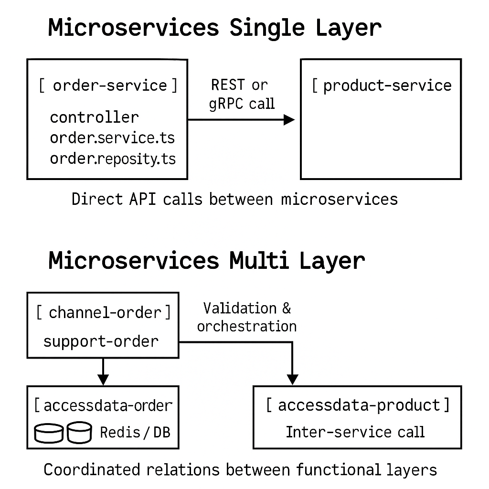

# Clase Avanzada: Arquitecturas de Sistemas Distribuidos

## Objetivos

- Comprender los tipos de arquitecturas distribuidas modernas.
- Comparar enfoques monolíticos vs. microservicios.
- Diferenciar microservicios *Single Layer* vs. *Multi Layer*.
- Entender el impacto del acceso a orígenes de datos en sistemas distribuidos.
- Conocer los beneficios de implementar caché.

---

## Contenido

1. Introducción a sistemas distribuidos  
2. Arquitectura monolítica vs distribuida  
3. Microservicios: concepto y tipos  
4. Relaciones en microservicios  
5. Acceso a orígenes de datos  
6. Beneficios del uso de caché  
7. Diagramas explicativos

---

## 1. ¿Qué es un sistema distribuido?

Es un sistema donde los componentes están ubicados en diferentes nodos de red pero colaboran entre sí como un sistema único. Se comunican mediante APIs, mensajes, o eventos.

**Ejemplos**: Netflix, Uber, Amazon.

---

## 2. Arquitectura monolítica vs distribuida

| Característica            | Monolítica                 | Distribuida (Microservicios)     |
|--------------------------|----------------------------|----------------------------------|
| Despliegue               | Una sola unidad            | Independiente por servicio       |
| Escalabilidad            | Todo o nada                | Escalado por componente          |
| Fallos                   | Afectan todo               | Contenidos por servicio          |
| Desarrollo por equipos   | Más difícil de aislar      | Equipos por servicio             |

---

## 3. Microservicios: Single Layer vs Multi Layer

### 🟦 Microservicios *Single Layer*

Cada servicio es responsable de **toda la lógica de negocio y datos** de su dominio.  
- Más simple de implementar.
- Menor latencia.
- Lógica duplicada entre servicios.

---

### 🟩 Microservicios *Multi Layer*

Se separan las **capas de exposición, orquestación y acceso a datos**.  
- Mejor desacoplamiento.
- Facilita testing y mantenibilidad.
- Mayor complejidad operativa.

**Capas típicas**:
- `channel` (API pública)
- `support` (orquestador y lógica de negocio)
- `accessdata` (DAO + base de datos/cache)

---

## 4. Relaciones entre Microservicios

| Arquitectura        | Tipo de relación |
|---------------------|------------------|
| Single Layer        | Directa (REST o eventos) entre servicios |
| Multi Layer         | Encapsulada (solo el `support` coordina) |

**Ejemplo**: en una app de tickets, el `support-order` consulta al `accessdata-user` por el estado del cliente antes de permitir una orden.

---

## 5. Acceso a Orígenes de Datos

El acceso eficiente a datos es crítico en sistemas distribuidos.

### Desafíos:

- Latencia por múltiples llamadas en red.
- Inconsistencias si se duplican datos.
- Sobrecarga de bases de datos.

### Recomendaciones:

- Acceso directo solo desde `accessdata`.
- Normalizar el uso de DAOs.
- Proteger con circuit breakers o timeouts.

---

## 6. Beneficios de implementar caché

Agregar Redis o similar aporta:

| Beneficio                  | Descripción                                           |
|----------------------------|-------------------------------------------------------|
| Reducción de latencia   | Datos frecuentes se responden más rápido             |
| Menor carga a BD         | Menos queries pesadas                                |
| Inteligencia local       | Permite replicar reglas en caché (ej. límites de uso)|
| Control TTL             | Vencimiento automático de datos obsoletos            |

### Buenas prácticas

- Prefijar las claves (ej. `product:all`)
- TTL razonable (1h–24h)
- Invalidar al actualizar registros

---

## Diagrama Integrado (Single vs Multi Layer)

Este diagrama ilustra claramente los dos enfoques:

---

## Conclusión

- La arquitectura *multi layer* te da más control, organización y escalabilidad.
- Redis y la separación clara de capas son claves para sistemas distribuidos modernos.
- Definir correctamente qué capa accede a qué recurso evita problemas de acoplamiento y rendimiento.
