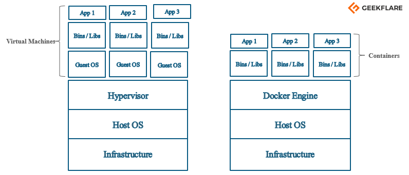
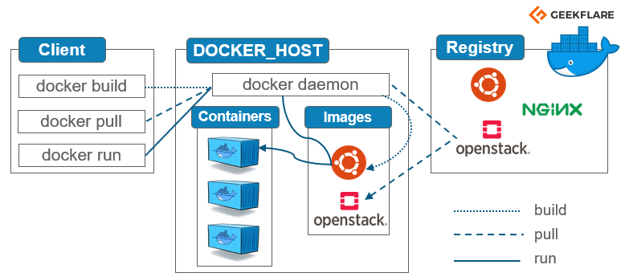

# Clase 03 – Módulo 04: Deploy con Docker

## Objetivos

- Entender la **arquitectura de Docker** (Engine, cliente, daemon, API, registros, objetos).  
- Construir **imágenes reproducibles** para apps Node.js con buenas prácticas (multi-stage).  
- Orquestar un stack con **Docker Compose** (API).  
- Gestionar **variables de entorno** y **secretos** en Docker/Compose.  
- Aplicar **seguridad** (usuario no root, read-only, caps mínimas, healthchecks).  
- Optimizar **tamaño/tiempo de build** y **performance** (caché, drivers, buildx).  
- Implementar **observabilidad y apagado limpio** (logs, señales, health).

---

## Contenido

1) Teoría y fundamentos de Docker  
&nbsp;&nbsp;1.1 Virtualización tradicional vs contenedores  
&nbsp;&nbsp;1.2 Arquitectura Docker: Engine (CLI, API, daemon)  
&nbsp;&nbsp;1.3 Registros y objetos (imágenes, contenedores, volúmenes, redes)  
&nbsp;&nbsp;1.4 Redes Docker (bridge, host, overlay, none, macvlan)  
&nbsp;&nbsp;1.5 Almacenamiento: **capas** y **copy‑on‑write**; **volúmenes**  
&nbsp;&nbsp;1.6 Runtimes (containerd/runc)  
2) Preparación del proyecto (Node 20 + TypeScript)  
3) **Dockerfile** multi‑stage (builder + runtime)  
4) **.dockerignore** y uso efectivo de caché  
5) **Docker Compose** (APIhealthchecks, redes, volúmenes, secrets)  
6) Variables de entorno y **secretos** (y cómo leerlos en código)  
7) Seguridad en contenedores (no root, read‑only, caps, no‑new‑privileges)  
8) Optimización (imágenes base, `npm ci`/`pnpm`, multi‑arch con buildx)  
9) Observabilidad (logs, `exec`, **SIGTERM/SIGINT**, endpoint `/health`)  
10) Ejemplo completo paso a paso (crear archivos, construir, levantar, probar)  
11) Checklist de despliegue  
12) Ejercicios guiados  
13) Comandos útiles

---

## 1) Teoría y fundamentos de Docker

### 1.1 Virtualización tradicional vs contenedores
En la virtualización tradicional cada VM trae **su propio kernel/SO**, lo que la hace pesada en arranque y consumo. En contenedores, múltiples apps comparten **el mismo kernel del host**, logrando **arranques en segundos** y menor sobrecarga.<br>


### 1.2 Arquitectura Docker: Engine (CLI, API, daemon)
Docker sigue un modelo **cliente‑servidor**:  
- **Docker CLI** (cliente) ejecuta comandos.  
- **Docker API** (REST) comunica instrucciones.  
- **Docker daemon (`dockerd`)** crea y gestiona **imágenes, contenedores, redes y volúmenes**.<br>


### 1.3 Registros y objetos
- **Registro**: almacén de imágenes (público como Docker Hub o privado).  
- **Objetos Docker**:  
  - **Imágenes**: plantillas **de solo lectura** que definen cómo crear contenedores.  
  - **Contenedores**: instancias en ejecución de una imagen.  
  - **Volúmenes**: persistencia desacoplada del ciclo de vida del contenedor.  
  - **Redes**: conectividad y aislamiento entre contenedores.

### 1.4 Redes Docker (drivers)
Drivers principales: 
- **bridge**: Es el controlador de red por defecto para un contenedor. Se utiliza esta red cuando su aplicación se ejecuta en contenedores aislados, es decir, cuando varios contenedores se comunican con el mismo host docker.
- **host**: Este controlador elimina el aislamiento de red entre los contenedores Docker y el host Docker. Se utiliza cuando no necesita ningún aislamiento de red entre el host y el contenedor.
- **overlay**: Esta red permite que los servicios del enjambre se comuniquen entre sí. Se utiliza cuando los contenedores se ejecutan en distintos hosts Docker o cuando los servicios del enjambre están formados por varias aplicaciones.
- **none**: Este controlador desactiva todas las redes.
- **macvlan**: Este controlador asigna direcciones mac a los contenedores para que parezcan dispositivos físicos. El tráfico se enruta entre los contenedores a través de sus direcciones mac. Esta red se utiliza cuando se desea que los contenedores parezcan un dispositivo físico, por ejemplo, durante la migración de una configuración VM.

### 1.5 Almacenamiento: capas y copy‑on‑write; volúmenes
Las imágenes y contenedores usan un **filesystem por capas**. Con **copy‑on‑write (CoW)**, un archivo se **copia a la capa superior** solo al modificarse.  
**Volúmenes**: persistencia fuera del contenedor para no perder datos al eliminarlo.

### 1.6 Runtimes
Docker Engine usa **`runc`** como runtime por defecto.

---

## 2) Preparación del proyecto (NestJS con Node 20 + TypeScript)

Para esta clase, prepararemos un proyecto **NestJS** que será empaquetado y desplegado en Docker.

**Estructura sugerida**
```
/app
├─ src/
│  ├─ app.controller.ts
│  ├─ app.module.ts
│  ├─ app.service.ts
│  └─ main.ts
├─ package.json
├─ tsconfig.json
├─ nest-cli.json
├─ Dockerfile
├─ .dockerignore
├─ docker-compose.yml
├─ .env
└─ secrets/
   ├─ mysql_root_password.txt
   └─ mysql_app_password.txt
```

**`src/main.ts`**
```ts
import { NestFactory } from '@nestjs/core';
import { AppModule } from './app.module';

async function bootstrap() {
  const app = await NestFactory.create(AppModule);
  await app.listen(process.env.PORT || 3000);
}
bootstrap();
```

**`src/app.module.ts`**
```ts
import { Module } from '@nestjs/common';
import { AppController } from './app.controller';
import { AppService } from './app.service';

@Module({
  imports: [],
  controllers: [AppController],
  providers: [AppService],
})
export class AppModule {}
```

**`src/app.controller.ts`**
```ts
import { Controller, Get } from '@nestjs/common';

@Controller()
export class AppController {
  @Get('health')
  getHealth() {
    return { status: 'ok' };
  }
}
```

**`src/app.service.ts`**
```ts
import { Injectable } from '@nestjs/common';

@Injectable()
export class AppService {
  getHello(): string {
    return 'Hello World!';
  }
}
```

Este ejemplo de NestJS nos permitirá crear un endpoint `/health` para ser utilizado en los healthchecks de Docker y Docker Compose.

## 3) Dockerfile (multi‑stage build)

```dockerfile
FROM node:20-alpine AS builder
WORKDIR /app
COPY package*.json ./
RUN npm ci
COPY tsconfig.json ./
COPY src ./src
RUN npm run build

FROM node:20-alpine AS runtime
WORKDIR /app
COPY package*.json ./
RUN npm ci --omit=dev
COPY --from=builder /app/dist ./dist
ENV NODE_ENV=production     PORT=3000
EXPOSE 3000
USER node
HEALTHCHECK --interval=30s --timeout=5s --start-period=15s --retries=3     CMD wget -qO- http://127.0.0.1:${PORT}/health || exit 1
CMD ["node", "dist/server.js"]
```

---

## 4) .dockerignore

```
node_modules
dist
.git
.gitignore
Dockerfile
**/*.log
.env
.env.*
coverage
.vscode
```

---

## 5) Docker Compose

```yaml
version: "3.9"
services:
  api:
    build:
      context: .
      dockerfile: Dockerfile
      target: runtime
    image: myorg/myapp-api:latest
    env_file:
      - .env
    environment:
      NODE_ENV: production
      PORT: 3000
    ports:
      - "8080:3000"
    depends_on:
      redis:
        condition: service_healthy
      mysql:
        condition: service_healthy
    healthcheck:
      test: ["CMD-SHELL", "wget -qO- http://127.0.0.1:3000/health || exit 1"]
      interval: 30s
      timeout: 5s
      retries: 3
      start_period: 15s
    read_only: true
    tmpfs:
      - /tmp
    cap_drop:
      - ALL
    security_opt:
      - no-new-privileges:true
    ulimits:
      nofile: 65536
    networks:
      - app-net

  redis:
    image: redis:7-alpine
    command: ["redis-server", "--appendonly", "yes"]
    volumes:
      - redis-data:/data
    healthcheck:
      test: ["CMD", "redis-cli", "ping"]
      interval: 10s
      timeout: 3s
      retries: 5
    networks:
      - app-net

  mysql:
    image: mysql:8.4
    environment:
      MYSQL_ROOT_PASSWORD_FILE: /run/secrets/mysql_root_password
      MYSQL_DATABASE: appdb
      MYSQL_USER: appuser
      MYSQL_PASSWORD_FILE: /run/secrets/mysql_app_password
    volumes:
      - mysql-data:/var/lib/mysql
    secrets:
      - mysql_root_password
      - mysql_app_password
    healthcheck:
      test: ["CMD-SHELL", "mysqladmin ping -h 127.0.0.1 -u$$MYSQL_USER -p$$(cat /run/secrets/mysql_app_password) || exit 1"]
      interval: 20s
      timeout: 5s
      retries: 10
    networks:
      - app-net

  proxy:
    image: nginx:1.27-alpine
    depends_on:
      api:
        condition: service_started
    volumes:
      - ./ops/nginx.conf:/etc/nginx/nginx.conf:ro
    ports:
      - "80:80"
    networks:
      - app-net

networks:
  app-net:

volumes:
  redis-data:
  mysql-data:

secrets:
  mysql_root_password:
    file: ./secrets/mysql_root_password.txt
  mysql_app_password:
    file: ./secrets/mysql_app_password.txt
```

---

## 6) Variables de entorno y secretos

**`.env`**
```
APP_NAME=MyApp
APP_LOG_LEVEL=info
REDIS_URL=redis://redis:6379
DB_HOST=mysql
DB_NAME=appdb
DB_USER=appuser
DB_PORT=3306
```

**Lectura en código**
```ts
import 'dotenv/config';
export const config = {
    port: Number(process.env.PORT ?? 3000),
    redisUrl: process.env.REDIS_URL ?? 'redis://localhost:6379',
    db: {
        host: process.env.DB_HOST ?? 'localhost',
        port: Number(process.env.DB_PORT ?? 3306),
        name: process.env.DB_NAME ?? 'appdb',
        user: process.env.DB_USER ?? 'appuser',
        passwordFile: process.env.DB_PASSWORD_FILE ?? '/run/secrets/mysql_app_password'
    }
};
```

---
## 7) Seguridad en contenedores (Hardening)

Docker aísla procesos, pero no es una barrera infalible. Si un contenedor se compromete, el atacante podría intentar escalar al host o moverse a otros contenedores. Por eso, aplicamos estas medidas:

### 7.1 **USER no root**
Por defecto, muchos contenedores corren como `root`. Si alguien toma control, tendrá privilegios elevados.  
En imágenes oficiales como `node:alpine` ya existe un usuario `node`:

```dockerfile
USER node
```

En `docker-compose.yml`:

```yaml
services:
  api:
    user: node
```

---

### 7.2 **Read-only FS**
Evita que se escriba en el sistema de archivos raíz del contenedor, reduciendo la posibilidad de alterar binarios:

```yaml
read_only: true
```

---

### 7.3 **tmpfs para /tmp**
Si tu aplicación necesita escribir archivos temporales, usa `tmpfs` para montarlos en memoria y que se eliminen al detener el contenedor:

```yaml
tmpfs:
  - /tmp
```

---

### 7.4 **cap_drop ALL**
Elimina todas las *capabilities* de Linux, dejando solo las necesarias (por ejemplo, `NET_BIND_SERVICE` si la app debe escuchar en puertos < 1024):

```yaml
cap_drop:
  - ALL
# cap_add:
#   - NET_BIND_SERVICE
```

---

### 7.5 **no-new-privileges**
Evita que un proceso gane privilegios extra durante su ejecución:

```yaml
security_opt:
  - no-new-privileges:true
```

---

### 7.6 **Healthchecks**
Permiten a Docker detectar fallos y reiniciar el contenedor:

En Dockerfile:
```dockerfile
HEALTHCHECK --interval=30s --timeout=5s --start-period=15s --retries=3   CMD wget -qO- http://127.0.0.1:${PORT}/health || exit 1
```

En Compose:
```yaml
healthcheck:
  test: ["CMD-SHELL", "wget -qO- http://127.0.0.1:3000/health || exit 1"]
  interval: 30s
  timeout: 5s
  retries: 3
  start_period: 15s
```

---


---

## 8) Optimización

Optimizar imágenes y contenedores mejora tiempo de build, despliegue y uso de recursos.

### 8.1 **Imágenes base ligeras**
Usar `node:alpine` o imágenes *distroless* para reducir tamaño y superficie de ataque.

---

### 8.2 **Multi-stage build**
Separar build y runtime:
- Builder: instala deps de desarrollo y compila.
- Runtime: solo deps de producción y artefactos compilados.

---

### 8.3 **Caché de dependencias**
Copiar `package*.json` y lockfiles antes del código para cachear `npm ci` o `pnpm install`.

---

### 8.4 **Logs a stdout/stderr**
No escribir logs en archivos locales dentro del contenedor; usa salida estándar para integrarlos con sistemas como Loki o ELK.

---

### 8.5 **Multi-arch con buildx**
Permite crear imágenes para varias arquitecturas:
```bash
docker buildx build --platform linux/amd64,linux/arm64 -t myorg/myapp:1.0.0 --push .
```


---

## 9) Observabilidad

Controlar y supervisar contenedores es clave para detectar problemas y apagarlos de forma segura.

### 9.1 **Logs**
```bash
docker compose logs -f api
```

---

### 9.2 **Acceso shell**
```bash
docker compose exec api sh
```

---

### 9.3 **Señales SIGTERM/SIGINT**
Permiten apagar ordenadamente, cerrando conexiones y recursos:

```ts
process.on('SIGTERM', shutdown);
process.on('SIGINT', shutdown);
```

---

### 9.4 **Endpoint `/health`**
Debe responder rápido y sin dependencias pesadas para que orquestadores (Compose/K8s) puedan verificar el estado.

---

## 10) Comandos útiles

```bash
docker build \
  --build-arg APP_VERSION=1.0.0 \
  --build-arg GIT_COMMIT=$(git rev-parse --short HEAD) \
  --build-arg BUILD_DATE=$(date -u +'%Y-%m-%dT%H:%M:%SZ') \
  -t mi-app:1.0.0 \
  .
docker-compose up --build
docker-compose logs -f example-app-1
docker-compose down -v
```