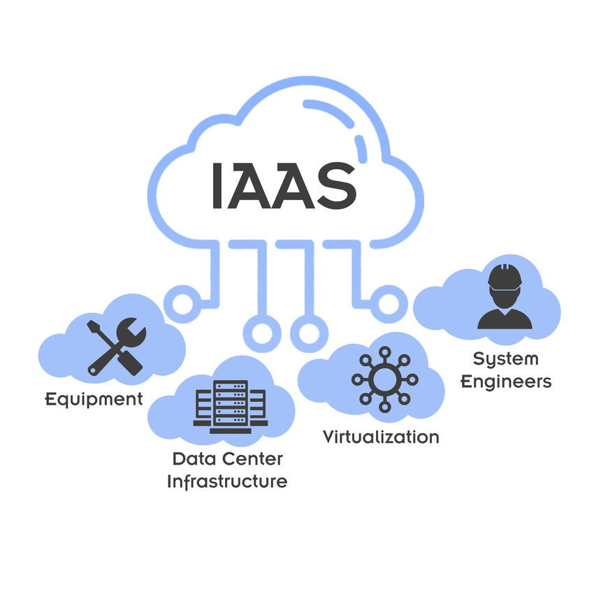

# Sesión 1 --- Conceptos básicos de AWS

> Programa: **Curso Cloud AWS y despliegues productivos**\
> Módulo 01 · Sesión 01

------------------------------------------------------------------------

## Objetivos de aprendizaje

Al finalizar la sesión, el estudiante será capaz de:

1.  Explicar qué es AWS, sus componentes clave y cómo se diferencia de
    otras nubes.\
2.  Crear una cuenta de AWS, aplicar configuraciones iniciales y buenas
    prácticas de seguridad.\
3.  Analizar los diferentes modelos de despliegue en la nube y cuándo
    usarlos.\
4.  Comprender la importancia de **Infraestructura como Código (IaC)** y
    aplicarla en un ejemplo real.

------------------------------------------------------------------------

## Contenido

1.  **Conceptos clave de AWS**\
    1.1. Historia y propuesta de valor.\
    1.2. Estructura global: Regiones, Zonas de disponibilidad, Edge
    Locations.\
    1.3. Modelos de servicio (IaaS, PaaS, SaaS, FaaS).\
    1.4. Principales servicios por categoría.

2.  **Creación de cuenta y configuraciones básicas**\
    2.1. Pasos para crear una cuenta Free Tier.\
    2.2. Configuración inicial: MFA, facturación, alertas.\
    2.3. IAM: usuarios, roles, políticas y buenas prácticas.\
    2.4. Herramientas de gestión (AWS CLI, SDKs, Consola Web).

3.  **Modelos de despliegue en la nube**\
    3.1. Nube pública, privada, híbrida y multicloud.\
    3.2. Casos de uso empresariales.\
    3.3. Ejemplo práctico: web en EC2 con almacenamiento en S3.

4.  **Fundamentos de infraestructura como código (IaC)**\
    4.1. Qué es IaC y por qué usarlo.\
    4.2. Herramientas: CloudFormation vs Terraform.\
    4.3. Flujo de trabajo DevOps con IaC.\
    4.4. Ejemplo práctico: bucket S3 con CloudFormation.

------------------------------------------------------------------------

## 1. Conceptos clave de AWS

### 1.1 Historia y propuesta de valor

Cuando pensamos en **Amazon** en los años 2000, lo primero que viene a
la mente es una tienda en línea que vendía libros y luego de todo un
poco. Pero lo que pocos sabían es que, detrás de esa web, Amazon tenía
que resolver un **problema enorme de tecnología**: cómo manejar millones
de transacciones, escalar en épocas de picos (como Navidad) y no
colapsar sus servidores.

De esa necesidad interna, Amazon empezó a construir una infraestructura
que pudiera **crecer y achicarse bajo demanda**, automatizada y
accesible desde cualquier parte del mundo. En **2006** decidieron
ofrecer esa infraestructura como servicio y nacieron los dos primeros
productos:\
- **S3 (Simple Storage Service)**: almacenamiento de objetos en la
nube.\
- **EC2 (Elastic Compute Cloud)**: servidores virtuales que se podían
encender y apagar como si fueran focos.

La **propuesta de valor** fue disruptiva:\
- En lugar de **comprar servidores caros** que podían tardar meses en
instalarse, ahora podías **rentar uno en minutos**.\
- No había que invertir grandes sumas iniciales (**CAPEX**); simplemente
pagabas lo que usabas (**OPEX**).\
- El sistema estaba diseñado para **escalar casi infinitamente**, algo
que antes requería arquitecturas muy complejas.\
- Además, al correr sobre la infraestructura global de Amazon, obtenías
seguridad y alcance mundial sin ser un gigante tecnológico.

**Comparación con el pasado:**\
- Antes: una startup que quería lanzar su app tenía que comprar
servidores físicos (mínimo USD \$20,000 -- \$50,000), contratar gente
para instalarlos, rentar un data center y esperar meses.\
- Ahora (con AWS): con una tarjeta de crédito podías lanzar un servidor
en minutos, pagar unos pocos dólares al mes y probar tu idea en el
mercado sin una inversión inicial gigantesca.


------------------------------------------------------------------------

### 1.2 Estructura global (https://aws.amazon.com/es/about-aws/global-infrastructure/)

AWS no está "en la nube" de manera difusa: tiene una estructura física
muy concreta, pensada para permitir disponibilidad, rendimiento,
cumplimiento legal y cercanía al usuario. Cuando diseñas sistemas en
AWS, elegir región, zona de disponibilidad y punto de presencia (edge)
es una decisión técnica importante, no solo de configuración.

#### Conceptos

-   **Regiones**: Una región es una ubicación geográfica donde AWS
    agrupa varios centros de datos. Cada región está aislada de otras
    para limitar fallas o desastres, cumplir con regulaciones locales
    (por ejemplo de datos) y reducir latencia si tus usuarios están
    cerca.

    

-   **Zonas de Disponibilidad (AZ)**: Dentro de cada región AWS tiene
    varias AZs (al menos 3 en la mayoría de regiones). Cada AZ es uno o
    más data centers con su propia alimentación eléctrica, red,
    refrigeración, etc., separados físicamente los unos de los otros, lo
    que ayuda a la tolerancia a fallos. Si una AZ falla, las otras no se
    ven afectadas, siempre que tu arquitectura esté diseñada para usar
    múltiples AZs.

    

-   **Edge Locations**: Son nodos más pequeños, distribuidos
    mundialmente, usados para entregar contenido más rápido al usuario
    final, reducir la latencia y optimizar experiencias mediante
    caching. Servicios como CloudFront se apoyan en estas Edge
    Locations.

    

### Regiones AWS y número de AZs

-   AWS cuenta con **38 regiones activas** y más de **120 zonas de disponibilidad (AZs)**.

    | Código        | Nombre                                | AZs |
    |---------------|----------------------------------------|-----|
    | us-east-1     | US East (N. Virginia, EE.UU.)          | 6   |
    | us-east-2     | US East (Ohio, EE.UU.)                 | 3   |
    | us-west-1     | US West (N. California, EE.UU.)        | 3   |
    | us-west-2     | US West (Oregon, EE.UU.)               | 4   |
    | af-south-1    | África (Ciudad del Cabo)               | 3   |
    | ap-east-1     | Asia Pacífico (Hong Kong)              | 3   |
    | ap-south-2    | Asia Pacífico (Hyderabad, India)       | 3   |
    | ap-southeast-3| Asia Pacífico (Yakarta, Indonesia)     | 3   |
    | ap-southeast-5| Asia Pacífico (Malasia)                | 3   |
    | ap-southeast-4| Asia Pacífico (Melbourne, Australia)   | 3   |
    | ap-south-1    | Asia Pacífico (Mumbai, India)          | 3   |
    | ap-southeast-6| Asia Pacífico (Nueva Zelanda)          | 3   |
    | ap-northeast-3| Asia Pacífico (Osaka, Japón)           | 3   |
    | ap-northeast-2| Asia Pacífico (Seúl, Corea del Sur)    | 4   |
    | ap-southeast-1| Asia Pacífico (Singapur)               | 3   |
    | ap-southeast-2| Asia Pacífico (Sídney, Australia)      | 3   |
    | ap-east-2     | Asia Pacífico (Taipéi, Taiwán)         | 3   |
    | ap-southeast-7| Asia Pacífico (Tailandia)              | 3   |
    | ap-northeast-1| Asia Pacífico (Tokio, Japón)           | 4   |
    | ca-central-1  | Canadá (Central)                       | 3   |
    | ca-west-1     | Canadá Oeste (Calgary)                 | 3   |
    | eu-central-1  | Europa (Fráncfort, Alemania)           | 3   |
    | eu-west-1     | Europa (Irlanda)                       | 3   |
    | eu-west-2     | Europa (Londres, Reino Unido)          | 3   |
    | eu-south-1    | Europa (Milán, Italia)                 | 3   |
    | eu-west-3     | Europa (París, Francia)                | 3   |
    | eu-south-2    | Europa (España)                        | 3   |
    | eu-north-1    | Europa (Estocolmo, Suecia)             | 3   |
    | eu-central-2  | Europa (Zúrich, Suiza)                 | 3   |
    | il-central-1  | Oriente Medio (Tel Aviv, Israel)       | 3   |
    | mx-central-1  | México (Centro)                        | 3   |
    | me-south-1    | Oriente Medio (Bahréin)                | 3   |
    | me-central-1  | Oriente Medio (EAU)                    | 3   |
    | sa-east-1     | Sudamérica (São Paulo, Brasil)         | 3   |


#### Analogía simple

- **Región**: como una ciudad grande (ej. São Paulo).  
- **Zona de Disponibilidad (AZ)**: los barrios de esa ciudad, cada uno con electricidad propia.  
- **Edge Location**: las tiendas de conveniencia repartidas por toda la ciudad, para que siempre tengas una cerca y no debas ir hasta el supermercado central.

#### Noticias
- **AWS construirá una nueva Región en Chile para finales de 2026**
    - AWS anunció planes de lanzar la región AWS South America (Chile) al final de 2026.
    - Estará compuesta por tres Zonas de Disponibilidad (AZs) al iniciarla.
    - Inversión estimada: aproximadamente USD 4.000 millones para construcción, operación, mantenimiento, etc.
    - La región apunta a dar soporte a aplicaciones que requieren baja latencia, replicación sincrónica, cumplimiento de residencia de datos, e impulsar innovación en IA, machine learning, etc.
- **Google Cloud ya tiene Región operativa en Santiago, Chile**
    - Google Cloud inauguró una región de nube en Santiago de Chile.
    - Esta región cuenta con 3 zonas de disponibilidad.
    - Fue parte de la estrategia de Google para acercar sus servicios de nube a los clientes chilenos y latinoamericanos, mejorar latencia, ofrecer almacenamiento de datos local, etc.

------------------------------------------------------------------------

### 1.3 Modelos de servicio

-   **IaaS (Infraestructura como Servicio):**
    - **¿Qué es?** 
        - Capas base: redes privadas (VPC), subredes, balanceadores, EC2 (VMs), almacenamiento en bloques (EBS), IPs elásticas, SG/NACL, etc. Tú diseñas y administras casi todo.
    - **Cuándo usarlo**
        - Necesitas control fino del sistema operativo, librerías, kernels, GPU, drivers (ej. ML con CUDA, FFmpeg, codecs).
        - Migras cargas legacy que requieren persistencia de SO o software con licencias específicas.
        - Arquitecturas personalizadas (reverse proxies, sidecars, servicios en contenedores sin orquestador administrado).
    - **Ventajas**
        - Máximo control y flexibilidad.
        - Fácil de entender para equipos acostumbrados a data centers.
        - Puedes optimizar costos con Reserved Instances o Spot.
    - **Desventajas**
        - Mayor operación: parches, backups, rotación de logs, hardening.
        - Escalado y alta disponibilidad son tu responsabilidad (múltiples AZ, Auto Scaling, etc.).
    - **Costos típicos**
        - EC2 por hora/segundo; EBS por GB/mes + IOPS; tráfico de salida (egress).
        - Ahorros con Savings Plans / Reserved / Spot.
    - **Mini-arquitectura (API web IaaS)**
        - VPC con 2 subredes privadas + 2 públicas, NAT Gateway.
        - ALB público → Auto Scaling Group de EC2 (2+ instancias) → RDS (si lo combinas con PaaS DB) o MySQL en EC2 (IaaS total).
        - S3 para estáticos, CloudFront opcional.
    - **Alternativas no-AWS**
        - Azure: Virtual Machines, Virtual Network, Managed Disks, Load Balancer.
        - Google Cloud: Compute Engine, VPC, Persistent Disk, Cloud Load Balancing.
        - Otros: DigitalOcean Droplets, Linode/Akamai, Vultr, OVH, Hetzner; Equinix Metal (bare metal).

    
-   **PaaS (Plataforma como Servicio):**
    - **¿Qué es?** 
        - El proveedor opera la plataforma (SO, parches, orquestación básica). Tú aportas código o defines un servicio gestionado.
    - **Cuándo usarlo**
        - Quieres desplegar rápido apps sin armar infraestructura detallada.
        - Necesitas bases de datos gestionadas (backups, parches, failover): RDS/Aurora.
        - Equipos pequeños que priorizan time-to-market.
    - **Ventajas**
        - Menos carga operativa (backups automáticos, parches, monitoreo básico).
        - Escalado y health checks integrados (Beanstalk, RDS Multi-AZ).
        - Integración nativa con CloudWatch, IAM, secretos, etc.
    - **Desventajas**
        - Menos control fino (configs avanzadas pueden ser complejas).
        - Costo mayor que montar todo en IaaS cuando la carga es baja y estable.
        - “Opinionado”: salirte del camino feliz puede requerir hacks.
    - **Costos típicos**
        - Beanstalk cobra por los recursos subyacentes (EC2, ELB, EBS).
        - RDS: instancia + almacenamiento + IOPS + transferencia; Multi-AZ suma costo.
    - **Mini-arquitectura (web PaaS)**
        - Beanstalk (App Node.js/Java/Python) en 2 AZ + ALB + Auto Scaling.
        - RDS (PostgreSQL) Multi-AZ.
        - S3 para assets, CloudFront para CDN, Secrets Manager para credenciales.
    - **Alternativas no-AWS**
        - Google Cloud: Cloud Run (containers serverless), App Engine; Cloud SQL (Postgres/MySQL).
        - Azure: App Service, Azure Spring Apps; Azure Database for PostgreSQL/MySQL.
        - Heroku: dynos + add-ons (Postgres, Redis). OpenShift / Cloud Foundry (PaaS sobre K8s).

    
-   **SaaS (Software como Servicio):**
    - **¿Qué es?** 
        - Aplicaciones completas listas para usar (correo, reuniones, CRM, analítica, etc.). No gestionas plataforma ni infraestructura.
    - **Cuándo usarlo**
        - Necesitas resolver una función de negocio sin desviar al equipo técnico (correo corporativo, reuniones, helpdesk).
        - Requisitos de cumplimiento delegados al proveedor (backup, DR, cifrado administrado).
    - **Ventajas**
        - Cero operación infra/plataforma.
        - Despliegue y adopción muy rápidos.
        - SLA y compliance del proveedor.
    - **Desventajas**
        - Menos personalización.
        - Posible lock-in funcional y planes por usuario que escalan en costo.
        - Dependencia total del roadmap del proveedor.
    - **Costos típicos**:
        - Suscripciones por usuario/mes; extras por almacenamiento, funciones premium, grabaciones, etc.
    - **Mini-arquitectura (colaboración)**:
        - WorkMail + Chime para comunicación interna.
        - Integración con IAM/AD/SSO para identidades.
        - Auditoría y retención habilitadas según normativas.
    - **Alternativas no-AWS**:
        - Google Workspace (Gmail, Meet, Drive), Microsoft 365/Teams.
        - Slack, Zoom.
        - Salesforce/HubSpot (CRM), Atlassian (Jira/Confluence).
        - Auth0/Okta (IDaaS), Twilio SendGrid (correo transaccional).

    
-   **FaaS (Función como Servicio):**
    - **¿Qué es?** 
        - Subes funciones (Node, Python, Java, Go, etc.) que corren cuando se invocan (eventos: HTTP vía API Gateway, S3, SQS, Kinesis, CRON, IoT). Facturación por ms y memoria.
    - **Cuándo usarlo**
        - Cargas event-driven (procesar subidas a S3, jobs asíncronos, webhooks).
        - Tráfico muy variable o impredecible (picos) donde pagar “solo cuando corre” es ventajoso.
        - Backends de micro-features, APIs ligeras, ETL pequeño, automatizaciones DevOps.
    - **Ventajas**
        - Cero servidores visibles; scaling automático a miles de invocaciones.
        - Pago por uso real; excelente para picos y baja ociosa.
        - Integración natural con servicios AWS (S3, DynamoDB, SQS, EventBridge).
    - **Desventajas**
        - Cold starts (mitigables con provisión de concurrencia).
        - Límites de tiempo/CPU/memoria/paquetes; debugging distinto a VMs.
        - Arquitecturas complejas si abusas de demasiadas funciones desacopladas.
    - **Costos típicos**
        - Invocaciones + duración (ms) × memoria.
        - API Gateway, SQS, DynamoDB, etc., se cobran aparte.
    - **Mini-arquitectura (event-driven)**
        - S3 → evento → Lambda (procesa imagen) → guarda metadatos en DynamoDB.
        - API pública: API Gateway → Lambda → DynamoDB/S3.
    - **Alternativas no-AWS**
        - Google Cloud Functions; Cloud Run Jobs (batch); Pub/Sub como disparador.
        - Azure Functions (HTTP, Queue/Service Bus, Timer).
        - Cloudflare Workers (edge), Queues, KV/D1/R2.
        - Vercel/Netlify Functions; OpenFaaS (self-hosted).

    


------------------------------------------------------------------------

### 1.4 Principales servicios por categoría

-   **Cómputo:** EC2, ECS, Lambda.\
-   **Almacenamiento:** S3, EBS, Glacier.\
-   **Bases de datos:** RDS, DynamoDB, Aurora.\
-   **Redes:** VPC, Route 53, API Gateway.\
-   **Seguridad:** IAM, KMS, Shield.

------------------------------------------------------------------------

## 2. Creación de cuenta y configuraciones básicas

### 2.1 Pasos para crear una cuenta
1.  Ingresar a [aws.amazon.com](https://aws.amazon.com).
2.  Ve al aopción de registro (https://signin.aws.amazon.com/signup?request_type=register)

3.  Ingresa un correo para tu cuenta ROOT (principal) y un nombre de cuenta
    - email: usmp.andes.cloud@gmail.com
    - accountName: usmp.andes
4.  Verificar OTP email:

5.  Ingresa tu contraseña:

6.  Selecciona tu plan:

7.  Ingresa tus datos:

8.  Valida tu tarjeta:

9.  Valida tu teléfono:


10.  Registro correcto:


------------------------------------------------------------------------

### 2.2 Configuración inicial

-   **MFA:** activa autenticación en dos pasos en la cuenta root.\
-   **Billing alerts:** configura alertas en CloudWatch para evitar
    cobros sorpresa.\
-   **Soporte:** selecciona el plan que necesites (Developer, Business,
    Enterprise).

------------------------------------------------------------------------

### 2.3 IAM

-   **Usuarios:** cada persona debe tener su usuario IAM.\
-   **Roles:** se asignan a servicios (ej. EC2 que accede a S3).\
-   **Políticas:** permisos definidos en JSON.

**Ejemplo de política IAM (JSON):**

``` json
{
  "Version": "2012-10-17",
  "Statement": [
    {
      "Effect": "Allow",
      "Action": "s3:*",
      "Resource": "*"
    }
  ]
}
```


------------------------------------------------------------------------

### 2.4 Herramientas de gestión

-   **Consola Web**: intuitiva, para principiantes.\
-   **AWS CLI**: línea de comandos para scripts.\
-   **SDKs**: librerías en varios lenguajes (Node, Python, Java).


------------------------------------------------------------------------

## 3. Modelos de despliegue en la nube

### 3.1 Tipos

-   **Pública**: todo corre en AWS.
-   **Privada**: data centers internos (ejemplo: banca).
-   **Híbrida**: combinación (ejemplo: backups locales + S3).
-   **Multicloud**: AWS + Azure + GCP.

### 3.2 Casos de uso

-   **Retail:** e-commerce que usa nube pública (S3 + CloudFront).
-   **Gobierno:** nube híbrida por normativas de datos sensibles.
-   **Fintech:** multicloud para evitar dependencia de un único
    proveedor.

### 3.3 Ejemplo práctico

Desplegar un sitio web:\
- EC2 con Apache/Nginx.\
- Archivos estáticos en S3.\
- DNS con Route 53.

## 4. Fundamentos de IaC

### 4.1 Qué es IaC

Definir infraestructura en **archivos declarativos** versionados en Git.


------------------------------------------------------------------------

### 4.2 Herramientas

-   **CloudFormation:** nativo AWS.

-   **Terraform:** soporta múltiples nubes.


------------------------------------------------------------------------

### 4.3 Flujo de trabajo

1.  Desarrollador escribe un template IaC.
2.  Commit a GitHub.
3.  Pipeline CI/CD aplica el template.

4.  AWS crea la infraestructura automáticamente.

------------------------------------------------------------------------

### 4.4 Ejemplo práctico

CloudFormation para un bucket S3:

``` yaml
Resources:
  MyFirstBucket:
    Type: AWS::S3::Bucket
    Properties:
      BucketName: curso-aws-ejemplo
```

------------------------------------------------------------------------

## Actividad práctica

1.  Crear cuenta en Free Tier.
2.  Configurar MFA y usuario IAM.