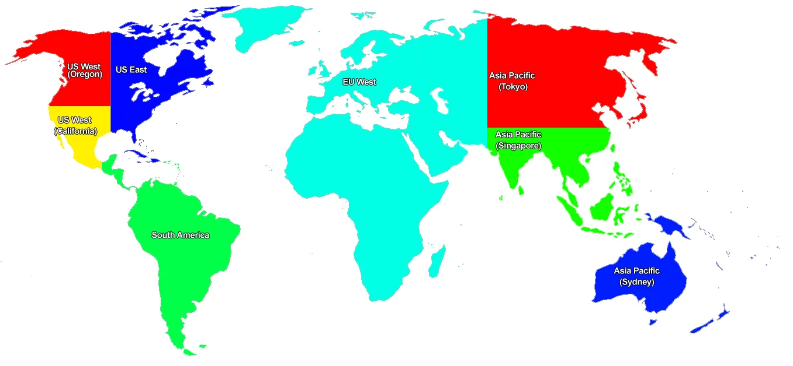
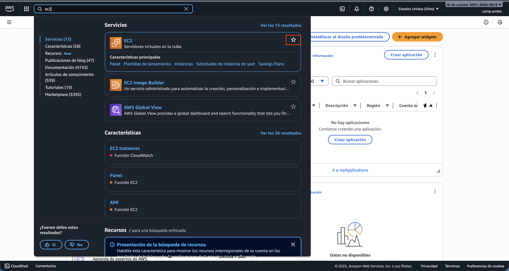
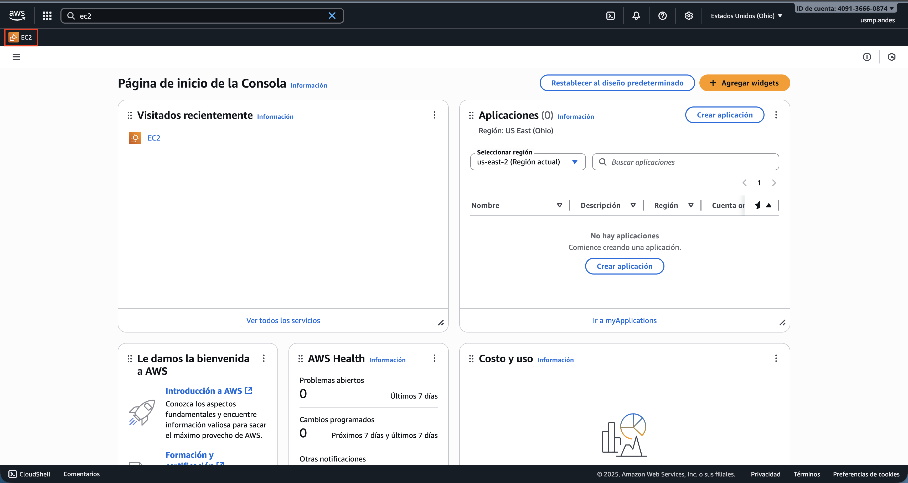
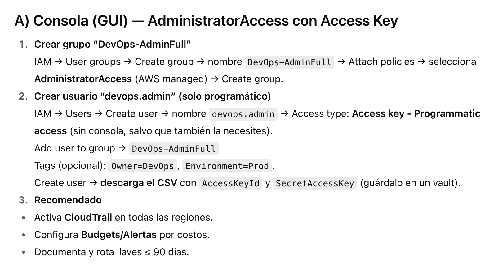
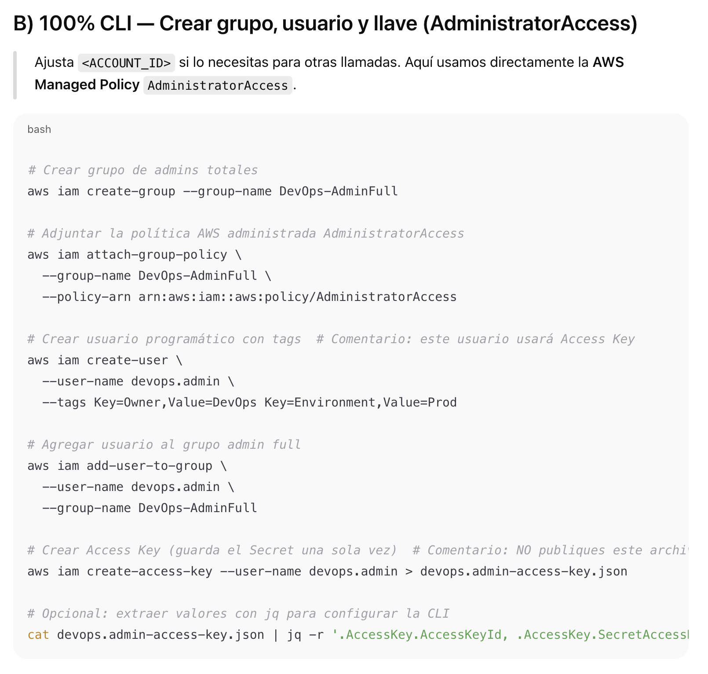
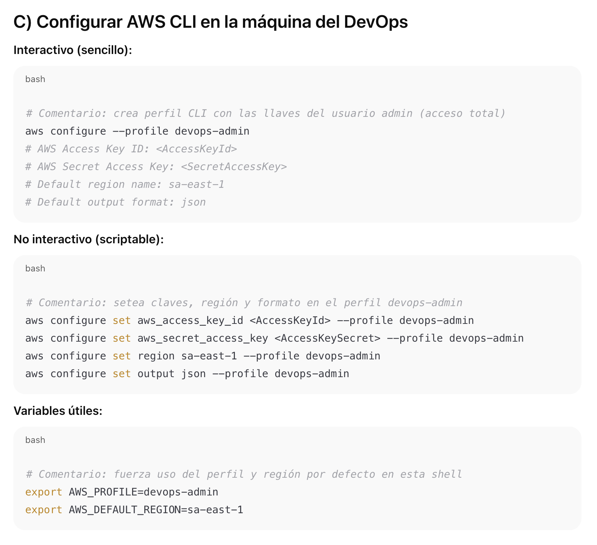
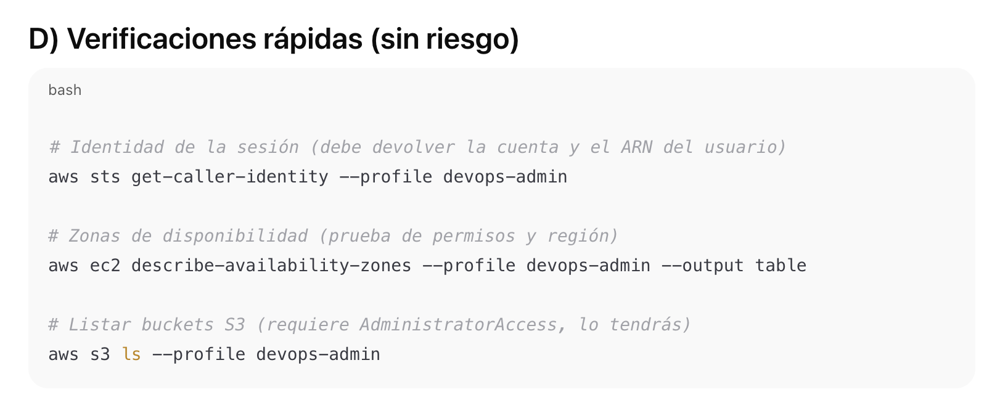
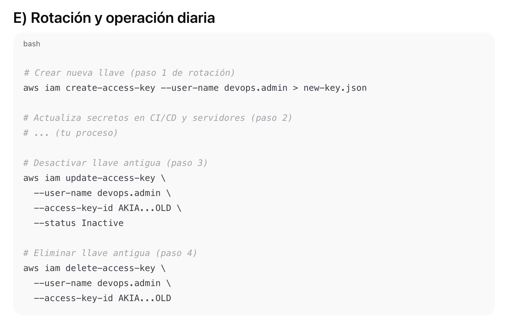

# Sesión 2 — Configuración de servicios base (Versión avanzada)

> Programa: **Curso Cloud AWS y despliegues productivos**  
> Módulo 01 · Sesión 02  

---

## Objetivos de aprendizaje

Al finalizar la sesión, el estudiante será capaz de:

1. Comprender en detalle la **estructura y jerarquía de la Consola de AWS**, diferenciando entre servicios globales y por región.  
2. Diseñar y aplicar una **estrategia de usuarios y permisos en IAM** (usuarios, grupos, roles, políticas personalizadas y uso de STS).  
3. Configuración de aws cli full permission
4. Administrar el **Gestor de costos y facturación**, aplicando etiquetas (tagging) para cost allocation, presupuestos multinivel y alertas.  

---

## Contenido

1. **Exploración de la consola de AWS**  
   - Diferencias entre servicios **globales** y **regionales**.  
   - Uso de la barra de búsqueda y favoritos.  
   - Creación de Resource Groups y uso de Tag Editor.  

2. **Configuración de usuarios y permisos con IAM**  
   - Root account, usuarios IAM, grupos y roles.  
   - Políticas administradas, personalizadas e inline.  
   - Principio de **least privilege**.  
   - Roles temporales con **STS**.  
   - Uso de AWS CLI con SSO en lugar de credenciales estáticas.  

3. **Configuración de AWS CLI** 
   - Instalación de aws cli
   - Generación de iam permission
   - Configuración

4. **Gestor de costos y facturación en AWS**  
   - Uso de **Cost Explorer** y proyecciones.  
   - Presupuestos (Budgets) con thresholds y alertas vía SNS.  
   - Etiquetado obligatorio (`Project`, `Owner`, `Environment`).  
   - Activación de **Cost Allocation Tags**.  
   - Uso de **AWS Organizations** para billing consolidado y Service Control Policies (SCP).  

---

## Desarrollo del contenido

### 1. Exploración de la consola
- Servicios globales (IAM, Route 53, CloudFront) vs regionales (EC2, RDS).
  - **Servicios Globales**
    - Se configuran una sola vez por cuenta y su alcance es a nivel mundial.
    - No requieren seleccionar región en la consola.
    - Ejemplos:
      - IAM (Identity and Access Management): gestión de usuarios, roles y políticas.
      - Route 53: sistema de DNS administrado, funciona a nivel global.
      - CloudFront: CDN de AWS que distribuye contenido en Edge Locations alrededor del mundo.
    - Ejemplo práctico:
      - Si creas un usuario en IAM en la región us-east-1, ese mismo usuario existe y es válido en eu-west-1, ap-south-1, etc.
    - Ventaja:
      - Simplifica la gestión centralizada de identidades, DNS y contenido distribuido.
  - **Servicios Regionales**
    - Requieren elegir una región específica para desplegarlos.
    - Los recursos no se replican automáticamente entre regiones.
    - Ejemplos:
      - EC2 (Elastic Compute Cloud): las instancias corren en una zona de disponibilidad dentro de una región.
      - RDS (Relational Database Service): las bases de datos se crean en una región específica.
      - S3: aunque es regional, los buckets se crean en una región concreta, pero son accesibles globalmente a través de endpoints.
    - Ejemplo práctico:
      - Una base de datos RDS en us-east-1 no está disponible en sa-east-1 (São Paulo) salvo que configures replicación multi-región.
    - Ventaja:
      - Permite a los arquitectos elegir regiones cercanas a los usuarios finales para reducir latencia y cumplir con normativas locales.

  
- Personalización con favoritos y Resource Groups.
  - **Favoritos en la consola de AWS**
    - En la barra superior de la consola puedes marcar como favorito cualquier servicio que uses con frecuencia.
    - Estos accesos quedan guardados en una lista fija, visible en la parte superior de la página.
    - Beneficios:
      - Ahorra tiempo al no tener que buscar siempre en el catálogo.
      - Útil para roles específicos:
        - Un desarrollador podría tener como favoritos: EC2, Lambda, S3.
        - Un arquitecto de red podría tener: VPC, Route 53, CloudFront.
    - Ejemplo práctico:
      - Buscar EC2 en la barra de búsqueda.
      - Al lado del nombre, seleccionar la estrella para fijarlo como favorito.
      - El ícono de EC2 aparecerá en la barra de navegación superior.
  - **Resource Groups**
    - Los Resource Groups permiten agrupar y visualizar recursos según tags (etiquetas) o criterios comunes.
      - Funcionan como vistas dinámicas de tus recursos.
      - Se pueden crear grupos por proyecto, entorno, aplicación o responsable.
    - Ejemplo práctico:
      - Supongamos que etiquetas tus recursos con:
        - Project=TaxiApp
        - Environment=Production
      - Puedes crear un Resource Group que muestre todos los recursos con esas etiquetas (EC2, RDS, S3, ELB, etc.) y verlos en un solo panel.
    - Beneficios:
      - Gestión centralizada de proyectos en AWS.
      - Permite aplicar acciones masivas sobre un conjunto de recursos (ej. parar todas las instancias de un entorno de testing).
      - Útil para equipos grandes que manejan entornos multi-cuenta y multi-región.
  - **Tag Editor (herramienta relacionada)**
    - Permite buscar, agregar o modificar etiquetas en múltiples recursos a la vez.
    - Ejemplo: cambiar el valor de la etiqueta Owner en todas las instancias de EC2 y buckets S3.
  
  
  

### 2. IAM en detalle
  - **Usuarios:** (personas)
    - Qué son: Identidades de largo plazo para individuos (humanos) que ingresan con usuario/contraseña (a la consola) y/o Access key/Secret (para APIs/CLI).
    - Cuándo usarlos:
      - Administradores, DevOps, desarrolladores, analistas, contabilidad (acceso de consola).
      - Integraciones manuales que operan desde la laptop del usuario vía CLI/SDK.
    - Buenas prácticas:
      - Sin access keys si no son necesarias.
      - MFA obligatorio y contraseñas rotadas.
      - Política mínima necesaria (least privilege): nada de AdministratorAccess por defecto.
      - Adjunta políticas gestionadas propias (customer managed) y/o inline para casos específicos.
      - Considera Permission Boundaries si delegas administración de IAM a otros equipos.
    - Ejemplos
      - Política mínima para leer S3 en un bucket concreto:

      ``` json
      {
        "Version": "2012-10-17",
        "Statement": [{
          "Sid": "ReadSpecificBucket",
          "Effect": "Allow",
          "Action": ["s3:GetObject","s3:ListBucket"],
          "Resource": [
            "arn:aws:s3:::mi-bucket",
            "arn:aws:s3:::mi-bucket/*"
          ]
        }]
      }
      ```
  - **Roles:** (servicios, federación o acceso temporal)
    - Qué son: Identidades sin credenciales permanentes. Se asumen (assume) para obtener credenciales temporales. Tienen políticas de permisos y una política de confianza (trust policy) que define quién puede asumirlos.
    - Casos típicos:
      - Servicios de AWS (EC2/Lambda/ECS) accediendo a S3, DynamoDB, etc. (perfil de instancia o role de ejecución).
      - Federación (SAML/OIDC) con SSO/IdP (Okta, Google Workspace, Azure AD).
      - Acceso cross-account (cuentas separadas para dev/qa/prd) sin compartir usuarios.
    - Buenas prácticas:
      - Un rol por workload o propósito; granularidad clara.
      - Limita el principal en la trust policy (cuentas/servicios específicos).
      - Usa Session Tags y ExternalId/Condition para controles adicionales.
    - Ejemplo:
      - Trust policy para que EC2 asuma un rol:
    
    ``` json
    {
      "Version": "2012-10-17",
      "Statement": [{
        "Effect": "Allow",
        "Principal": { "Service": "ec2.amazonaws.com" },
        "Action": "sts:AssumeRole"
      }]
    }
    ```
      - Permissions policy del rol (acceso a DynamoDB tabla específica):

    ``` json
    {
      "Version": "2012-10-17",
      "Statement": [{
        "Effect": "Allow",
        "Action": ["dynamodb:PutItem","dynamodb:GetItem","dynamodb:UpdateItem"],
        "Resource": "arn:aws:dynamodb:us-east-1:<ACCOUNT_ID>:table/Orders"
      }]
    }
    ```
  - **Grupos:** (organización lógica)
    - Qué son: Contenedores lógicos para agrupar usuarios y adjuntar permisos a nivel de grupo (no dan acceso por sí mismos).
    - Cuándo usarlos:
      - Gestionar permisos por función: admins, devs, finanzas, soporte.
      - Separar por dominio/sistema: data-readers, billing-viewers, ops-ec2.
    - Buenas prácticas:
      - Mantén los permisos en grupos, no en usuarios individuales.
      - Usa nombres descriptivos y documentados.
      - Combina grupos para construir permisos compuestos (p. ej., un usuario en data-readers y billing-viewers).
    - Ejemplo CLI:

    ``` bash
    # Grupo para sólo-lectura en EC2
    aws iam create-group --group-name ec2-readonly
    aws iam attach-group-policy \
      --group-name ec2-readonly \
      --policy-arn arn:aws:iam::aws:policy/AmazonEC2ReadOnlyAccess

    # Agregar varios usuarios
    aws iam add-user-to-group --user-name juan.perez --group-name ec2-readonly
    aws iam add-user-to-group --user-name ana.lopez  --group-name ec2-readonly
    ```
  - **STS**: permite emitir credenciales temporales.
    - Qué es: AWS Security Token Service emite credenciales temporales (AccessKey/SecretKey/SessionToken) con vigencia limitada (típicamente 15 min a 12 h según rol/política).
    - Para qué sirve:
      - Rotación automática y menor superficie de riesgo (no persistir llaves).
      - MFA para elevar privilegios temporalmente.
      - Cross-account seguro sin usuarios duplicados.
      - Federación (SAML/OIDC) otorgando sesiones de consola y CLI.
    - Modos comunes:
      - AssumeRole (humano o servicio asume un rol).
      - GetSessionToken (usuario obtiene sesión temporal, usualmente con MFA) — menos usado hoy si puedes assume-role con MFA.
    - Buenas prácticas:
      - Duración mínima necesaria (--duration-seconds).
      - MFA para roles sensibles (Condition con aws:MultiFactorAuthPresent).

Ejemplo: rol de **read-only** en RDS asignado por 12 horas a un analista externo.  

### 3. Configuración de AWS Cli
- La AWS CLI v2 es la herramienta estándar para automatizar y operar AWS desde terminal. Lo ideal es autenticarse con SSO (IAM Identity Center) y usar roles temporales, evitando llaves de acceso permanentes.
  - 1) Instalación rápida
    - macOS
    ```
    # Recomendado (Homebrew)
    brew install awscli
    aws --version
    ```
    - Linux (x86_64)
    ```
    curl "https://awscli.amazonaws.com/awscli-exe-linux-x86_64.zip" -o "awscliv2.zip"
    unzip awscliv2.zip
    sudo ./aws/install
    aws --version
    ```
    - Windows
    ```
    # Con Chocolatey
    choco install awscli -y
    aws --version
    ```
  - 2) Directorios y archivos clave
    - Config global por usuario:
      - ~/.aws/config (perfiles, regiones, SSO, roles)
      - ~/.aws/credentials (llaves — evita usarlas si puedes)
    - Variables útiles:
      - AWS_PROFILE, AWS_DEFAULT_REGION, AWS_CONFIG_FILE, AWS_SHARED_CREDENTIALS_FILE

  
  
  
  
  

### 4. Costos y facturación
- Creación de presupuestos con alarmas.  
- Consolidación de billing en AWS Organizations.  
- Uso de **SCP** para evitar lanzamiento de recursos en cuentas dev.  

---

## Ejemplo de política JSON avanzada

```json
{
  "Version": "2012-10-17",
  "Statement": [
    {
      "Sid": "AllowS3AccessOnlyFromCorporateIP",
      "Effect": "Allow",
      "Action": "s3:*",
      "Resource": "arn:aws:s3:::mi-bucket/*",
      "Condition": {
        "IpAddress": {
          "aws:SourceIp": "190.116.45.0/24"
        }
      }
    }
  ]
}
```

*Esta política restringe el acceso a un bucket de S3 únicamente desde la red corporativa.*  

---

## Comparativa: IAM vs Organizations

| Característica        | IAM (1 cuenta)                     | AWS Organizations (multi-cuenta)       |
|-----------------------|-------------------------------------|-----------------------------------------|
| Alcance               | Usuarios, grupos, roles             | Varias cuentas agrupadas                |
| Control de políticas  | Policies JSON                       | Service Control Policies (SCP)          |
| Uso principal         | Permisos internos                   | Gobernanza y billing centralizado        |
| Ejemplo               | Rol con acceso a S3                 | Bloquear EC2 en región `us-east-1`      |

---

## Ejercicio guiado

1. Crear un usuario IAM con permisos solo sobre S3.  
2. Activar MFA para ese usuario.  
3. Crear un grupo en IAM Role para el uso de Aws Cli%.   

---

## Discusión crítica

- ¿Por qué es más seguro usar **roles temporales con STS** que claves de acceso estáticas?  
- ¿Qué impacto tiene la falta de etiquetado de recursos en la gestión de costos?  
- ¿Qué ventajas y limitaciones trae una estrategia multi-cuenta con AWS Organizations?  
