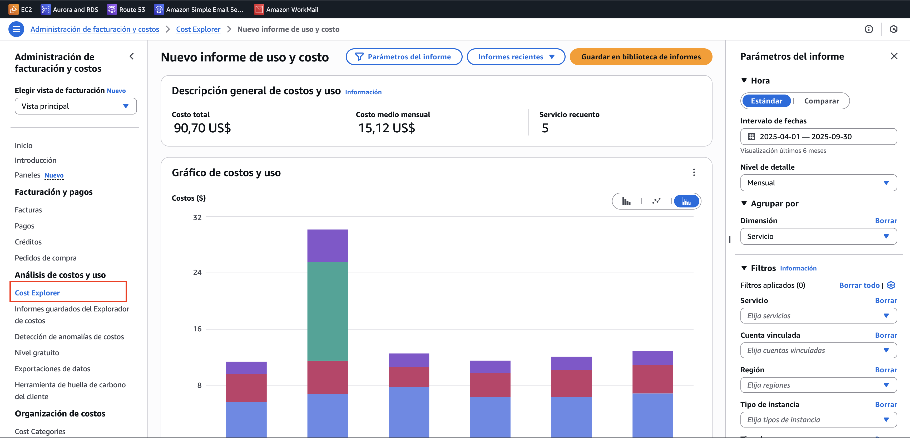

# Módulo 1 · Sesión 4

## Mejorando la Infraestructura

---

## Objetivos

1.  Aprender a **optimizar costos en AWS** mediante buenas prácticas y
    herramientas nativas.\
2.  Entender las diferencias y beneficios de **instancias reservadas** y
    **Spot**.\
3.  Conocer **estrategias de escalabilidad** para aplicaciones modernas
    en la nube.\
4.  Realizar un **caso práctico de implementación** con foco en ahorro y
    eficiencia.

---

## Contenido

1.  Optimización de costos en AWS\
2.  Uso de instancias reservadas y Spot\
3.  Estrategias de escalabilidad\
4.  Caso práctico de implementación

---

## Desarrollo de la clase

### 1) Optimización de costos en AWS

-   **Monitoreo de gastos**:
    -   Usar **AWS Cost Explorer** para analizar tendencias.
        
    -   Configurar **AWS Budgets** con alertas de sobreconsumo.
        ```
        aws budgets create-budget         --account-id 000123456789         --budget '{
            "BudgetName": "FreeTier-EC2-Usage",
            "BudgetLimit": {
                "Amount": "750",
                "Unit": "HOURS"
            },
            "TimeUnit": "MONTHLY",
            "BudgetType": "USAGE",
            "CostFilters": {
                "UsageType": ["BoxUsage:t3.micro"]
            }
        }'         --notifications-with-subscribers '[
            {
            "Notification": {
                "NotificationType": "ACTUAL",
                "ComparisonOperator": "GREATER_THAN",
                "Threshold": 80.0,
                "ThresholdType": "PERCENTAGE"
            },
            "Subscribers": [
                {
                "SubscriptionType": "EMAIL",
                "Address": "jorge.ramos.sandoval.flores@gmail.com"
                }
            ]
            }
        ]'
        ```
    -   Activar **Cost and Usage Reports** (CUR) para detalle granular.
-   **Buenas prácticas**:
    -   Apagar instancias no usadas (EC2, RDS).\
    -   Usar escalamiento automático en lugar de sobredimensionar.\
    -   Adoptar arquitecturas **serverless** (ej. Lambda, DynamoDB)
        cuando el patrón de uso sea intermitente.

---

### 2) Uso de instancias reservadas y Spot

El costo de **EC2 On-Demand** puede ser alto si se ejecutan cargas de trabajo de forma constante. Para optimizar, AWS ofrece **modelos de compra alternativos**: **Instancias Reservadas (RI)** y **Spot Instances**.

-   **2.1. Instancias Reservadas (RI)**

    -   **Qué son:**

        -   Son un compromiso de **uso garantizado** de una instancia EC2 durante **1 o 3 años**.
        -   Se paga una tarifa reducida a cambio de esa reserva.

    -   **Tipos de RI:**

        -   **Standard RI**: máximo descuento, pero menos flexibles (tipo de instancia y región fijos).
        -   **Convertible RI**: permiten cambiar atributos (ej. tipo de instancia), con menos descuento.
        -   **Scheduled RI**: para cargas de trabajo recurrentes en horarios específicos.

    -   **Beneficios:**

        -   Hasta **72% más baratas** que On-Demand.
        -   Ideales para **cargas estables y predecibles** (bases de datos, backend de aplicaciones críticas, servidores que funcionan 24/7).
        -   Permiten planificar costos a largo plazo.

    -   **Ejemplo de precios promedio (us-east-1, instancia t3.medium):**

        -   On-Demand: **$0.0416/hora** (~$30/mes).
        -   RI 1 año estándar: **$0.026/hora** (~$18/mes).
        -   RI 3 años estándar: **$0.018/hora** (~$13/mes).

        -   **Ahorro:** entre **40% y 72%**.

-   **2.2. Instancias Spot**

    -   **Qué son:**

        -   Instancias sobrantes de AWS que se subastan a muy bajo costo.
        -   Se pagan solo mientras están disponibles.

    -   **Características clave:**

        -   Hasta **90% de ahorro** comparado con On-Demand.
        -   AWS puede **reclamarlas en cualquier momento** con 2 minutos de aviso.
        -   Se pueden integrar con **Auto Scaling Groups** para reponer instancias automáticamente.

    -   **Casos de uso recomendados:**

        -   Procesamiento batch (ej. renderizado, ETL).
        -   Big Data y analítica.
        -   Entrenamiento de modelos de **Machine Learning/IA**.
        -   Pruebas y entornos no críticos.

    -   **Ejemplo de precios promedio (us-east-1, instancia t3.medium):**

        -   On-Demand: **$0.0416/hora**.
        -   Spot: **$0.008/hora** (cuando hay disponibilidad).
        -   **Ahorro:** hasta **80-90%**.

-   **2.3. Estrategia combinada**

    -   El mejor enfoque es **mezclar los tres modelos** (On-Demand, RI, Spot) para optimizar costo y resiliencia:

    -   **Base estable → Reservadas (RI)**

        -   Ejemplo: 2 instancias RDS + 2 instancias backend que siempre deben estar activas.
        -   Precio: si fueran On-Demand $120/mes → con RI a 3 años $52/mes.

    -   **Demanda variable → On-Demand**

        -   Ejemplo: instancias extra en picos de tráfico que no justifican un contrato a largo plazo.
        -   Precio: $0.0416/hora, solo cuando se usan.

    -   **Procesos tolerantes a fallos → Spot**

        -   Ejemplo: jobs de big data que pueden reiniciarse sin problema si la instancia se interrumpe.
        -   Precio: ~$0.008/hora.

    -   **Comparación de costos para 1 instancia t3.medium corriendo 24/7 (730 horas/mes):**

        -   On-Demand → **$30.37/mes**.
        -   RI 1 año → **$18.98/mes**.
        -   RI 3 años → **$13.14/mes**.
        -   Spot → **$5.84/mes** (siempre disponible).

---

### 3) Estrategias de escalabilidad

#### 3.1 Escalabilidad vertical (Scale Up)

**Idea:** aumentar recursos de una sola instancia (vCPU, RAM, IOPS).

-   **Ventajas**

    -   Muy simple de aplicar.
    -   Útil para picos puntuales o PoCs.

-   **Límites**

    -   **Tope físico** del tipo de instancia.
    -   Posible **reinicio** para aplicar cambios.
    -   Un solo punto de falla si no hay redundancia.

-   **Buenas prácticas**
    -   En RDS: subir clase de instancia y/o activar **I/O-Optimized**.
    -   En EBS: migrar a **gp3/io2** y ajustar IOPS/Throughput.
    -   Medir p95/p99 de latencia antes y después.

**Caso de uso – Base de datos OLTP con CPU al 80%**  
Un RDS PostgreSQL `db.t3.large` con picos de CPU en horario laboral.  
Acción: escalar a `db.r6g.large` (más vCPU/RAM) y mover el volumen a **gp3** con +IOPS.  
Resultado esperado: latencia de consultas p95 baja 30–40% y elimina timeouts sin tocar la app.

---

#### 3.2 Escalabilidad horizontal (Scale Out)

**Idea:** añadir más réplicas idénticas y balancear tráfico.

-   **Ventajas**

    -   **Resiliencia**: si cae una réplica, el servicio sigue.
    -   Escala **elástica y granular**.
    -   Encaja con apps **stateless** y microservicios.

-   **Retos**

    -   Desacoplar **estado** (sesiones/archivos).
    -   Idempotencia y concurrencia.

-   **Buenas prácticas**
    -   Sesión en **ElastiCache/DynamoDB**.
    -   Archivos en **S3**; no en disco local.
    -   Observa **RPS** y latencia p95 como señales de escalado.

**Caso de uso – API Node.js con picos diarios**  
Una API con 2 instancias saturadas entre 7–10 p.m.  
Acción: externalizar sesión a **ElastiCache**, mover archivos a **S3** y pasar a **4–8** réplicas pequeñas detrás de ALB.  
Resultado: latencia p95 estable aun en pico; costo controlado con réplicas Spot para picos.

---

#### 3.3 Auto Scaling Groups (ASG) para EC2

**Qué hacen:** ajustan el tamaño del grupo según **políticas, horarios o métricas**.

-   **Modos**

    -   **Target Tracking** (mantén objetivo: ej. CPU 50%).
    -   **Step Scaling** (umbrales: ej. CPU>70% +2 instancias).
    -   **Scheduled Scaling** (calendario).
    -   **Basado en colas** (ej. backlog de **SQS**).

-   **Buenas prácticas**
    -   **Mixed Instances + Spot** con estrategia _capacity-optimized_.
    -   **Warm pools** para reducir tiempo de arranque.
    -   Cooldowns para evitar “yo-yo scaling”.

**Caso de uso – Workers SQS**  
Un consumidor procesa 100 msg/minuto y el backlog crece.  
Acción: ASG con **Target Tracking** por métrica SQS (mantener ≤ 1,000 mensajes visibles). Regla simple: `desired = ceil(backlog / (msgs_por_worker*minutos))`.  
Resultado: el grupo sube y baja workers automáticamente; backlog se mantiene estable sin intervención.

---

#### 3.4 Elastic Load Balancer (ELB)

**Qué hace:** distribuye tráfico a destinos **saludables**.

-   **Tipos**

    -   **ALB** (L7): reglas por **path/host**, WebSockets, HTTP/2.
    -   **NLB** (L4): **baja latencia**, TCP/UDP/gRPC.
    -   **GWLB**: inspección con appliances.

-   **Buenas prácticas**
    -   Health checks **realistas** (no `/` si hace demasiadas dependencias).
    -   Evitar sticky sessions salvo que sea imprescindible.
    -   Monitorizar `TargetResponseTime` y `5XX`.

**Caso de uso – Ruta por servicios**  
Un e-commerce separa `/api` y `/checkout`.  
Acción: **ALB** con reglas: `/api/*` → microservicio API; `/checkout/*` → servicio de pagos. Health checks específicos por ruta.  
Resultado: aísla fallas (si falla pagos, `/api` sigue bien); escalado independiente por Target Group.

---

#### 3.5 Serverless (AWS Lambda)

**Cómo escala:** **por invocación**; sin administrar servidores.

-   **Ventajas**
    -   Pago por uso, escala automática, cero patching.
-   **Retos**

    -   **Cold starts** (mitigar con **Provisioned Concurrency**).
    -   Conexiones a RDBMS: usar **RDS Proxy**.
    -   Límites de tiempo y memoria.

-   **Buenas prácticas**
    -   **Reserved/Provisioned Concurrency** para endpoints sensibles.
    -   Colas/eventos (SQS/EventBridge) para absorber picos.
    -   Idempotencia y _retries_ configurados.

**Caso de uso – Procesamiento de imágenes**  
Se sube una imagen a S3 y dispara Lambda para generar thumbnails.  
Acción: S3 (evento `ObjectCreated`) → Lambda procesa y guarda en S3; DynamoDB registra metadatos. **Reserved Concurrency** de 20 para controlar costos.  
Resultado: escala de 0 a cientos de invocaciones durante una campaña sin provisionar servidores.

---

#### 3.6 Contenedores (ECS/EKS)

**ECS** (en **Fargate** o EC2) y **EKS** (Kubernetes) escalan **servicios/pods** y también **nodos**.

-   **ECS**

    -   **Service Auto Scaling** sobre `DesiredCount` por CPU/RAM o métricas personalizadas.
    -   **Capacity Providers** para mezclar On-Demand y Spot.
    -   En **Fargate** no gestionas servidores.

-   **EKS**

    -   **HPA** (Horizontal Pod Autoscaler) por CPU/RAM o métricas (Prometheus Adapter).
    -   **Cluster Autoscaler**/**Karpenter** para nodos bajo demanda.
    -   PDB y probes de readiness/liveness.

-   **Buenas prácticas**
    -   Definir **requests/limits** realistas.
    -   **Rolling updates** con mínimo de réplicas saludables.
    -   Métricas de negocio (RPS, latencia, backlog) como disparadores.

**Caso de uso – API en ECS Fargate**  
Un backend Java recibe picos de campañas.  
Acción: servicio ECS en **Fargate** con **Auto Scaling** por CPU objetivo 50% (mín 2, máx 20 tareas). **Capacity Provider** con 70% On-Demand y 30% Spot.  
Resultado: escala de forma transparente sin administrar nodos; ahorro por Spot en picos y estabilidad con On-Demand.

---

## Conclusiones

-   La **optimización de costos** es continua, no un paso único.\
-   Usar una **combinación inteligente** de on-demand, reservadas y Spot
    maximiza eficiencia.\
-   La **escalabilidad horizontal con ASG y ELB** es la base de sistemas
    resilientes.\
-   Un **caso práctico bien implementado** puede traducirse en grandes
    ahorros sin sacrificar rendimiento.
