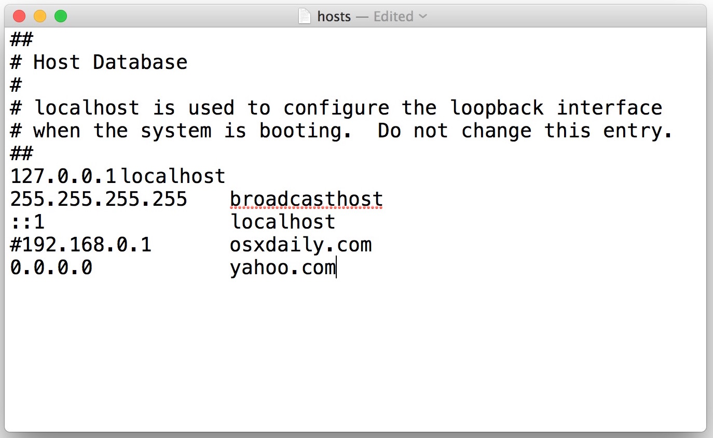
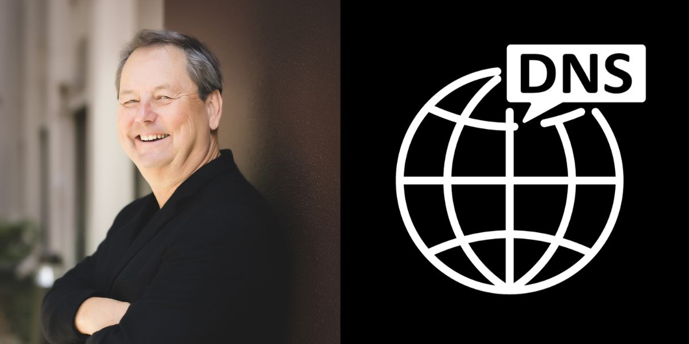
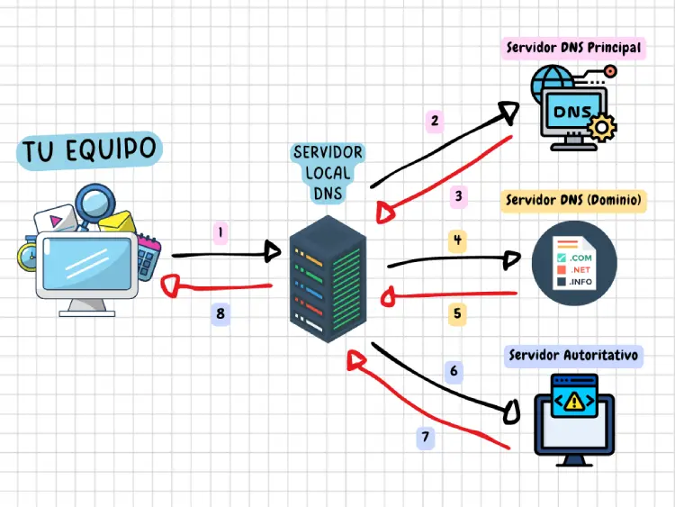
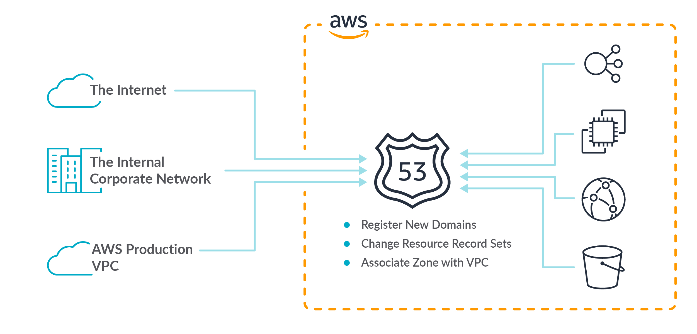
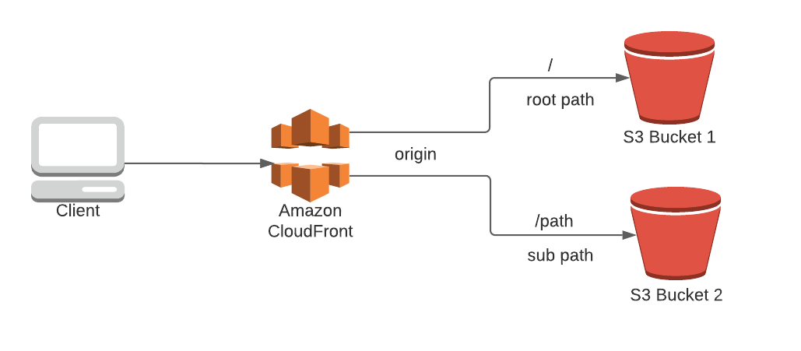

# Módulo 2 · Sesión 1

## Configuración de Route 53

---

### 1. Objetivos

1. Comprender la evolución histórica del sistema de nombres de dominio (DNS) y su impacto en la arquitectura moderna de Internet.
2. Analizar cómo AWS Route 53 gestiona la resolución DNS de forma global, escalable y segura.
3. Estudiar la integración entre Route 53, CloudFront y Certificate Manager para dominios seguros.
4. Implementar, mediante **CloudFormation**, un sitio web estático en **S3** con dominio personalizado y **HTTPS** mediante **CloudFront** y **ACM (AWS Certificate Manager)**.

---

### 2. Evolución del DNS y los dominios

#### 2.1. Los primeros días: direccionamiento por IP

En los orígenes de Internet (años 70 y 80), las máquinas se identificaban por su dirección IP.  
Ejemplo:

```
http://93.184.216.34
```

Era un enfoque técnico pero poco práctico para humanos, lo que llevó a la creación de un sistema de nombres más legible.

#### 2.2. El archivo HOSTS.TXT

Antes de que existiera el DNS, se utilizaba un archivo llamado `hosts.txt`, mantenido por el _Network Information Center (NIC)_.  
Este archivo mapeaba nombres a direcciones IP. Cada máquina lo descargaba manualmente.  
A medida que Internet crecía, esto se volvió insostenible:

-   Las actualizaciones eran lentas.
-   Existían conflictos de nombres.
-   El tráfico aumentaba exponencialmente.
    

#### 2.3. El nacimiento del DNS (1983)

En 1983, **Paul Mockapetris** propuso el **Domain Name System (DNS)**:  
Un sistema **jerárquico, distribuido y escalable**, que resolvía nombres de dominio en direcciones IP mediante una red global de servidores.

El DNS estableció una jerarquía de dominios:

```
. (raíz)
└── com
    └── amazon
        └── www
```

Cada nivel delega autoridad al siguiente mediante registros NS (Name Servers).



#### 2.4. Componentes del DNS moderno

| Componente                | Función principal                                                    |
| ------------------------- | -------------------------------------------------------------------- |
| **Resolver**              | Cliente (por ejemplo, el navegador) que inicia una consulta DNS.     |
| **Servidor recursivo**    | Recorre la jerarquía de servidores hasta obtener la respuesta.       |
| **Servidor autoritativo** | Fuente oficial de los registros DNS de un dominio.                   |
| **Zonas hospedadas**      | Conjuntos de registros administrados bajo un dominio.                |
| **Registros DNS**         | Asociaciones entre nombres y direcciones (A, AAAA, CNAME, MX, etc.). |



#### 2.5. Tipos comunes de registros

| Tipo      | Propósito                                  | Ejemplo                                 |
| --------- | ------------------------------------------ | --------------------------------------- |
| **A**     | Asocia nombre a IP IPv4                    | `www.tixgo.pe → 192.168.1.10`           |
| **AAAA**  | Asocia nombre a IP IPv6                    | `api.tixgo.pe → 2406:da1c::1`           |
| **CNAME** | Alias de otro dominio                      | `blog.tixgo.pe → www.tixgo.pe`          |
| **MX**    | Registros de correo                        | `mail.tixgo.pe → mx.google.com`         |
| **TXT**   | Texto arbitrario (verificación, SPF, DKIM) | `"v=spf1 include:_spf.google.com ~all"` |
| **NS**    | Servidores de nombres de una zona          | `ns-123.awsdns-01.com`                  |
| **SOA**   | Información de autoridad de la zona        | Contacto, número de serie, TTL, etc.    |

---

### 3. DNS en la era del cloud

Con la expansión del cloud computing, el DNS pasó de ser una herramienta estática a una **infraestructura dinámica y programable**.  
Hoy en día, los proveedores como AWS, Google y Cloudflare ofrecen servicios DNS con:

-   Alta disponibilidad global.
-   Bajísima latencia mediante _Anycast_.
-   Escalabilidad automática.
-   Integración con balanceadores, CDNs y certificados.

---

### 4. AWS Route 53: visión general

AWS lanzó **Route 53** en 2010 como un servicio de DNS gestionado, diseñado para ofrecer:

-   Escalabilidad global.
-   Monitoreo de salud de endpoints.
-   Políticas avanzadas de enrutamiento.
-   Soporte para alias hacia servicios AWS (sin costo de consulta).



#### 4.1. Conceptos clave

| Concepto           | Descripción                                                     |
| ------------------ | --------------------------------------------------------------- |
| **Hosted Zone**    | Representa un dominio y todos sus registros DNS.                |
| **Record Set**     | Registro individual dentro de una zona (A, CNAME, MX, etc.).    |
| **Alias Record**   | Enlace directo a un recurso AWS (S3, CloudFront, ELB, etc.).    |
| **Health Check**   | Verificación automática del estado de un endpoint.              |
| **Routing Policy** | Estrategia de resolución DNS (Simple, Weighted, Latency, etc.). |

#### 4.2. Políticas de enrutamiento

| Política          | Descripción                              | Caso de uso                 |
| ----------------- | ---------------------------------------- | --------------------------- |
| **Simple**        | Una sola IP o alias.                     | Sitio pequeño o API fija.   |
| **Weighted**      | Divide tráfico por porcentajes.          | Canary releases o balanceo. |
| **Failover**      | Activa un respaldo si el primario falla. | Alta disponibilidad.        |
| **Latency-based** | Envía al servidor más cercano.           | Global apps.                |
| **Geolocation**   | Basado en ubicación del cliente.         | Localización de contenido.  |

---

### 5. Registro y configuración de dominios

1. Registrar dominio (en Route 53 o un registrador externo).
2. Crear **Hosted Zone** correspondiente.
3. Configurar los **NS records** en el registrador.
4. Añadir registros A, CNAME o Alias según el tipo de recurso.

---

### 6. Integración con servicios AWS

Route 53 se integra directamente con:

-   **S3**: sitios estáticos.
-   **CloudFront**: distribución global de contenido.
-   **API Gateway**: endpoints públicos de APIs.
-   **Load Balancer (ALB/NLB)**: balanceo de tráfico.
-   **Certificate Manager (ACM)**: emisión automática de certificados SSL.

---

### 7. Caso práctico: sitio web en S3 + CloudFront + HTTPS + Route 53 (con CloudFormation)

#### Objetivo

Implementar un sitio web estático servido desde S3, distribuido globalmente mediante CloudFront y asegurado con HTTPS usando Certificate Manager, todo gestionado mediante CloudFormation.



#### 7.1. Arquitectura del despliegue

```
Usuario → CloudFront (HTTPS)
                 ↓
        S3 (sitio estático)
                 ↓
           Route 53 (DNS)
                 ↓
  ACM (certificado SSL gestionado)
```

#### 7.2. Pasos generales

1. Crear un **bucket S3** con hosting estático habilitado.
2. Generar un **certificado SSL en AWS Certificate Manager (ACM)**.
3. Crear una **distribución CloudFront** que apunte al bucket S3.
4. Configurar un registro **A (Alias)** en **Route 53** para el dominio.
5. Automatizar todo con **CloudFormation**.

#### 7.3. Plantilla `template.yaml`

```yaml
AWSTemplateFormatVersion: "2010-09-09"
Description: "Static site for usmp.identity.pe with S3 (private) + CloudFront + ACM + Route53 (alias)."

Parameters:
    HostedZoneId:
        Type: String
        Description: "Route 53 Hosted Zone ID for usmp.identity.pe"

    BucketName:
        Type: String
        Default: "usmp-identity-pe-site"
        Description: "S3 bucket name to store the static website files"

    DomainName:
        Type: String
        Default: "usmp.identity.pe"
        Description: "FQDN to serve via CloudFront"

Resources:
    WebsiteBucket:
        Type: AWS::S3::Bucket
        Properties:
            BucketName: !Ref BucketName
            OwnershipControls:
                Rules:
                    - ObjectOwnership: BucketOwnerPreferred
            PublicAccessBlockConfiguration:
                BlockPublicAcls: true
                BlockPublicPolicy: true
                IgnorePublicAcls: true
                RestrictPublicBuckets: true
            VersioningConfiguration:
                Status: Enabled
            Tags:
                - Key: Name
                  Value: !Ref BucketName

    SSLCertificate:
        Type: AWS::CertificateManager::Certificate
        Properties:
            DomainName: !Ref DomainName
            ValidationMethod: DNS
            DomainValidationOptions:
                - DomainName: !Ref DomainName
                  HostedZoneId: !Ref HostedZoneId
            Tags:
                - Key: Name
                  Value: !Sub "Cert-${DomainName}"

    CFOriginAccessControl:
        Type: AWS::CloudFront::OriginAccessControl
        Properties:
            OriginAccessControlConfig:
                Name: !Sub "oac-${DomainName}"
                Description: !Sub "OAC for ${DomainName}"
                OriginAccessControlOriginType: s3
                SigningBehavior: always
                SigningProtocol: sigv4

    CloudFrontDistribution:
        Type: AWS::CloudFront::Distribution
        Properties:
            DistributionConfig:
                Enabled: true
                DefaultRootObject: index.html
                HttpVersion: http2
                PriceClass: PriceClass_100
                Aliases:
                    - !Ref DomainName
                Origins:
                    - Id: S3Origin
                      DomainName: !GetAtt WebsiteBucket.RegionalDomainName
                      S3OriginConfig: {}
                      OriginAccessControlId: !GetAtt CFOriginAccessControl.Id
                DefaultCacheBehavior:
                    TargetOriginId: S3Origin
                    ViewerProtocolPolicy: redirect-to-https
                    AllowedMethods: [GET, HEAD]
                    CachedMethods: [GET, HEAD]
                    Compress: true
                    ForwardedValues:
                        QueryString: false
                        Cookies:
                            Forward: none
                ViewerCertificate:
                    AcmCertificateArn: !Ref SSLCertificate
                    SslSupportMethod: sni-only

    BucketPolicy:
        Type: AWS::S3::BucketPolicy
        Properties:
            Bucket: !Ref WebsiteBucket
            PolicyDocument:
                Version: "2012-10-17"
                Statement:
                    - Sid: AllowCloudFrontReadViaOAC
                      Effect: Allow
                      Principal:
                          Service: cloudfront.amazonaws.com
                      Action: ["s3:GetObject"]
                      Resource: !Sub "${WebsiteBucket.Arn}/*"
                      Condition:
                          StringEquals:
                              AWS:SourceArn: !Sub "arn:aws:cloudfront::${AWS::AccountId}:distribution/${CloudFrontDistribution}"

    DNSRecordA:
        Type: AWS::Route53::RecordSet
        Properties:
            HostedZoneId: !Ref HostedZoneId
            Name: !Ref DomainName
            Type: A
            AliasTarget:
                DNSName: !GetAtt CloudFrontDistribution.DomainName
                HostedZoneId: Z2FDTNDATAQYW2 # CloudFront global hosted zone ID

Outputs:
    SiteURL:
        Description: "HTTPS URL"
        Value: !Sub "https://${DomainName}"
    BucketToUpload:
        Description: "Upload your index.html (and assets) here"
        Value: !Ref WebsiteBucket
    DistributionDomain:
        Description: "CloudFront domain"
        Value: !GetAtt CloudFrontDistribution.DomainName
```

#### 7.4. Despliegue

```bash
aws route53 list-hosted-zones-by-name --dns-name usmp.identity.pe \
  --query "HostedZones[0].Id" --output text

aws cloudformation validate-template \
  --template-body file://template.yaml \
  --region us-east-1

aws cloudformation deploy \
  --template-file template.yaml \
  --stack-name site-usmp-identity \
  --parameter-overrides HostedZoneId=Z0361699OKD8QTDX2VYY \
  --capabilities CAPABILITY_NAMED_IAM \
  --region us-east-1

aws cloudformation describe-stacks \
  --stack-name site-usmp-identity \
  --query "Stacks[0].Outputs" --output table \
  --region us-east-1

aws s3 cp ./index.html s3://usmp-identity-pe-site/ --region us-east-1

aws cloudformation delete-stack \
  --stack-name site-usmp-identity \
  --region us-east-1
```

#### 7.5. Resultado final

-   Bucket S3 público con el sitio web.
-   Certificado SSL validado automáticamente.
-   Distribución CloudFront con HTTPS habilitado.
-   Registro DNS en Route 53 apuntando al CDN global.

---

### 8. Conclusiones

1. El DNS evolucionó de un modelo centralizado a uno distribuido esencial para Internet.
2. AWS Route 53 integra DNS, monitoreo y alias automáticos hacia servicios AWS.
3. CloudFormation permite reproducir, auditar y versionar la infraestructura DNS/CDN.
4. La combinación **S3 + CloudFront + ACM + Route 53** es ideal para sitios web estáticos globales y seguros.
