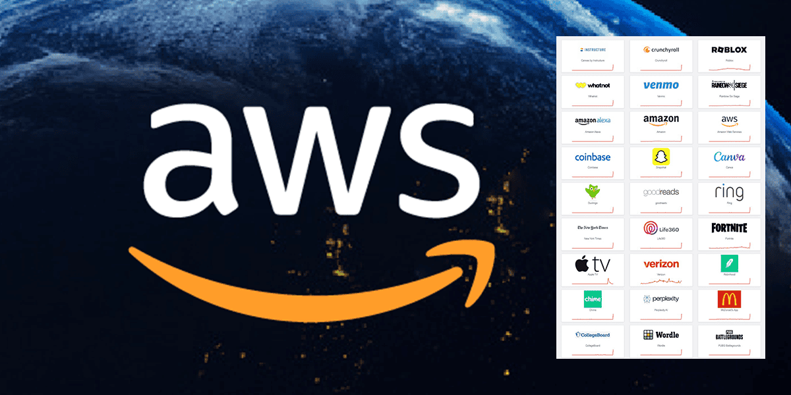
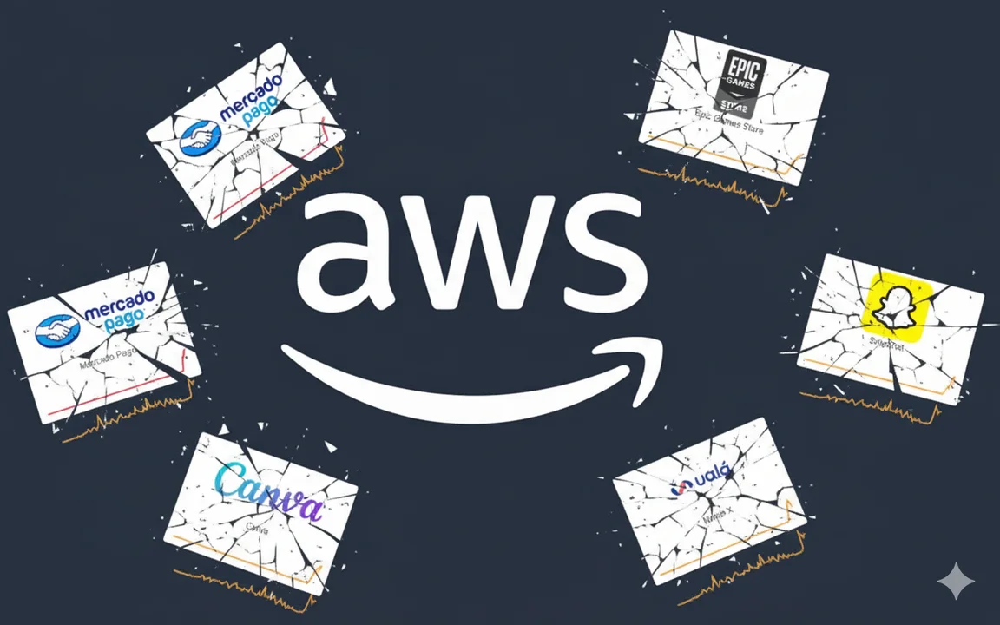
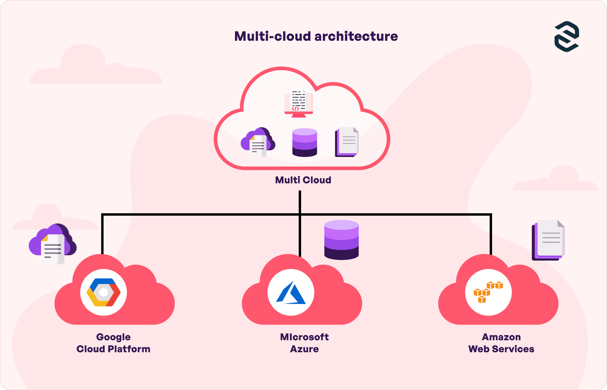
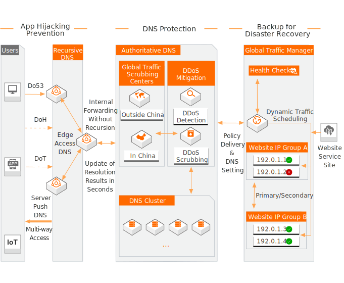

# Incidente Amazon Web Services (AWS) — 20 de octubre de 2025

## 1) Línea de tiempo

### 🕛 11:49 PM PDT (19 oct)

AWS comienza a observar **errores y latencias** en múltiples servicios.

> _Aún sin identificar la causa raíz._

### 🕐 12:51 AM PDT

Confirman que **múltiples servicios presentan fallos de API y soporte técnico (Support Center)**.

> Indica que el impacto llega hasta el plano administrativo.

### 🕜 1:26 AM PDT

Se confirma que el problema principal es con **DynamoDB API endpoint US-EAST-1**.

> El fallo en DynamoDB afecta a servicios que dependen de él (IAM, S3 control plane, Lambda).

### 🕑 2:01 AM PDT

Identifican el **posible origen**: **resolución DNS del endpoint de DynamoDB**.

> Se inician mitigaciones en paralelo.  
> La degradación de DNS interno provoca “timeouts” en toda la malla de servicios.

### 🕓 2:22 AM – 2:27 AM PDT

Aplican mitigaciones iniciales y comienzan los **primeros signos de recuperación**.

> Muchos requests aún fallan porque los clientes mantienen caché DNS corrupta.

### 🕔 3:03 AM – 3:35 AM PDT

El **problema DNS se resuelve completamente**.

> La mayoría de servicios vuelve a funcionar.  
> Persisten errores en **EC2 instance launch** y **ECS** por dependencias de DynamoDB.  
> AWS recomienda **limpiar cachés DNS locales**.

### 🕕 4:08 AM – 4:48 AM PDT

El foco se traslada a **EC2**, donde un subsistema interno no logra lanzar nuevas instancias.

> EC2, RDS, ECS y Glue dependen de este plano de lanzamiento.  
> También se observan **demoras en Lambda y SQS**.  
> AWS limita (“rate limit”) los lanzamientos para estabilizar.

### 🕖 5:10 AM – 5:48 AM PDT

-   Se **recupera el procesamiento de colas SQS vía Lambda**.
-   EC2 lanza instancias en algunas AZ, con progresos graduales.
    > _Primera evidencia de recuperación estructural._

### 🕗 6:42 AM – 7:29 AM PDT

-   Aún existen **errores elevados en lanzamientos EC2**.
-   Se detectan **problemas de red internos (connectivity issues)**.
    > Aquí el evento deja de ser de datos (Dynamo) y pasa a infraestructura (red interna).

### 🕘 8:04 AM – 8:43 AM PDT

-   AWS confirma que la falla de red proviene del **subsystem interno de Network Load Balancer (NLB)**.
-   Se **restringen nuevos lanzamientos EC2** para ayudar a la recuperación.
    > Este es el segundo “trigger” del evento, posterior al DNS.

### 🕙 9:13 AM – 10:38 AM PDT

-   Se aplican mitigaciones en el subsistema NLB.
-   Conectividad y APIs comienzan a estabilizarse.
-   **EC2** muestra signos de recuperación en varias AZ.
    > Los equipos de AWS priorizan zonas con mayor densidad de clientes.

### 🕛 11:22 AM – 12:15 PM PDT

-   Aumenta la tasa de lanzamientos EC2 exitosos.
-   **Lambda** mejora sus invocaciones, aunque algunas funciones aún fallan.
-   Se **reduce el throttling** y se normaliza el polling de SQS.
    > Empieza la etapa de “service-by-service recovery”.

### 🕐 1:03 PM – 1:52 PM PDT

-   Todos los servicios mejoran.
-   Lambda se normaliza.
-   EC2 lanza instancias en todas las AZ, pero con throttles parciales.
    > El backlog de colas SQS y Lambda se procesa lentamente.

### 🕒 2:48 PM – 3:01 PM PDT (RESOLVED)

-   Se eliminan todos los throttles.
-   EC2 y Redshift recuperan 100 %.
-   AWS Connect funciona normalmente.
-   Queda backlog en Config, Redshift y Connect que se procesa en horas siguientes.

## 2) Versión oficial (AWS)

-   AWS publica en su blog que “entre 11:49 PM PDT del 19 de octubre y 2:24 AM PDT del 20 de octubre, los servicios en US-EAST-1 experimentaron tasas elevadas de error, debido a problemas de resolución DNS para endpoints de DynamoDB”. Fuente: [AboutAmazon (AWS blog)](https://www.aboutamazon.com/news/aws/aws-service-disruptions-outage-update)
-   En el panel de estado (“AWS Health Dashboard”) se muestra el evento: “Multiple AWS services experienced network connectivity issues in the US-EAST-1 Region”. Fuente: [AWS Health Dashboard](https://health.aws.amazon.com/health/status?ts=20251020)
    

## 3) Versión no oficial (prensa / analistas)

-   El fallo pone de manifiesto la vulnerabilidad de depender en gran medida de un solo proveedor de nube. Fuente: [The Guardian](https://www.theguardian.com/technology/2025/oct/20/amazon-web-services-aws-outage-hits-dozens-websites-apps)
-   El problema técnico principal identificado: error en el DNS interno, lo cual generó fallos en cadena. Fuente: [Business Insider](https://www.businessinsider.com/dns-error-major-aws-outage-amazon-snapchat-reddit-venmo-2025-10)
-   Artículo técnico que profundiza en por qué una degradación DNS se propagó a gran escala. Fuente: [Wired](https://www.wired.com/story/what-that-huge-aws-outage-reveals-about-the-internet/)
    

## 4) Impacto en el ecosistema

-   Se vieron afectados grandes plataformas: juegos, apps de mensajería, servicios financieros, dispositivos IoT (como cámaras de seguridad) y más. Fuente: [TechRadar](https://www.techradar.com/news/live/amazon-web-services-alexa-ring-snapchat-fortnite-down-october-2025)
-   Sectores críticos (banca, salud, gobierno) reportaron interrupciones, evidenciando el alcance de la dependencia en la nube. Fuente: [eMarketer](https://www.emarketer.com/content/aws-outage-exposes-growing-fragility-cloud-economy)
    

## 5) Lecciones técnicas para arquitecturas cloud

1. El servicio DNS **no es trivial**: una falla allí puede cortar el descubrimiento de endpoints y provocar reintentos masivos.
2. Blast radius de la región US-EAST-1: cuando tus dependencias (control plane, datos críticos) están centralizadas allí, el impacto puede ser severo.
3. Diseñar para backlog y colas: después de la interrupción, muchos servicios tuvieron que procesar colas de mensajes acumulados.
4. Separar plano de control vs plano de datos, y evitar que un fallo de “management endpoint” afecte el tráfico de cliente.
   
   

## 6) ¿Por qué muchas arquitecturas híbridas/multi-cloud no mitigaron el impacto?

-   Tener web/frontend en otra nube no basta si los datos o identidad siguen en AWS y se ven afectados.
-   Replicación de datos entre nubes muchas veces es **pasiva**, con RTO/RPO que no sirven ante un fallo activo de control plane.
-   Operativa, observabilidad, secretos y colas rara vez están orquestados y probados en múltiples nubes.
-   Coste y complejidad: muchas empresas dicen “multi-cloud” pero en realidad tienen **activo-pasivo teórico**, sin drills de fail-over reales.
-   Dependencias cruzadas externas: aunque tu módulo esté en otra nube, si el proveedor de notificaciones, auth o pagos está en AWS, el fallo les llega igual.
    

## 7) Checklist de resiliencia para cargas en AWS

-   Tener **multi-región activa**: mínimo una región secundaria con datos sincronizados, no solo standby.
-   Revisar todos los puntos de dependencia (DNS interno, control plane, colas, IAM) y asegurar fallback.
-   TTL de DNS razonables y cachés de endpoints críticos con opción de fallback.
-   Diseñar “modo degradado”: por ejemplo, lectura en sólo lectura, colas locales, fallback limitado.
-   Realizar **DR drills regulares**: poner a prueba failover, rollback, cargas y latencias reales.
-   Monitorizar “dependencias de proveedor” para servicios de terceros hospedados en la nube que puedan fallar.
-   Incluir en los SLAs internos la posibilidad de degradación severa de un proveedor nube y el impacto en negocio.

---

### Preguntas para discusión en clase

1. ¿Cuáles son los riesgos de tener toda tu infraestructura crítica en una sola región de nube?
2. En una arquitectura híbrida (on-premises + nube) ¿cómo garantizarías que un fallo en la nube no afecte los procesos on-premises esenciales?
3. ¿Qué significa hoy “multi-cloud útil” vs “multi-cloud de marketing”?
4. ¿Qué métricas de negocio (SLO, SLA) deberían revisarse tras un incidente de esta magnitud?
5. ¿Cómo diseñarías un plan de recuperación post-incidente para minimizar el backlog y volver a operación normal más rápido?

---

> **Fuentes clave:**
>
> -   [The Verge: Major AWS outage took down Fortnite, Alexa, Snapchat, and more](https://www.theverge.com/news/802486/aws-outage-alexa-fortnite-snapchat-offline)
> -   [The Guardian: Amazon Web Services outage shows internet users 'at mercy' of too few providers](https://www.theguardian.com/technology/2025/oct/20/amazon-web-services-aws-outage-hits-dozens-websites-apps)
> -   [Reuters: Amazon says AWS cloud service back to normal after outage disrupts businesses worldwide](https://www.reuters.com/business/retail-consumer/amazons-cloud-unit-reports-outage-several-websites-down-2025-10-20/)
> -   [AWS blog: Update – AWS services operating normally](https://www.aboutamazon.com/news/aws/aws-service-disruptions-outage-update)
