# Módulo 2 · Sesión 4

## Distribución de Contenido con CloudFront

---

## Objetivos

1. Comprender los **conceptos de CDN** y sus beneficios en disponibilidad, rendimiento y costos.
2. Configurar **distribuciones** y entender los **orígenes** (S3/ALB/API).
3. Aplicar **estrategias de caching** (TTL, headers, invalidaciones) y **optimización** (compresión, políticas).
4. **Desplegar por IaC**: VPC + S3 Gateway Endpoint + Bucket seguro + EC2 con Role, y **exponer URLs vía capa de “cloudfrontend”** en el backend.
5. Monitorear y **resolver problemas** con métricas, logs y WAF/Shield.

---

## Contenido de la clase

1. Conceptos de CDN y beneficios
2. Arquitectura de AWS CloudFront
3. Tipos de orígenes (S3, EC2/ALB, API Gateway, Custom)
4. Control de caching: TTL, invalidaciones y headers
5. Seguridad y acceso (OAC/OAI, signed URLs/cookies)
6. Monitoreo y troubleshooting (CloudWatch, Access/Real-Time Logs, WAF)
7. **Laboratorio**: VPC + S3 Gateway Endpoint + S3 Bucket (BPA/SSE/Versioning/CORS) + EC2 con Role + **capa “cloudfrontend”** en backend (NestJS)

---

## Desarrollo del contenido

### 1) Conceptos de CDN y beneficios

-   **CDN**: red global de nodos (PoP) que sirven contenido desde el **edge** cercano al usuario.
-   Beneficios: **latencia baja**, **alivia el origen**, **alta disponibilidad**, **seguridad** (TLS, WAF), **menores costos** (menos egress desde origen).

---

### 2) Arquitectura de AWS CloudFront

-   **Distribución**: define orígenes, políticas de caché y seguridad.
-   **Orígenes**: S3 (estático), ALB/EC2 (dinámico), API Gateway (serverless), Custom (externo).
-   **Edge Locations**: PoP que cachean objetos según TTL y headers.
    

---

### 3) Tipos de orígenes

| Origen          | Caso típico                     | Nota                                |
| --------------- | ------------------------------- | ----------------------------------- |
| **S3**          | Sitios estáticos, assets, media | Ideal con **OAC** y bloqueo público |
| **ALB/EC2**     | Web dinámica, SSR, APIs         | Control granular de headers/cache   |
| **API Gateway** | APIs serverless                 | Integración nativa con auth y WAF   |
| **Custom**      | Servidores fuera de AWS         | Útil en migraciones o híbrido       |

---

### 4) Control de caching

-   **TTL** (Min/Default/Max) en la Behavior.
-   **Headers de control** desde el origen: `Cache-Control`, `ETag`, `Expires`.
-   **Invalidaciones** para forzar refresco (`/index.html`, `/assets/*`).
-   **Compresión** (Gzip/Brotli), **object versioning** para “cache-busting”.

---

### 5) Seguridad y acceso

-   **OAC (recomendado)**: acceso privado de CloudFront al bucket con condición `AWS:SourceArn` (distribución).
-   **Firmas** (signed URLs/cookies) para contenido restringido.
-   **WAF/Shield**: reglas de capa 7 y protección DDoS.

---

### 6) Monitoreo y troubleshooting

-   **CloudWatch**: `4xxErrorRate`, `5xxErrorRate`, latencia, bytes.
-   **Access Logs** y **Real-Time Logs**: auditoría, antifraude.
-   **Análisis de cabeceras**: hit/miss, vary headers, compresión.
-   **WAF logs**: reglas que bloquean tráfico legítimo.

---

### 7) Laboratorio (IaC + Backend): VPC + S3 Gateway Endpoint + S3 Bucket seguro + EC2 con Role + capa “cloudfrontend” (NestJS)

#### 7.1. Objetivo del lab

-   Desplegar **red + almacenamiento** por CloudFormation:
    -   **VPC** con dos subnets públicas
    -   **Gateway VPC Endpoint a S3** (tráfico privado a S3)
    -   **Bucket S3** con **BPA**, **SSE (AES-256)**, **Versioning**, **CORS**, **Lifecycle**
    -   **EC2** con **IAM Role** para acceso privado a S3
-   Consumir S3 desde un backend **NestJS** usando **rol IAM (sin credenciales)**.
-   Exponer **URLs “cloudfrontend”** (dominio CDN/base pública) desde el servicio S3 del backend, manteniendo presignados S3 cuando aplique.

> Nota: Este lab **no crea la distribución CloudFront**. La “capa cloudfrontend” es **parametrizable** en el backend (variable de entorno). Puedes conectar **cualquier CDN/CloudFront** luego y el backend emitirá URLs con ese dominio automáticamente.

---

#### 7.2. CloudFormation – `template.yml`

Usa **exactamente** este template (el que indicaste), que crea VPC, subnets, ruta pública, **Gateway Endpoint S3**, bucket endurecido y EC2 con role:

```yaml
AWSTemplateFormatVersion: "2010-09-09"
Description: "VPC + S3 Gateway Endpoint + S3 Bucket (BPA, SSE, Versioning, CORS) + EC2 con Role para acceso privado a S3 - DEMO CLASS"

Parameters:
    VpcCidr:
        Type: String
        Default: 10.0.0.0/16
        Description: CIDR para la VPC
    PublicSubnet1Cidr:
        Type: String
        Default: 10.0.1.0/24
    PublicSubnet2Cidr:
        Type: String
        Default: 10.0.2.0/24
    AllowedSSH:
        Type: String
        Default: 0.0.0.0/0
        Description: CIDR para SSH (restringe a tu IP en producción)
    KeyPairName:
        Type: AWS::EC2::KeyPair::KeyName
        Description: Nombre del KeyPair para la EC2
    BucketName:
        Type: String
        Default: ""
        Description: (Opcional) Nombre del bucket. Si vacío, se genera con el ID del stack.
    AllowedOrigins:
        Type: CommaDelimitedList
        Default: "http://localhost:3000,http://localhost:5173,http://test-s3.usmp.identity.pe"
        Description: Orígenes permitidos para CORS
    InstanceType:
        Type: String
        Default: t3.micro
        AllowedValues:
            - t3.micro
        Description: Tipo de instancia

Mappings:
    RegionMap:
        us-east-1:
            AL2023: "ami-0b72821e2f351e396"
        us-east-2:
            AL2023: "ami-0a4121235da23f3aa"
        us-west-2:
            AL2023: "ami-013168dc3850ef002"

Conditions:
    HasBucketName: !Not [!Equals [!Ref BucketName, ""]]

Resources:
    VPC:
        Type: AWS::EC2::VPC
        Properties:
            CidrBlock: !Ref VpcCidr
            EnableDnsHostnames: true
            EnableDnsSupport: true
            Tags: [{ Key: Name, Value: !Sub "${AWS::StackName}-vpc" }]

    IGW:
        Type: AWS::EC2::InternetGateway
        Properties:
            Tags: [{ Key: Name, Value: !Sub "${AWS::StackName}-igw" }]

    VPCGatewayAttachment:
        Type: AWS::EC2::VPCGatewayAttachment
        Properties:
            InternetGatewayId: !Ref IGW
            VpcId: !Ref VPC

    PublicSubnet1:
        Type: AWS::EC2::Subnet
        Properties:
            VpcId: !Ref VPC
            CidrBlock: !Ref PublicSubnet1Cidr
            MapPublicIpOnLaunch: true
            AvailabilityZone: !Select [0, !GetAZs ""]
            Tags: [{ Key: Name, Value: !Sub "${AWS::StackName}-public-1" }]

    PublicSubnet2:
        Type: AWS::EC2::Subnet
        Properties:
            VpcId: !Ref VPC
            CidrBlock: !Ref PublicSubnet2Cidr
            MapPublicIpOnLaunch: true
            AvailabilityZone: !Select [1, !GetAZs ""]
            Tags: [{ Key: Name, Value: !Sub "${AWS::StackName}-public-2" }]

    PublicRouteTable:
        Type: AWS::EC2::RouteTable
        Properties:
            VpcId: !Ref VPC
            Tags: [{ Key: Name, Value: !Sub "${AWS::StackName}-public-rt" }]

    PublicRoute:
        Type: AWS::EC2::Route
        DependsOn: VPCGatewayAttachment
        Properties:
            RouteTableId: !Ref PublicRouteTable
            DestinationCidrBlock: 0.0.0.0/0
            GatewayId: !Ref IGW

    PublicSubnet1RouteTableAssociation:
        Type: AWS::EC2::SubnetRouteTableAssociation
        Properties:
            SubnetId: !Ref PublicSubnet1
            RouteTableId: !Ref PublicRouteTable

    PublicSubnet2RouteTableAssociation:
        Type: AWS::EC2::SubnetRouteTableAssociation
        Properties:
            SubnetId: !Ref PublicSubnet2
            RouteTableId: !Ref PublicRouteTable

    # Gateway Endpoint para S3 (rutas privadas a S3)
    S3GatewayEndpoint:
        Type: AWS::EC2::VPCEndpoint
        Properties:
            VpcId: !Ref VPC
            ServiceName: !Sub "com.amazonaws.${AWS::Region}.s3"
            RouteTableIds: [!Ref PublicRouteTable]
            VpcEndpointType: Gateway
            PolicyDocument:
                Version: "2012-10-17"
                Statement:
                    - Sid: AllowAllS3FromVpc
                      Effect: Allow
                      Principal: "*"
                      Action: ["s3:*"]
                      Resource: ["*"]

    S3Bucket:
        Type: AWS::S3::Bucket
        Properties:
            BucketName:
                !If [
                    HasBucketName,
                    !Ref BucketName,
                    !Sub "${AWS::StackName}-${AWS::AccountId}-${AWS::Region}",
                ]
            PublicAccessBlockConfiguration:
                BlockPublicAcls: true
                IgnorePublicAcls: true
                BlockPublicPolicy: true
                RestrictPublicBuckets: true
            VersioningConfiguration:
                Status: Enabled
            BucketEncryption:
                ServerSideEncryptionConfiguration:
                    - ServerSideEncryptionByDefault:
                          SSEAlgorithm: AES256
            CorsConfiguration:
                CorsRules:
                    - AllowedHeaders: ["*"]
                      AllowedMethods: ["GET", "PUT", "POST", "DELETE", "HEAD"]
                      AllowedOrigins: !Ref AllowedOrigins
                      ExposedHeaders: ["ETag", "x-amz-request-id", "x-amz-id-2"]
                      MaxAge: 3000
            LifecycleConfiguration:
                Rules:
                    - Id: TransitionToIA
                      Status: Enabled
                      Transitions:
                          - StorageClass: STANDARD_IA
                            TransitionInDays: 30
        # CAMBIO IMPORTANTE: Permite la eliminación del bucket
        DeletionPolicy: Delete

    S3BucketPolicy:
        Type: AWS::S3::BucketPolicy
        Properties:
            Bucket: !Ref S3Bucket
            PolicyDocument:
                Version: "2012-10-17"
                Statement:
                    # POLÍTICA SIMPLIFICADA - Permisos completos para el rol EC2
                    - Sid: AllowFullS3Access
                      Effect: Allow
                      Principal:
                          AWS: !GetAtt Ec2Role.Arn
                      Action: "s3:*"
                      Resource:
                          - !Sub "arn:aws:s3:::${S3Bucket}"
                          - !Sub "arn:aws:s3:::${S3Bucket}/*"

    Ec2SecurityGroup:
        Type: AWS::EC2::SecurityGroup
        Properties:
            GroupDescription: Permitir SSH y HTTP
            VpcId: !Ref VPC
            SecurityGroupIngress:
                - IpProtocol: tcp
                  FromPort: 22
                  ToPort: 22
                  CidrIp: !Ref AllowedSSH
                - IpProtocol: tcp
                  FromPort: 3000
                  ToPort: 3000
                  CidrIp: 0.0.0.0/0
                - IpProtocol: tcp
                  FromPort: 80
                  ToPort: 80
                  CidrIp: 0.0.0.0/0
            Tags: [{ Key: Name, Value: !Sub "${AWS::StackName}-sg" }]

    Ec2Role:
        Type: AWS::IAM::Role
        Properties:
            AssumeRolePolicyDocument:
                Version: "2012-10-17"
                Statement:
                    - Effect: Allow
                      Principal:
                          Service: [ec2.amazonaws.com]
                      Action: ["sts:AssumeRole"]
            Path: "/"
            Policies:
                - PolicyName: S3FullAccess
                  PolicyDocument:
                      Version: "2012-10-17"
                      Statement:
                          - Effect: Allow
                            Action: "s3:*"
                            Resource: "*"
            Tags: [{ Key: Name, Value: !Sub "${AWS::StackName}-role" }]

    Ec2InstanceProfile:
        Type: AWS::IAM::InstanceProfile
        Properties:
            Path: "/"
            Roles: [!Ref Ec2Role]

    Ec2Instance:
        Type: AWS::EC2::Instance
        Properties:
            ImageId: !FindInMap [RegionMap, !Ref "AWS::Region", AL2023]
            InstanceType: !Ref InstanceType
            IamInstanceProfile: !Ref Ec2InstanceProfile
            KeyName: !Ref KeyPairName
            SubnetId: !Ref PublicSubnet1
            SecurityGroupIds: [!Ref Ec2SecurityGroup]
            Tags: [{ Key: Name, Value: !Sub "${AWS::StackName}-ec2" }]

Outputs:
    BucketNameOut:
        Description: Nombre del bucket S3
        Value: !Ref S3Bucket
        Export:
            Name: !Sub "${AWS::StackName}-bucket-name"
    Ec2PublicIp:
        Description: IP pública de la instancia
        Value: !GetAtt Ec2Instance.PublicIp
    VpcId:
        Description: ID de la VPC
        Value: !Ref VPC
    S3VpceId:
        Description: ID del Gateway VPC Endpoint de S3
        Value: !Ref S3GatewayEndpoint
    Ec2RoleArn:
        Description: ARN del rol de la EC2 con permisos completos de S3
        Value: !GetAtt Ec2Role.Arn
```

**Despliegue:**

```bash
aws cloudformation deploy \
  --template-file template.yml \
  --stack-name s3-vpc-endpoint-demo \
  --parameter-overrides KeyPairName=MI_KEYPAIR \
  --capabilities CAPABILITY_NAMED_IAM
```

> Nota: Aunque `DeletionPolicy: Delete` permite borrar el bucket con el stack, **debe estar vacío**. Si no, vacíalo con `aws s3 rm s3://<bucket> --recursive`.

---

#### 7.3. Backend (NestJS): Servicio S3 con “capa cloudfrontend”

Variables sugeridas en `.env`:

```env
AWS_REGION=us-east-1
AWS_S3_BUCKET_NAME=<nombre-del-bucket>
CLOUDFRONT_BASE_URL=https://dxxxxxxx.cloudfront.net   # opcional; si no existe, se usa S3
```

**Código (`s3.service.ts`)**: basado en tu implementación, con la “capa cloudfrontend”.

```ts
import { Injectable } from "@nestjs/common";
import { ConfigService } from "@nestjs/config";
import {
    S3Client,
    PutObjectCommand,
    GetObjectCommand,
    DeleteObjectCommand,
    ListObjectsV2Command,
} from "@aws-sdk/client-s3";
import { getSignedUrl } from "@aws-sdk/s3-request-presigner";

export type UploadedFile = {
    originalname: string;
    mimetype: string;
    size: number;
    buffer: Buffer;
};

export type S3File = {
    key: string;
    url: string;
    size: number;
    mimetype: string;
    lastModified?: Date;
};

export type PresignedUrlResponse = {
    url: string;
    key: string;
    expiresIn: number;
};

@Injectable()
export class S3Service {
    private readonly s3Client: S3Client;
    private readonly bucketName: string;
    private readonly region: string;
    private readonly cdnBaseUrl?: string;

    constructor(private configService: ConfigService) {
        this.bucketName =
            this.configService.get<string>("AWS_S3_BUCKET_NAME") ?? "";
        this.region =
            this.configService.get<string>("AWS_REGION") || "us-east-1";
        this.cdnBaseUrl =
            this.configService.get<string>("CLOUDFRONT_BASE_URL") || undefined;

        // Credenciales implícitas via IAM Role (EC2/ECS/EKS) — SIN claves
        this.s3Client = new S3Client({ region: this.region });
    }

    /** Construye la URL pública usando CDN si está configurado, de lo contrario S3 regional. */
    private buildPublicUrl(key: string): string {
        if (this.cdnBaseUrl) {
            // Asegurar que no queden dobles slashes
            return `${this.cdnBaseUrl.replace(/\/+$/, "")}/${key.replace(
                /^\/+/,
                ""
            )}`;
        }
        return `https://${this.bucketName}.s3.${this.region}.amazonaws.com/${key}`;
    }

    async uploadFile(file: UploadedFile, folder?: string): Promise<S3File> {
        const key = folder
            ? `${folder}/${Date.now()}-${file.originalname}`
            : `${Date.now()}-${file.originalname}`;

        const put = new PutObjectCommand({
            Bucket: this.bucketName,
            Key: key,
            Body: file.buffer,
            ContentType: file.mimetype,
            Metadata: {
                originalName: file.originalname,
                uploadedAt: new Date().toISOString(),
            },
        });

        await this.s3Client.send(put);

        return {
            key,
            url: this.buildPublicUrl(key),
            size: file.size,
            mimetype: file.mimetype,
        };
    }

    async uploadMultipleFiles(
        files: UploadedFile[],
        folder?: string
    ): Promise<S3File[]> {
        return Promise.all(files.map((f) => this.uploadFile(f, folder)));
    }

    async generatePresignedUrl(
        key: string,
        expiresIn = 3600
    ): Promise<PresignedUrlResponse> {
        const get = new GetObjectCommand({ Bucket: this.bucketName, Key: key });
        const url = await getSignedUrl(this.s3Client, get, { expiresIn });
        return { url, key, expiresIn };
        // Nota: si necesitas presignados “vía CloudFront”, debes implementar Signed URLs/Cookies.
    }

    async generateUploadPresignedUrl(
        key: string,
        contentType: string,
        expiresIn = 3600
    ): Promise<PresignedUrlResponse> {
        const put = new PutObjectCommand({
            Bucket: this.bucketName,
            Key: key,
            ContentType: contentType,
        });
        const url = await getSignedUrl(this.s3Client, put, { expiresIn });
        return { url, key, expiresIn };
    }

    async deleteFile(key: string): Promise<void> {
        const del = new DeleteObjectCommand({
            Bucket: this.bucketName,
            Key: key,
        });
        await this.s3Client.send(del);
    }

    async listFiles(prefix?: string): Promise<S3File[]> {
        const list = new ListObjectsV2Command({
            Bucket: this.bucketName,
            Prefix: prefix,
        });
        const res = await this.s3Client.send(list);
        if (!res.Contents) return [];
        return res.Contents.map((o) => ({
            key: o.Key!,
            url: this.buildPublicUrl(o.Key!),
            size: o.Size || 0,
            mimetype: "unknown",
            lastModified: o.LastModified,
        }));
    }

    async getFile(key: string): Promise<Buffer> {
        const get = new GetObjectCommand({ Bucket: this.bucketName, Key: key });
        const res = await this.s3Client.send(get);
        if (!res.Body) throw new Error("File not found");
        return Buffer.from(await res.Body.transformToByteArray());
    }
}
```

**Puntos clave de la “capa cloudfrontend”:**

-   **No obliga** a tener ya CloudFront: si `CLOUDFRONT_BASE_URL` no está definida, las URLs siguen siendo **S3 regionales**.
-   Cuando configures tu distribución y mapees tu **dominio CDN**, basta con setear la env var y **sin cambiar código** empezarás a emitir **URLs CDN**.
-   Para **contenido privado bajo CDN**, usa **Signed URLs/Signed Cookies** de CloudFront y/o **OAC** para acceso privado al bucket (no cubierto en este lab por el alcance acordado).

---

#### 7.4. Probar conectividad privada (desde EC2)

1. Conectarse por SSH a la EC2 (usa la IP de `Ec2PublicIp` de los outputs).
2. Instalar AWS CLI (si no está) y subir/leer objetos sin salir a Internet (vía **Gateway Endpoint**):

```bash
aws s3 cp /etc/hostname s3://$BUCKET/health/hostname.txt
aws s3 ls s3://$BUCKET/health/
```

3. Desde tu **backend** (corriendo en esa EC2 o donde tengas rol/credenciales), subir archivos y verificar que las **URLs devueltas** usen **CLOUDFRONT_BASE_URL** si la definiste.

---

## Troubleshooting (rápido)

| Síntoma                  | Causa                               | Acción                                          |
| ------------------------ | ----------------------------------- | ----------------------------------------------- |
| 403 al leer objeto       | Bucket bloquea público y no hay CDN | Usa URL presignada o monta OAC + CloudFront     |
| No sale por VPC Endpoint | Ruta no asociada a la RT correcta   | Verifica `RouteTableIds` del VPCE y subnets     |
| No borra stack           | Bucket con objetos                  | `aws s3 rm s3://BUCKET --recursive` y reintenta |
| CORS bloquea desde front | Orígenes no listados                | Agrega origen al parámetro `AllowedOrigins`     |
| Las URLs no usan CDN     | Falta `CLOUDFRONT_BASE_URL`         | Define la env var sin slash final               |

---

## Conclusiones

-   CloudFront acelera la entrega y agrega controles de seguridad.
-   El **Gateway Endpoint S3** permite **tráfico privado** desde la VPC hacia S3.
-   **Roles IAM** en EC2 simplifican el acceso a S3 sin credenciales.
-   La **“capa cloudfrontend” en backend** desacopla la **generación de URLs** del proveedor CDN: habilita CloudFront cuando quieras sin tocar el código.

```bash
export AWS_REGION=us-east-1
export STACK_NAME=curso-s3-ec2
export KEY_NAME=pem-usmp

aws cloudformation deploy \
  --template-file template.yaml \
  --stack-name $STACK_NAME \
  --capabilities CAPABILITY_NAMED_IAM \
  --parameter-overrides KeyPairName=$KEY_NAME AllowedSSH=0.0.0.0/0 \
  --region $AWS_REGION

aws cloudformation describe-stacks \
  --stack-name $STACK_NAME \
  --query "Stacks[0].Outputs" --output table --region $AWS_REGION

# Eliminar stack
aws cloudformation delete-stack --stack-name curso-s3-ec2 --region us-east-1
aws cloudformation describe-stacks --stack-name curso-s3-ec2 --region us-east-1
```
