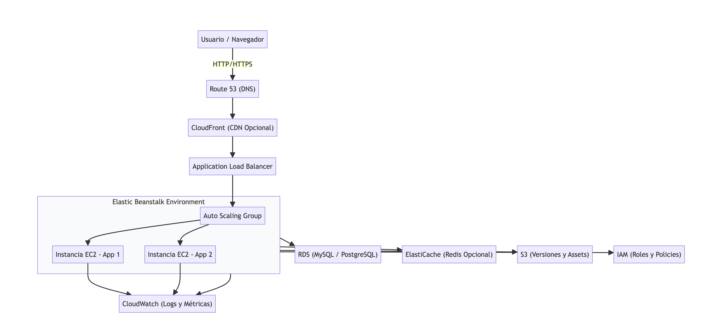

# Módulo 03 · Sesión 02 — Despliegue de Backend con Elastic Beanstalk (NestJS con pnpm)

## Objetivos

1. Entender Elastic Beanstalk (EB) como PaaS para Node.js.
2. Desplegar un backend **NestJS** en un entorno **dev** de EB usando **pnpm**.
3. Configurar variables por entorno con `.ebextensions` o `eb setenv`.
4. Escalar y monitorear desde EB/CloudWatch.
5. Replicar a **prd** cambiando únicamente nombres/valores (sin pasos nuevos).

## Contenido

1. Introducción breve y casos de uso de Elastic Beanstalk
2. Despliegue de aplicaciones Node.js/Java/Python (enfocado en NestJS con pnpm)
3. Paso a paso: creación y despliegue del entorno DEV
4. Configuración y administración del entorno DEV
5. Cómo replicar a PRD cambiando solo nombres/valores
6. Opcional: CI/CD con GitHub Actions
7. Resumen operativo

---

## Desarrollo del contenido

### 1) Introducción breve y casos de uso

**Elastic Beanstalk** orquesta EC2, Auto Scaling Group, ALB, logs, health checks y versiones. Entregas tu código y EB lo ejecuta con la plataforma **Node.js**.  
Casos típicos:

-   API REST de NestJS con picos de tráfico.
-   Multiambiente `dev` y `prd` con versiones independientes.
-   Migración de servidores manuales a una PaaS administrada con rollback rápido.

---

### 2) Despliegue de aplicaciones Node.js/Java/Python (enfocado en Node/NestJS con pnpm)

EB soporta **Node.js**, **Java** y **Python**. Aquí desplegamos **NestJS** usando **pnpm**.

**Prerrequisitos locales**

```bash
# EB CLI
pip install --upgrade awsebcli

# Configurar credenciales AWS
aws configure

# pnpm
npm i -g pnpm@9

# Crear proyecto NestJS (o usar uno existente)
pnpm dlx @nestjs/cli new backend-nest
cd backend-nest
```

**Ajustes mínimos en NestJS**

-   Escuchar el puerto de EB y en `0.0.0.0`.
-   Scripts de arranque con build previo.
-   Forzar uso de `pnpm` en EB con `.ebextensions`.

`src/main.ts`

```ts
// Código en inglés; comentarios en español.
import { NestFactory } from "@nestjs/core";
import { AppModule } from "./app.module";

async function bootstrap() {
    // EB provee PORT por variable de entorno; usar 0.0.0.0 para exponer el servidor.
    const app = await NestFactory.create(AppModule);
    const port = process.env.PORT ? Number(process.env.PORT) : 3000;
    await app.listen(port, "0.0.0.0");
}
bootstrap();
```

`package.json` (fragmento relevante)

```json
{
    "name": "backend-nest",
    "private": true,
    "type": "module",
    "engines": { "node": ">=18 <23" },
    "scripts": {
        "build": "nest build",
        "start": "node dist/main.js",
        "start:prod": "node dist/main.js",
        "prestart": "pnpm run build"
    },
    "packageManager": "pnpm@9.0.0"
}
```

---

### 3) Paso a paso: creación y despliegue del entorno DEV (con ARBOL DE CARPETAS Y ARCHIVOS)

#### 3.1 Estructura base del proyecto (antes de EB)

```
backend-nest/
├─ src/
│  ├─ app.controller.ts
│  ├─ app.module.ts
│  ├─ app.service.ts
│  └─ main.ts
├─ test/
├─ .gitignore
├─ nest-cli.json
├─ package.json
├─ pnpm-lock.yaml
├─ tsconfig.build.json
└─ tsconfig.json
```

#### 3.2 Archivos que **DEBES CREAR** para EB (y dónde colocarlos)

**1) `.ebignore` (en la raíz)**

```
# backend-nest/.ebignore
.git
node_modules
test
coverage
dist/**/*.map
Dockerfile
docs
*.log
```

**2) `Procfile` (en la raíz)**

```
# backend-nest/Procfile
web: pnpm start
```

**3) Carpeta `.ebextensions/` (en la raíz) con dos archivos:**

-   `00-pnpm-install.config`

    ```yaml
    # backend-nest/.ebextensions/00-pnpm-install.config
    commands:
        01_install_pnpm:
            command: "npm install -g pnpm@9.0.0"
        02_install_dependencies:
            command: "pnpm install --frozen-lockfile"
    ```

-   `01-env.config`
    ```yaml
    # backend-nest/.ebextensions/01-env.config
    option_settings:
        aws:elasticbeanstalk:application:environment:
            NODE_ENV: development
            APP_NAME: backend-nest
    ```

**Resultado esperado:**

```
backend-nest/
├─ .ebextensions/
│  ├─ 00-pnpm-install.config
│  └─ 01-env.config
├─ src/
│  ├─ app.controller.ts
│  ├─ app.module.ts
│  ├─ app.service.ts
│  └─ main.ts
├─ .ebignore
├─ Procfile
├─ package.json
├─ pnpm-lock.yaml
├─ tsconfig.build.json
└─ tsconfig.json
```

#### 3.3 Inicializar Elastic Beanstalk

```bash
eb init
# Región: us-east-1
# Plataforma: Node.js
# Application name: backend-nest-app
```

#### 3.4 Crear el entorno DEV

```bash
eb create backend-nest-dev   --instance_type t3.micro   --single   --envvars NODE_ENV=development,APP_NAME=backend-nest
```

#### 3.5 Verificar estado y abrir URL

```bash
eb status
eb open
```

#### 3.6 Desplegar cambios

```bash
git add .
git commit -m "feat: first deploy dev"
eb deploy
```

#### 3.7 Logs y estado

```bash
eb logs --all
eb health
```

---

### 4) Configuración y administración del entorno DEV

**Variables de entorno**

```bash
eb setenv NODE_ENV=development API_URL=https://api-dev.example.com
```

O desde la consola de EB → Configuration → Software → Environment Properties.

**Escalado**

-   Mantener 1 instancia: `--single` o Capacity Min=1, Max=1.
-   Escalar a prueba: Min=1, Max=2.

**Monitoreo**

-   Revisar métricas en la pestaña **Monitoring**.
-   Conectar **CloudWatch Logs** desde Configuration → Logs.

---

### 5) Cómo replicar a PRD cambiando solo nombres/valores

-   **Environment name**: `backend-nest-prd`
-   **Variables**: `NODE_ENV=production`
-   **Capacidad**: sin `--single`, con autoscaling.

```bash
eb create backend-nest-prd   --instance_type t3.medium   --envvars NODE_ENV=production,APP_NAME=backend-nest   --scale 2
eb deploy backend-nest-prd
```

Cambiar entre entornos:

```bash
eb use backend-nest-dev
eb use backend-nest-prd
```

---

### 6) Opcional: CI/CD con GitHub Actions (pnpm)

```yaml
name: Deploy to Elastic Beanstalk
on:
    push:
        branches: ["main"]
jobs:
    deploy:
        runs-on: ubuntu-latest
        steps:
            - name: Checkout
              uses: actions/checkout@v4

            - name: Use Node
              uses: actions/setup-node@v4
              with:
                  node-version: "20"

            - name: Install pnpm
              run: npm install -g pnpm@9.0.0

            - name: Install dependencies
              run: pnpm install --frozen-lockfile

            - name: Build
              run: pnpm run build

            - name: Zip artifact
              run: |
                  zip -r dist.zip . -x ".git/*" "node_modules/*" "test/*" "coverage/*"

            - name: Deploy to EB
              uses: einaregilsson/beanstalk-deploy@v21
              with:
                  aws_access_key: ${{ secrets.AWS_ACCESS_KEY_ID }}
                  aws_secret_key: ${{ secrets.AWS_SECRET_ACCESS_KEY }}
                  application_name: backend-nest-app
                  environment_name: backend-nest-dev
                  region: us-east-1
                  version_label: build-${{ github.run_number }}
                  deployment_package: dist.zip
```

---

### 7) Resumen operativo

-   Archivos clave: `.ebextensions`, `.ebignore`, `Procfile`.
-   `dev`: `t3.micro`, `--single`, `NODE_ENV=development`.
-   `eb deploy` y `eb logs` para iterar.
-   Replicar a `prd` cambiando nombres/variables y capacidad.
-   Misma estructura de carpetas y archivos.


