# Módulo 2 · Sesión 3 — Gestión de Bases de Datos con RDS

## Objetivos

-   Comprender qué es Amazon RDS, su historia, casos de uso y modelos de precios básicos.
-   Configurar RDS (MySQL/PostgreSQL) con buenas prácticas de disponibilidad y seguridad.
-   Diseñar políticas de backups y replicación (Single-AZ vs Multi-AZ, snapshots, PITR).
-   Conectar un backend (EC2) de forma segura a una base de datos en subred privada.

## Contenido

1. Configuración de RDS con MySQL y PostgreSQL
2. Backups automáticos y replicación
3. Optimización y seguridad (red, cifrado, acceso)
4. Conexión del backend con RDS
5. Demo: `template-cloudformation.yml` (VPC, subredes, RDS privado, EC2 público)

---

## Desarrollo de los temas

### 1) Configuración de RDS con MySQL y PostgreSQL

**¿Qué es RDS?** Servicio administrado para bases relacionales (MySQL, PostgreSQL, MariaDB, Oracle, SQL Server y Aurora): AWS gestiona parches, backups, failover y escalado de cómputo/almacenamiento. Lanzado originalmente en 2009 (inició con MySQL; PostgreSQL llegó en 2013).

**Casos de uso típicos**

-   Apps web y móviles con patrones OLTP.
-   Migración lift-and-shift desde on-premise sin administrar motor/OS.
-   Multi-AZ para HA sin reescribir la app.

**Precios de referencia (on-demand, us-east-1, solo para orientación)**

-   **Instancias**: se cobra por hora según familia/size y engine.
-   **Almacenamiento**: GB-mes (gp3/gp2/provisioned IOPS).
-   **Backups**: hasta el **100%** del tamaño de tu DB incluidos (automated backups); extra desde **~$0.095/GB-mes** (varía por región).

| Concepto            |                                                                                             RDS MySQL |   RDS PostgreSQL | Nota                                       |
| ------------------- | ----------------------------------------------------------------------------------------------------: | ---------------: | ------------------------------------------ |
| Cálculo (on-demand) |                                                               Depende de clase (db.t3/db.t4g/db.m7g…) | Depende de clase | Ver tablas oficiales por instancia/engine. |
| Almacenamiento gp3  |                                                                                              $/GB-mes |         $/GB-mes | Similar entre engines (varía por región).  |
| Backup adicional    |                                                                                        ~$0.095/GB-mes |   ~$0.095/GB-mes | Después de exceder 100% del tamaño de DB.  |
| Free Tier           | 750 h/mes instancias single-AZ selectas + 20 GB de storage y 20 GB de backups por 12 meses (elegible) |             Idem | Sujeto a condiciones y fecha de alta.      |

> Revisa el pricing exacto en tu región antes de decidir tamaños/clases. Los valores cambian con el tiempo.

**Single-AZ vs Multi-AZ**

-   **Single-AZ**: un nodo; menor costo; downtime en mantenimiento/fallos.
-   **Multi-AZ (DB instance)**: 1 standby en AZ distinta, failover automático; el standby **no** sirve lecturas.
-   **Multi-AZ (DB cluster)**: 2 standbys que **sí** pueden servir lecturas y mejor latencia de commit (hasta ~2×).

**Notas de compatibilidad/soporte**  
Planifica upgrades y fin de soporte por versión (Extended Support aplica cargos).

---

### 2) Backups automáticos y replicación

-   **Backups automáticos (Automated Backups)**: ventanas diarias + **Point-In-Time Recovery (PITR)** según periodo de retención (1–35 días). Hasta el tamaño de la DB sin costo adicional; excedente se cobra por GB-mes.
-   **Snapshots manuales**: persistentes hasta que los borres; útiles para **golden images**, migraciones y pre-release checkpoints.
-   **Replicación**:
    -   **Multi-AZ** (sin cambios en la app) para HA.
    -   **Read Replicas** (PostgreSQL/MySQL) para escalar lectura y aislar ETLs/reportes; promueve a primario en DR.
-   **AWS Backup** (opcional) para gobernanza central, vaults con políticas y cross-region.

---

### 3) Estrategias de optimización y seguridad

**Arquitectura y red**

-   RDS **en subred privada**; acceso solo desde **SG del backend**.
-   EC2/containers en pública o privada con **NAT**; jamás exponer RDS a Internet.
-   **DB Subnet Group** debe incluir **≥2 subredes en ≥2 AZ** (requisito de RDS, incluso en Single-AZ).
-   **Multi-AZ** incrementa durabilidad/disponibilidad (failover AZ).

**Cifrado y secretos**

-   **At-rest** con **KMS**; **in-transit** con TLS.
-   Gestionar credenciales con **Secrets Manager** o **SSM Parameter Store**.
-   Rotación de contraseñas/tokens programada.

**Performance**

-   Elegir clase **burstable** (t4g/t3) para dev; **m7g/r7g** para prod con carga sostenida.
-   **gp3** con IOPS/throughput ajustables; considerar **PIOPS** para write-heavy.
-   Ajustar **autovacuum** (Postgres), buffers y pool (RDS Proxy) para conexiones efímeras.

**Gobernanza & costos**

-   Limita el período de retención si no necesitas 35 días.
-   Programa ventanas de mantenimiento.
-   Alerta por métricas (CPU, FreeStorage, ReplicaLag) y eventos RDS.

---

### 4) Conexión del backend con RDS

-   Conecta desde EC2/containers usando **endpoint DNS** de RDS, puerto 3306 (MySQL) o 5432 (Postgres).
-   **Security Groups**: abre **solo** desde el SG del backend.
-   Usa **drivers** oficiales (mysql2/pg) y pools (p. ej., `pg.Pool`, `mysql2` pool).
-   Variables vía **SSM/Secrets** y **systemd/EnvFile** o **ECS task env**; jamás commitear secretos.

---

## 5) Demo — `template-cloudformation.yml`

> Nota importante: **RDS exige un DB Subnet Group con al menos 2 subredes en distintas AZ**. Tu pedido original incluía “1 pública + 1 privada”; para que el stack sea válido y productivo, incluí **2 subredes privadas** (mínimo necesario) y **1 pública**. Mantiene el espíritu del ejercicio (EC2 público ↔ RDS privado) y respeta el requisito de RDS.

Copia y pega el siguiente archivo como `template-cloudformation.yml`:

```yaml
AWSTemplateFormatVersion: "2010-09-09"
Description: "VPC + Subnets + RDS (MySQL/PostgreSQL) en privado + EC2 Amazon Linux 2023 en público"

Parameters:
    ProjectName:
        Type: String
        Default: rds-class
    VpcCidr:
        Type: String
        Default: 10.0.0.0/16
    PublicSubnetCidr:
        Type: String
        Default: 10.0.1.0/24
    PrivateSubnet1Cidr:
        Type: String
        Default: 10.0.2.0/24
    PrivateSubnet2Cidr:
        Type: String
        Default: 10.0.3.0/24
    AllowedSSH:
        Type: String
        Default: 0.0.0.0/0
        Description: "Restringe a tu IP pública para producción (x.x.x.x/32)"
    DBEngine:
        Type: String
        AllowedValues: [mysql, postgres]
        Default: postgres
    DBEngineVersion:
        Type: String
        Default: "15" # ejemplo, valida contra versions disponibles en tu región
    DBUsername:
        Type: String
        Default: app_user
    DBPassword:
        Type: String
        NoEcho: true
        MinLength: 8
        Description: "Usa Secrets Manager en producción"
    DBAllocatedStorage:
        Type: Number
        Default: 20
    DBInstanceClass:
        Type: String
        Default: db.t4g.micro
    MultiAZ:
        Type: String
        AllowedValues: ["true", "false"]
        Default: "false"

Mappings:
    EngineMap:
        mysql:
            Port: "3306"
            Family: "mysql8.0"
        postgres:
            Port: "5432"
            Family: "postgres15"

Resources:
    VPC:
        Type: AWS::EC2::VPC
        Properties:
            CidrBlock: !Ref VpcCidr
            EnableDnsHostnames: true
            EnableDnsSupport: true
            Tags: [{ Key: Name, Value: !Sub "${ProjectName}-vpc" }]

    IGW:
        Type: AWS::EC2::InternetGateway
        Properties:
            Tags: [{ Key: Name, Value: !Sub "${ProjectName}-igw" }]

    AttachIgw:
        Type: AWS::EC2::VPCGatewayAttachment
        Properties:
            InternetGatewayId: !Ref IGW
            VpcId: !Ref VPC

    PublicSubnet:
        Type: AWS::EC2::Subnet
        Properties:
            VpcId: !Ref VPC
            CidrBlock: !Ref PublicSubnetCidr
            MapPublicIpOnLaunch: true
            AvailabilityZone: !Select [0, !GetAZs ""]
            Tags: [{ Key: Name, Value: !Sub "${ProjectName}-public-a" }]

    PrivateSubnet1:
        Type: AWS::EC2::Subnet
        Properties:
            VpcId: !Ref VPC
            CidrBlock: !Ref PrivateSubnet1Cidr
            AvailabilityZone: !Select [0, !GetAZs ""]
            Tags: [{ Key: Name, Value: !Sub "${ProjectName}-private-a" }]

    PrivateSubnet2:
        Type: AWS::EC2::Subnet
        Properties:
            VpcId: !Ref VPC
            CidrBlock: !Ref PrivateSubnet2Cidr
            AvailabilityZone: !Select [1, !GetAZs ""]
            Tags: [{ Key: Name, Value: !Sub "${ProjectName}-private-b" }]

    PublicRT:
        Type: AWS::EC2::RouteTable
        Properties:
            VpcId: !Ref VPC
            Tags: [{ Key: Name, Value: !Sub "${ProjectName}-public-rt" }]

    PublicRoute:
        Type: AWS::EC2::Route
        Properties:
            RouteTableId: !Ref PublicRT
            DestinationCidrBlock: 0.0.0.0/0
            GatewayId: !Ref IGW

    PublicRTAssoc:
        Type: AWS::EC2::SubnetRouteTableAssociation
        Properties:
            SubnetId: !Ref PublicSubnet
            RouteTableId: !Ref PublicRT

    SGEC2:
        Type: AWS::EC2::SecurityGroup
        Properties:
            GroupDescription: "Acceso público a EC2 (22,80,443,3000)"
            VpcId: !Ref VPC
            SecurityGroupIngress:
                - {
                      IpProtocol: tcp,
                      FromPort: 22,
                      ToPort: 22,
                      CidrIp: !Ref AllowedSSH,
                  }
                - {
                      IpProtocol: tcp,
                      FromPort: 80,
                      ToPort: 80,
                      CidrIp: "0.0.0.0/0",
                  }
                - {
                      IpProtocol: tcp,
                      FromPort: 443,
                      ToPort: 443,
                      CidrIp: "0.0.0.0/0",
                  }
                - {
                      IpProtocol: tcp,
                      FromPort: 3000,
                      ToPort: 3000,
                      CidrIp: "0.0.0.0/0",
                  }
            Tags: [{ Key: Name, Value: !Sub "${ProjectName}-sg-ec2" }]

    SGRDS:
        Type: AWS::EC2::SecurityGroup
        Properties:
            GroupDescription: "Permite solo tráfico DB desde SGEC2"
            VpcId: !Ref VPC
            SecurityGroupIngress:
                - IpProtocol: tcp
                  FromPort: !FindInMap [EngineMap, !Ref DBEngine, Port]
                  ToPort: !FindInMap [EngineMap, !Ref DBEngine, Port]
                  SourceSecurityGroupId: !Ref SGEC2
            Tags: [{ Key: Name, Value: !Sub "${ProjectName}-sg-rds" }]

    DBSubnetGroup:
        Type: AWS::RDS::DBSubnetGroup
        Properties:
            DBSubnetGroupDescription: "Subredes privadas para RDS"
            SubnetIds: [!Ref PrivateSubnet1, !Ref PrivateSubnet2]
            Tags: [{ Key: Name, Value: !Sub "${ProjectName}-dbsubnet" }]

    RDSInstance:
        Type: AWS::RDS::DBInstance
        Properties:
            DBInstanceIdentifier: !Sub "${ProjectName}-${DBEngine}"
            Engine: !Ref DBEngine
            EngineVersion: !Ref DBEngineVersion
            MasterUsername: !Ref DBUsername
            MasterUserPassword: !Ref DBPassword
            AllocatedStorage: !Ref DBAllocatedStorage
            DBInstanceClass: !Ref DBInstanceClass
            StorageType: gp3
            PubliclyAccessible: false
            MultiAZ: !Ref MultiAZ
            VPCSecurityGroups: [!Ref SGRDS]
            DBSubnetGroupName: !Ref DBSubnetGroup
            DeletionProtection: false
            BackupRetentionPeriod: 7
            AutoMinorVersionUpgrade: true
            CopyTagsToSnapshot: true
            EnableIAMDatabaseAuthentication: false
            Tags:
                - { Key: Name, Value: !Sub "${ProjectName}-rds" }

    EC2Role:
        Type: AWS::IAM::Role
        Properties:
            AssumeRolePolicyDocument:
                Version: "2012-10-17"
                Statement:
                    - Effect: Allow
                      Principal: { Service: ec2.amazonaws.com }
                      Action: sts:AssumeRole
            ManagedPolicyArns:
                - arn:aws:iam::aws:policy/AmazonSSMManagedInstanceCore
            Tags: [{ Key: Name, Value: !Sub "${ProjectName}-ec2-role" }]

    EC2InstanceProfile:
        Type: AWS::IAM::InstanceProfile
        Properties:
            Roles: [!Ref EC2Role]

    EC2Instance:
        Type: AWS::EC2::Instance
        Properties:
            IamInstanceProfile: !Ref EC2InstanceProfile
            ImageId:
                {
                    {
                        resolve:ssm:/aws/service/ami-amazon-linux-latest/al2023-ami-kernel-default-x86_64,
                    },
                }
            InstanceType: t3.micro
            SubnetId: !Ref PublicSubnet
            SecurityGroupIds: [!Ref SGEC2]
            Tags: [{ Key: Name, Value: !Sub "${ProjectName}-ec2" }]

Outputs:
    VpcId:
        Value: !Ref VPC
    EC2PublicIp:
        Value: !GetAtt EC2Instance.PublicIp
    RDSEndpoint:
        Value: !GetAtt RDSInstance.Endpoint.Address
    DBPort:
        Value: !FindInMap [EngineMap, !Ref DBEngine, Port]
```



**Cómo probar (pasos rápidos)**

1. Lanza el stack en tu región (S3 + CloudFormation o consola).
2. Conéctate a la EC2 (ideal: **SSM Session Manager**).
3. Verifica el endpoint RDS: `cat /etc/motd`.
4. Con cliente:
    - Postgres: `psql -h <endpoint> -U app_user -p 5432 postgres`
    - MySQL: `mysql -h <endpoint> -u app_user -p -P 3306`
5. Asegúrate de que la SG de RDS **solo** permite el SG de EC2.

---

## Recomendaciones finales

-   **Prod**: Multi-AZ, cifrado KMS, Secrets Manager, SGs estrictas, backups ≥7 días, métricas/alarms.
-   **Costos**: dimensiona por carga real; gp3 con IOPS configurables; apaga entornos dev fuera de horario.
-   **Mantenibilidad**: define ventanas de mantenimiento y flujos de upgrade (menor downtime con Multi-AZ/Proxy).

## Despliegue

-   Paso 1: Preparar el Template: Guarda el template como rds-redis-infrastructure.yml

-   Paso 2: Crear el Stack con AWS CLI

```
aws cloudformation create-stack \
  --stack-name rds-redis-lab \
  --template-body file://template-cloudformation.yml \
  --parameters \
    ParameterKey=ProjectName,ParameterValue=app-evently \
    ParameterKey=KeyName,ParameterValue=pem-usmp \
    ParameterKey=DBUsername,ParameterValue=app_user \
    ParameterKey=DBPassword,ParameterValue=MiPassword123! \
    ParameterKey=DBName,ParameterValue=db_app_evently \
    ParameterKey=DBEngine,ParameterValue=mysql \
    ParameterKey=DBEngineVersion,ParameterValue=8.0.44 \
    ParameterKey=AllowedSSH,ParameterValue=179.6.46.25/32 \
  --capabilities CAPABILITY_IAM
```

-   Paso 3: Monitorear el Despliegue

```
# Ver estado del stack
aws cloudformation describe-stacks --stack-name rds-redis-lab

# Ver eventos del despliegue
aws cloudformation describe-stack-events --stack-name rds-redis-lab

# Esperar a que termine (opcional)
aws cloudformation wait stack-create-complete --stack-name rds-redis-lab

aws cloudformation delete-stack --stack-name rds-redis-lab
aws cloudformation wait stack-delete-complete --stack-name rds-redis-lab
```

-   Paso 4: Verificar los Outputs

```
# Obtener outputs del stack
aws cloudformation describe-stacks --stack-name rds-redis-lab --query "Stacks[0].Outputs"
```
