# Módulo 03 · Sesión 04 — Monitoreo y Gestión de Eventos

## Objetivos

-   Comprender lo importante que es el monitoreo, caso de uso reales y por qué CloudWatch.
-   Entender la relevancia de las alarmas y logs a nivel de monitoreo y negocio sin transgredir la seguridad.
-   Profundizar en AWS X-Ray y sus casos de uso reales.
-   Conocer las opciones de automatización de respuestas ante eventos en AWS y los escenarios más comunes donde se aplican.

---

## Contenido

1. Monitoreo de servicios con CloudWatch
2. Creación de alarmas y logs
3. AWS X-Ray para trazabilidad
4. Automatización de respuestas ante eventos

---

# Desarrollo de los temas

## 1) Monitoreo de servicios con CloudWatch

El monitoreo es la capacidad de observar en tiempo real el comportamiento de los servicios y recursos de un sistema. En AWS es especialmente crítico porque la infraestructura es elástica y distribuida: existen decenas o cientos de componentes comunicándose entre sí. Un incidente puede comenzar en un recurso pequeño (latencia del RDS, saturación de red, timeout con un proveedor externo) y escalar al fallo completo de un servicio.

CloudWatch es el servicio nativo de observabilidad de AWS. Permite recolectar métricas automáticas de cualquier servicio, sin agentes adicionales. Esto incluye CPU, memoria, red y disco de EC2; conexiones, storage y performance de RDS; requests, latencia y errores de API Gateway; estado y eventos de Lambda; y métricas de contenedores. CloudWatch es la base para entender cualquier anomalía.

### Ejemplo real

Tu backend NestJS en Elastic Beanstalk empieza a responder en 5–7 segundos. Las métricas de CloudWatch muestran CPU normal, memoria estable, latencia del ELB alta y ReadIOPS de MySQL disparado. La conclusión es que el cuello de botella estaba en la base de datos, no en el backend.

### Ejemplo de Dashboard con CloudFormation

```yaml
Resources:
    CWBasicDashboard:
        Type: AWS::CloudWatch::Dashboard
        Properties:
            DashboardName: DemoDashboard
            DashboardBody: !Sub |
                {
                  "widgets": [
                    {
                      "type": "metric",
                      "properties": {
                        "metrics": [
                          [ "AWS/EC2", "CPUUtilization", "InstanceId", "${EC2Instance}" ]
                        ],
                        "title": "CPU EC2 Backend"
                      }
                    }
                  ]
                }
```


---

## 2) Creación de alarmas y logs

Las alarmas permiten transformar un sistema pasivo en uno reactivo. No esperas que el usuario reporte una falla: el sistema te avisa —o actúa— antes de que ocurra daño. Se debe monitorear CPU alta, errores 5xx, latencias elevadas, conexiones de RDS, uso de memoria en Redis, mensajes pendientes en SQS, etc.

Los logs son la evidencia textual de lo que realmente pasó. Permiten entender flujos, identificar errores, revisar patrones de uso y auditar procesos. Deben gestionarse sin comprometer datos sensibles: nada de contraseñas, tokens completos o tarjetas.

### Ejemplo de Alarma en CloudFormation

```yaml
Resources:
    HighCPUAlarm:
        Type: AWS::CloudWatch::Alarm
        Properties:
            AlarmName: "HighCPUAlarm"
            MetricName: "CPUUtilization"
            Namespace: "AWS/EC2"
            Statistic: "Average"
            Period: 60
            EvaluationPeriods: 2
            Threshold: 80
            ComparisonOperator: "GreaterThanThreshold"
            AlarmActions:
                - !Ref SNSTopic
            Dimensions:
                - Name: InstanceId
                  Value: !Ref EC2Instance
```



---

## 3) AWS X-Ray para trazabilidad

X-Ray permite analizar el recorrido completo de una petición: Usuario → API Gateway → Lambda/Beanstalk → Base de datos → Servicio externo → Respuesta. Esto permite ver cuánto demoró cada paso, dónde ocurrió la latencia, si falló un microservicio o si hubo un problema externo.

### Casos de uso reales

-   Un endpoint demora 3 segundos: X-Ray muestra que el backend tarda 50ms, pero el servicio externo tarda 2.9s.
-   Un flujo de microservicios (auth → billing → notifications) muestra exactamente cuál servicio es más lento.

### CloudFormation para activar X-Ray

```yaml
Resources:
    XRayBeanstalkOptionSetting:
        Type: AWS::ElasticBeanstalk::Environment
        Properties:
            OptionSettings:
                - Namespace: aws:elasticbeanstalk:xray
                  OptionName: XRayEnabled
                  Value: true
```



---

## 4) Automatización de respuestas ante eventos

El objetivo final del monitoreo no es solo ver lo que pasa, sino responder automáticamente cuando algo peligra. Las combinaciones típicas son:

CloudWatch Alarm → SNS  
CloudWatch Alarm → EventBridge → Lambda  
EventBridge → SSM Automation  
EventBridge → Step Functions

### Ejemplo: Reinicio automático de una instancia congelada

```yaml
Resources:
    CPUStuckAlarm:
        Type: AWS::CloudWatch::Alarm
        Properties:
            AlarmName: "LowCPU-Instance-Stuck"
            MetricName: "CPUUtilization"
            Namespace: "AWS/EC2"
            Statistic: "Average"
            Period: 300
            EvaluationPeriods: 3
            Threshold: 5
            ComparisonOperator: "LessThanThreshold"
            AlarmActions:
                - !Ref RebootInstanceLambda

    RebootInstanceLambda:
        Type: AWS::Lambda::Function
        Properties:
            Handler: index.handler
            Runtime: nodejs18.x
            Role: !Ref LambdaRole
            Code:
                ZipFile: |
                    exports.handler = async () => {
                      const AWS = require("aws-sdk");
                      const ec2 = new AWS.EC2();
                      await ec2.rebootInstances({ InstanceIds: ["i-123456"] }).promise();
                    };
```


### Ejemplo real

En una ticketera, CloudWatch detecta error rate > 10%, latency > 2s y CPU al 90%. EventBridge ejecuta automáticamente una Lambda que aumenta el autoscaling, notifica al equipo y registra todo en CloudWatch Logs.

```
# Crear un bucket único (cambia el nombre)
0.1. AWS_ACCOUNT_ID=$(aws sts get-caller-identity --query Account --output text)
0.2. S3_BUCKET="monitoring-demo-${AWS_ACCOUNT_ID}"

0.3. aws s3 mb s3://$S3_BUCKET
0.4. aws s3 cp monitoring-demo.zip s3://$S3_BUCKET/


# 1. Desplegar Beanstalk
aws cloudformation deploy \
    --template-file cloudformation/beanstalk.yaml \
    --stack-name monitoring-demo-beanstalk \
    --parameter-overrides \
        SourceS3Bucket=monitoring-demo-905418316214 \
        SourceS3Key=monitoring-demo.zip \
    --capabilities CAPABILITY_IAM

# 2. Desplegar Dashboard
aws cloudformation deploy \
    --template-file cloudformation/dashboard.yaml \
    --stack-name monitoring-demo-dashboard \
    --parameter-overrides \
        EnvironmentName=monitoring-demo-env \
        ApplicationName=monitoring-demo-app

# 3. Desplegar Alarmas
aws cloudformation deploy \
    --template-file cloudformation/alarms.yaml \
    --stack-name monitoring-demo-alarms \
    --parameter-overrides \
        EnvironmentName=monitoring-demo-env \
        NotificationEmail=jorge.ramos.sandoval.flores@gmail.com

APP_URL="http://monitoring-demo-env.eba-qiegdp8z.us-east-1.elasticbeanstalk.com"; echo "🚨 Generando condiciones para probar alarmas..."; echo "❌ Generando errores..."; for i in {1..15}; do curl -s "$APP_URL/api/monitoring/error" > /dev/null; echo "Error $i generado"; sleep 10; done; echo "🐌 Generando alta latencia..."; curl -s "$APP_URL/api/monitoring/high-latency?delay=4000"; echo " - Latencia generada"; echo "🔥 Generando CPU spike..."; curl -s "$APP_URL/api/monitoring/cpu-spike?duration=10000"; echo " - CPU spike generado"; echo "💾 Generando memory leak..."; curl -s "$APP_URL/api/monitoring/memory-leak?iterations=8"; echo " - Memory leak generado"; echo ""; echo "📊 Verificando alarmas..."; aws cloudwatch describe-alarms --alarm-name-prefix "monitoring-demo-env" --query 'MetricAlarms[*].[AlarmName,StateValue]' --output table

# 4. Desplegar Logs
aws cloudformation deploy \
    --template-file cloudformation/logs.yaml \
    --stack-name monitoring-demo-logs
```
