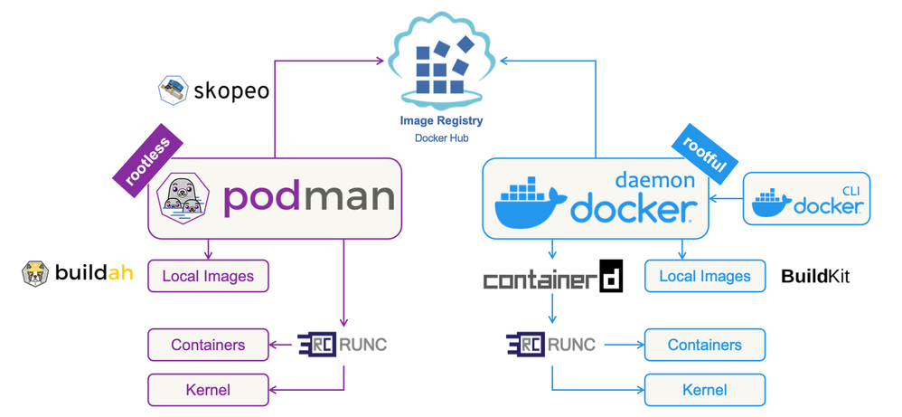
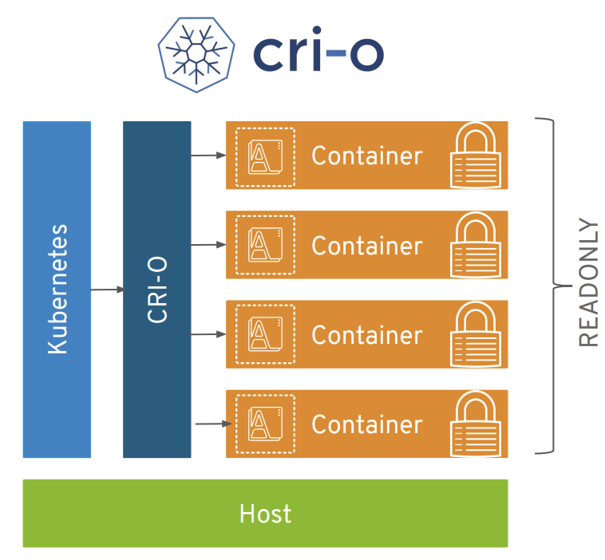
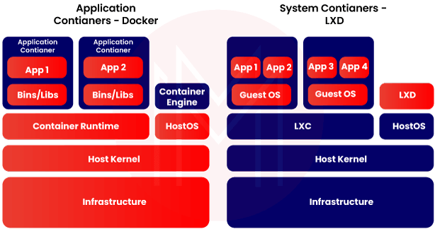
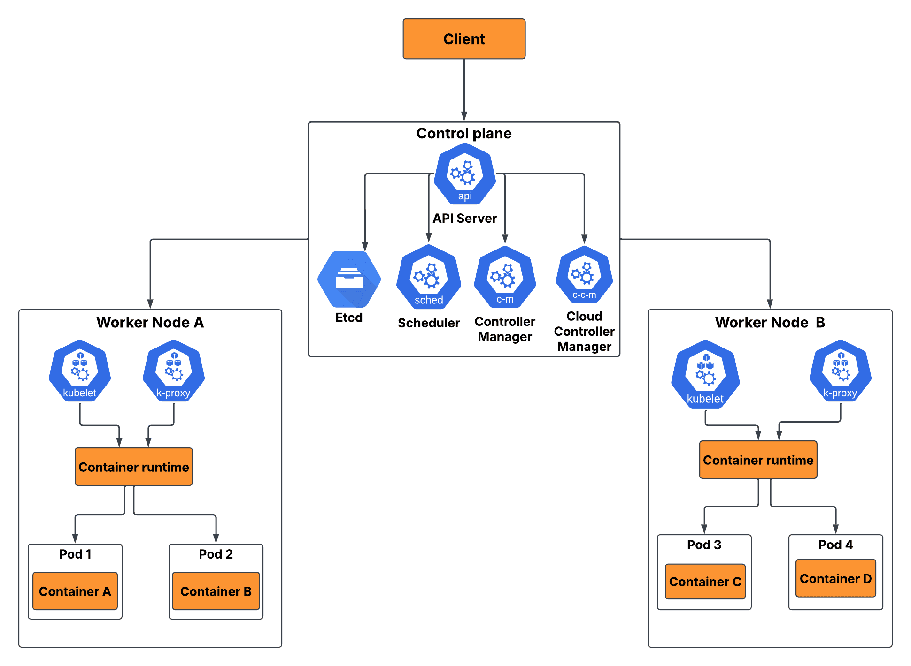
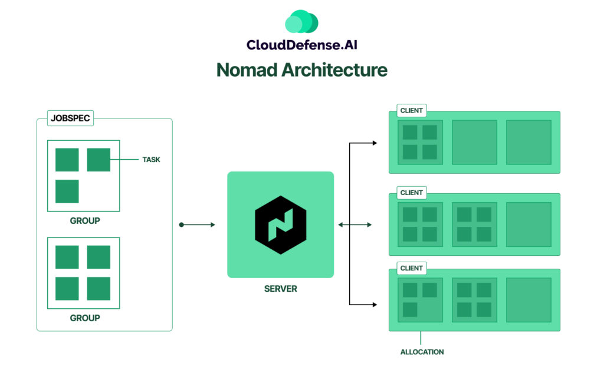

# Módulo 04 · Sesión 01 — Contenedores y Orquestación

## Contenedores en AWS con Docker, ECS y Fargate

## Objetivos de la sesión

Al finalizar esta sesión, el estudiante será capaz de:

1. Comprender la tecnología de contenerización, su importancia y el rol de Docker.
2. Evaluar alternativas de contenerización y su aplicabilidad en entornos AWS.
3. Explicar la arquitectura de ECS y comparar Fargate con otras soluciones de orquestación dentro y fuera de AWS.
4. Definir correctamente Task Definitions y Services en ECS.
5. Implementar un flujo completo de despliegue de contenedores hacia AWS.
6. Configurar monitoreo básico de contenedores usando CloudWatch.

## Contenido

1. Uso de Docker en AWS
2. Implementación de ECS y Fargate
3. Definición de tareas y servicios
4. Monitoreo de contenedores

# 1) Uso de Docker en AWS

## 1.1 ¿Qué es la contenerización?

La contenerización es un modelo para empaquetar aplicaciones junto con:

-   Dependencias
-   Librerías
-   Configuraciones
-   Runtime
-   Sistema base mínimo

El objetivo es garantizar que la aplicación se ejecute exactamente igual sin importar:

-   Máquina del desarrollador
-   Servidor local
-   Pipeline de CI/CD
-   Entorno cloud como AWS ECS, EKS o Lambda

Ventajas clave

-   Arranque ultrarrápido
-   Tamaño reducido (MB en lugar de GB)
-   Portabilidad multiplataforma
-   Escalabilidad inmediata
-   Aislamiento controlado
-   Simplificación del despliegue

### Comparación contenedor vs máquina virtual

| Aspecto       | Contenedores | Máquinas virtuales |
| ------------- | ------------ | ------------------ |
| Arranque      | Milisegundos | Segundos/minutos   |
| Peso          | MB           | GB                 |
| Kernel        | Compartido   | Independiente      |
| Aislamiento   | Medio/alto   | Alto               |
| Escalabilidad | Inmediata    | Lenta              |
| Gestión       | Sencilla     | Compleja           |

## 1.2 ¿Por qué Docker?

Docker se convirtió en estándar por diversas razones:

-   CLI muy simple
-   Dockerfile como estándar de empaquetado
-   Docker Hub como repositorio universal
-   Portabilidad garantizada
-   Integración con CI/CD y plataformas cloud

## 1.3 Alternativas a Docker

-   Podman

    -   Compatible con la CLI de Docker
    -   No requiere daemon
    -   Mayor enfoque en seguridad

    

-   containerd

    -   Runtime oficial usado en Kubernetes
    -   Ligero y rápido
    -   No incluye CLI de usuario

    

-   CRI-O

    -   Runtime especializado en Kubernetes
    -   Integración completa con CRI
    -   Muy minimalista

    

-   LXC/LXD

    -   Contenedores de sistema, no de aplicación
    -   Sustituto ligero de máquinas virtuales

    

-   Firecracker (AWS)

    -   MicroVMs ultralivianas
    -   Tecnología detrás de AWS Fargate y Lambda
    -   Alta seguridad, alto aislamiento

    

## 1.4 Licenciamiento

Docker Engine es gratuito. Docker Desktop requiere licencia solo para empresas grandes (250+ empleados o ingresos > 10M USD).  
El uso de Docker en AWS no genera costos adicionales.
Es clave entender qué se paga y qué no:

-   No requiere pago

    -   Docker Engine en Linux
    -   Docker en servidores cloud
    -   Uso en CI/CD
    -   Contenedores en AWS ECS, Fargate o EKS
    -   Docker en Windows Server sin Docker Desktop

-   Requiere licencia
    -   Docker Desktop en empresas con:
    -   Más de 250 empleados o
    -   Más de 10 millones USD en ingresos

Conclusión: usar Docker en AWS no requiere pagar licencias, salvo que uses Docker Desktop en entornos corporativos grandes.

## 1.5 Flujo Docker → AWS

-   Crear Dockerfile
-   Construir imagen
-   Subir imagen a un registro
    -   ECR (recomendado)
    -   Docker Hub (no recomendado en producción)
-   Definir Task Definition
-   Ejecutar en ECS/Fargate

## 1.6 Ejemplo Dockerfile

```dockerfile
FROM node:18-alpine
WORKDIR /app
COPY package*.json ./
RUN npm install --production
COPY . .
CMD ["npm", "run", "start:prod"]
```

# 2) Implementación de ECS y Fargate

## 2.1 ¿Qué es ECS?

ECS (Elastic Container Service) es la plataforma nativa de AWS para ejecutar contenedores sin necesidad de instalar Kubernetes.

**ECS ofrece:**

-   Deployment
-   Scaling automático
-   Networking
-   Integración con IAM
-   Integración con ECR
-   Monitoreo nativo
-   Zero-downtime deployments

    ECS puede ejecutar contenedores de dos formas:

**ECS sobre EC2**

-   Tú gestionas los servidores
-   Recomendado para cargas intensivas y estables
-   Más barato si optimizas infraestructura

**ECS sobre Fargate**

-   Modelo 100% serverless
-   No gestionas servidores
-   Pagas por CPU y RAM por tarea
-   Seguridad y aislamiento integrados con Firecracker
-   Ideal para microservicios y APIs modernas


## 2.2 Comparación ECS vs otras soluciones

### ECS vs EKS

| Criterio             | ECS                   | EKS                     |
| -------------------- | --------------------- | ----------------------- |
| Complejidad          | Baja                  | Alta                    |
| Tiempo de adopción   | Rápido                | Lento                   |
| Costos operativos    | Bajos                 | Altos                   |
| Portabilidad         | Baja (AWS only)       | Alta (multi-cloud)      |
| Modelo de despliegue | Simple                | Muy complejo            |
| Cuando usar          | Microservicios en AWS | Equipos expertos en K8s |


### ECS vs Kubernetes fuera de AWS

| Tecnología                 | Cloud principal | Ventaja                             | Desventaja            |
| -------------------------- | --------------- | ----------------------------------- | --------------------- |
| **GKE**                    | Google          | Kubernetes más estable y automático | Costos altos          |
| **AKS**                    | Azure           | Buen equilibrio de precio           | Menor madurez que GKE |
| **Kubernetes on-prem**     | Local           | Control total                       | Mantención compleja   |
| **Kubernetes multi-cloud** | Variado         | Portabilidad                        | Gestión difícil       |



### ECS vs Docker Swarm

| Característica      | ECS                             | Docker Swarm          |
| ------------------- | ------------------------------- | --------------------- |
| Popularidad         | Muy alta                        | Baja                  |
| Estado del proyecto | Activo                          | Semiabandonado        |
| Integración cloud   | Nativa AWS                      | Limitada              |
| Escalabilidad       | Muy alta                        | Media                 |
| Caso ideal          | APIs/Microservicios productivos | PYMES o uso educativo |


### ECS vs Nomad

| Característica       | ECS               | Nomad                           |
| -------------------- | ----------------- | ------------------------------- |
| Enfoque              | AWS only          | Multi-cloud                     |
| Curva de aprendizaje | Baja              | Media                           |
| Integraciones        | Muy altas         | Muy flexibles                   |
| Ideal para           | Sistemas 100% AWS | Entornos híbridos y multi-cloud |



### Comparación general completa

| Tecnología   | Complejidad | Escalabilidad | AWS Native | Multi-cloud | Caso ideal                     |
| ------------ | ----------- | ------------- | ---------- | ----------- | ------------------------------ |
| ECS Fargate  | Baja        | Muy alta      | Sí         | No          | Microservicios serverless      |
| ECS EC2      | Media       | Alta          | Sí         | No          | Cargas persistentes            |
| EKS          | Alta        | Muy alta      | Sí         | Sí          | Equipos expertos en Kubernetes |
| Docker Swarm | Baja        | Media         | No         | Sí          | Proyectos simples              |
| Nomad        | Media       | Alta          | No         | Sí          | Empresas multi-cloud           |
| GKE          | Media       | Muy alta      | No         | Sí          | Kubernetes avanzado            |
| AKS          | Media       | Muy alta      | No         | Sí          | Kubernetes híbrido             |

## 2.4 Caso de uso real

Escenario: plataforma de taxi con microservicios (auth, conductor, pasajero, viajes, pagos).

**Requisitos:**

-   Al menos 10 microservicios
-   Autoescalado rápido en horas pico
-   Tiempo de despliegue bajo
-   Seguridad estricta
-   Integración con RDS, Redis y Kafka
-   Mínimo mantenimiento

**Decisión técnica:**

-   Kubernetes es demasiado complejo para el tamaño del equipo
-   Swarm no escala bien
-   Nomad implica complejidad adicional

**Solución final:**

-   ECS con Fargate, porque:
    -   No requiere administrar EC2
    -   Escala en segundos
    -   Integración nativa con IAM
    -   Aislamiento con Firecracker
    -   Usado por miles de empresas con modelos de microservicios

**Resultado:**

-   Microservicios desplegados individualmente
-   Releases sin downtime
-   Auto Scaling basado en CPU y memoria
-   Logs en CloudWatch centralizados
-   Costos previsibles

# 3) Definición de tareas y servicios

## 3.1 Task Definition

Una Task Definition define imagen, memoria, CPU, puertos, variables de entorno y logging.

### Ejemplo

```json
{
    "family": "api-service",
    "networkMode": "awsvpc",
    "requiresCompatibilities": ["FARGATE"],
    "cpu": "256",
    "memory": "512",
    "containerDefinitions": [
        {
            "name": "api",
            "image": "123456789012.dkr.ecr.us-east-1.amazonaws.com/my-api:latest",
            "portMappings": [{ "containerPort": 3000 }],
            "environment": [{ "name": "NODE_ENV", "value": "production" }],
            "logConfiguration": {
                "logDriver": "awslogs",
                "options": {
                    "awslogs-group": "/ecs/api-service",
                    "awslogs-region": "us-east-1",
                    "awslogs-stream-prefix": "ecs"
                }
            }
        }
    ]
}
```

## 3.2 Service

Mantiene la cantidad deseada de tareas, repara fallos, permite Auto Scaling y soporta rolling updates sin downtime.

# 4) Monitoreo de contenedores

## 4.1 CloudWatch Logs

Centraliza logs de contenedores enviados desde ECS.

## 4.2 CloudWatch Metrics

Métricas clave:

-   CPUUtilization
-   MemoryUtilization
-   RunningTasksCount

## 4.3 Alarmas típicas

-   CPU > 80%
-   Memoria > 70%
-   Task Stopped

## 4.4 X-Ray

Opcional para trazabilidad distribuida:

-   Latencias
-   Call chains
-   Problemas en downstream
-   Identificación de microservicios lentos

# Cierre de la sesión

-   Qué es contenerización
-   Por qué Docker sigue siendo el estándar
-   Alternativas como Podman, CRI‑O y Firecracker
-   Comparación ECS vs EKS vs Swarm vs Nomad
-   Definición de Task Definition y Services
-   Monitoreo con CloudWatch
