# Propuesta de Escalamiento en 3 Modalidades

## 0. Contexto de la plataforma

Componentes:

-   MySQL DB
-   Redis Cache
-   Backend Node.js (stateless)
-   Frontend SPA (Nginx)

El objetivo es definir **3 niveles de despliegue** y **cuándo migrar** entre ellos según crecimiento, tráfico, complejidad técnica y riesgos, en el contexto de una plataforma de eventos que irá escalando con el tiempo.

---

# 1) Estrategia 1 – Despliegue clásico con Docker Compose

## Arquitectura

-   Un solo servidor (bare metal o VM).
-   Docker + docker-compose orquestando:
    -   `mysql`
    -   `redis`
    -   `backend`
    -   `frontend`
-   Todos en la misma red interna Docker.
-   Nginx en el mismo servidor exponiendo:
    -   API hacia internet.
    -   SPA estática del frontend.
-   Backups básicos y logs locales.

## Alcance estimado de tráfico

Con un servidor promedio **4 vCPU / 8 GB RAM**:

### Backend Node.js

-   **50–150 RPS** (Requests per second) dependiendo de latencia y lógica.
-   Latencias promedio de 100–200 ms.

### MySQL (instancia única)

-   **1 000 – 3 000 QPS** (queries por segundo) con índices adecuados.
-   Cuello de botella aparece en:
    -   Locks.
    -   JOINs pesados.
    -   Reportería dentro de la misma DB.

### Redis

-   No será el cuello. Puede manejar **cientos de miles de operaciones por segundo** con bajo consumo.

### Usuarios concurrentes

-   **100–300 usuarios concurrentes activos** sin problema.
-   Picos diarios de **3 000–10 000 usuarios**.

Ideal para:

-   MVP.
-   Primeros eventos medianos.
-   Tráfico estable y moderado.

## Señales para pasar a Estrategia 2 (Swarm)

Migrar cuando se observes:

1. **CPU > 70% sostenido en horas pico.**
2. **Latencias del backend > 300–400 ms.**
3. **Timeouts frecuentes** en API.
4. Riesgo de downtime crítico.
5. Picos importantes como:
    - **Venta de entradas masiva**.
    - Eventos simultáneos.
    - Nuevos módulos que cargan más la app.

En este punto el impacto de una caída comienza a ser mayor que el costo operativo de escalar horizontalmente.

---

# 2) Estrategia 2 – Clúster con Docker Swarm

## Arquitectura

-   Clúster de Swarm:
    -   1–3 managers.
    -   2–4 workers.
-   Servicios con réplicas:
    -   `backend-service`
    -   `frontend-service`
-   MySQL recomendado **fuera del clúster** o en servidor dedicado.
-   Redis dentro o fuera dependiendo del uso.
-   Balanceo:
    -   Routing mesh de Swarm.
    -   Opcionalmente Nginx/Traefik externo.

## Alcance estimado de tráfico

Ejemplo: **3 nodos workers de 4 vCPU / 8 GB RAM cada uno**.

### Backend Node.js

-   **3–6 réplicas**.
-   Capacidad agregada: **150–500 RPS** sostenidos.

### MySQL dedicado (8 vCPU / 16 GB)

-   **5 000 – 10 000 QPS**.
-   Réplicas de lectura opcionales.

### Usuarios concurrentes

-   **500–2 000 concurrentes**.
-   Picos de **20 000 – 100 000 usuarios** por día.

Ideal para:

-   Eventos grandes.
-   Dos o más productoras en simultáneo.
-   Necesidad de reducir tiempos de caída con rolling updates.

## Señales para pasar a Estrategia 3 (Kubernetes)

Migrar cuando:

1. Ya existen **10–30 microservicios**.
2. Se requiere:
    - Autoscaling avanzado (HPA).
    - Canary deploys.
    - Blue/green real.
3. El tráfico sostenido supera **500–1 000 RPS**.
4. Necesitas observabilidad completa:
    - Métricas.
    - Logs centralizados.
    - Trazabilidad distribuida.
5. Múltiples entornos:
    - dev / stage / prod.
    - Multi-región.

En este punto el producto ya está en fase de expansión y requiere arquitectura escalable y estable.

---

# 3) Estrategia 3 – Kubernetes (autoscaling y HA reales)

## Arquitectura

-   Clúster administrado (EKS, GKE, AKS) o Kubernetes on-prem.
-   Objetos principales:
    -   Deployments para backend.
    -   StatefulSets para Redis y DB (si no usas servicio administrado).
    -   Services, Ingress, ConfigMaps, Secrets.
    -   Horizontal Pod Autoscaler.
-   Observabilidad con:
    -   Prometheus.
    -   Grafana.
    -   Loki.
    -   Tempo.

## Alcance estimado de tráfico

Con un clúster de 6–10 nodos (4–8 vCPU / 16–32 GB cada uno):

### Backend

-   20–50 réplicas.
-   **1 000 – 5 000 RPS** sostenidos (o más según optimización).

### MySQL (administrado: RDS, CloudSQL, etc.)

-   Multi-AZ.
-   Réplicas de lectura.
-   Alta disponibilidad.

### Usuarios concurrentes

-   **Miles simultáneamente.**
-   Picos de **cientos de miles de usuarios** al día.

Ideal para:

-   Operación nacional o regional.
-   Multi-tenant.
-   SLA estrictos.
-   Lógica compleja distribuida.

---

# 4) Resumen y ruta sugerida

## Fase 1 — MVP (Docker Compose)

-   Simplicidad: un servidor.
-   Hasta **100–300** concurrentes.
-   Riesgo de caída total si falla la máquina.
-   Migrar cuando:
    -   CPU se sature.
    -   Latencias > 300 ms.
    -   El negocio ya no tolera downtime.

## Fase 2 — Crecimiento (Docker Swarm)

-   500–2 000 concurrentes.
-   Balanceo y alta disponibilidad básica.
-   Rolling updates menos riesgosos.
-   Migrar a Kubernetes cuando:
    -   Se multiplica el número de servicios.
    -   Se necesita autoscaling real.
    -   Tráfico llega a 500–1 000 RPS sostenidos.

## Fase 3 — Escala masiva (Kubernetes)

-   Miles de concurrentes.
-   Autoescalado dinámico.
-   Observabilidad completa.
-   Multi-entorno y multi-región.
