# Módulo 05 · Sesión 02 — Balanceo de Carga y Escalabilidad en AWS

## Objetivos de aprendizaje

Al finalizar esta sesión, el estudiante será capaz de:

1. Explicar qué es un balanceador de carga y por qué es crítico para aplicaciones productivas.
2. Implementar un **Application Load Balancer (ALB)** y entender sus componentes: listeners, reglas y target groups.
3. Configurar **Auto Scaling Groups (ASG)** para escalar horizontalmente instancias EC2.
4. Entender cómo se distribuye carga, cómo se garantiza redundancia Multi-AZ y cómo reaccionan los ASG ante fallos.
5. Diseñar estrategias de **pruebas de carga**, interpretación de métricas y optimización continua.

---

## Contenido de la sesión

1. Uso de Application Load Balancer (ALB)
2. Configuración de Auto Scaling Groups en AWS
3. Distribución de carga y redundancia
4. Pruebas de carga y optimización

---

# Desarrollo de los temas

# 1) Uso de Application Load Balancer (ALB)

## 1.1 ¿Qué es un Load Balancer?

Un Load Balancer es un servicio que distribuye el tráfico entrante entre múltiples instancias o contenedores para:

-   Evitar saturación de un solo servidor.
-   Aumentar disponibilidad.
-   Garantizar redundancia Multi-AZ.
-   Permitir escalamientos sin downtime.

En AWS, existen tres tipos:

| Tipo             | Uso ideal                            |
| ---------------- | ------------------------------------ |
| **ALB** (Capa 7) | Web apps, APIs, HTTP/HTTPS           |
| **NLB** (Capa 4) | Tráfico TCP/UDP de alta performance  |
| **CLB** (Legacy) | Compatibilidad con sistemas antiguos |

Aquí nos enfocamos en **Application Load Balancer (ALB)**.

---

## 1.2 Arquitectura de ALB

Un ALB se compone de:

### 1. Listener

Puerto donde escucha el tráfico:

-   80 (HTTP)
-   443 (HTTPS) con ACM

### 2. Rules (Reglas)

Definen cómo distribuir el tráfico:

-   Path-based routing (`/api/*`, `/static/*`)
-   Host-based routing (`admin.miapp.com`, `api.miapp.com`)
-   Redirecciones (ej. HTTP → HTTPS)

### 3. Target Groups

Agrupan instancias o contenedores:

-   EC2
-   ECS / Fargate
-   IPs
-   Lambda (como target)

---

## 1.3 Health Checks: la clave del uptime

Un health check típico:

-   URL: `/health`
-   Código esperado: `200`
-   Intervalo: 30 segundos
-   Healthy threshold: 3
-   Unhealthy threshold: 2

---

## 1.4 Caso real

Tu web tiene:

-   2 instancias EC2 con Node.js
-   1 ALB en 443
-   Health check cada 10 segundos

Si una instancia falla:

-   El ALB la marca **unhealthy**
-   La retira del tráfico
-   El ASG crea una nueva

La web no se cae.

---

# 2) Configuración de Auto Scaling Groups (ASG)

## 2.1 ¿Qué es un ASG?

Un **Auto Scaling Group**:

-   Mantiene un número mínimo/máximo de instancias.
-   Crea o elimina instancias automáticamente.
-   Se integra con ALB.
-   Soporta escalamiento automático.

---

## 2.2 Componentes de un ASG

1. **Launch Template**
2. **ASG**
3. **Scaling policies**

---

## 2.3 Modos de escalamiento

-   Dinámico
-   Basado en demanda del ALB
-   Predictivo
-   Programado

---

## 2.4 Reemplazo automático

Si una instancia falla:

-   El ASG la destruye
-   Crea otra automáticamente

---

# 3) Distribución de carga y redundancia

## 3.1 Métodos

-   Round Robin
-   Least Outstanding Requests (default)

---

## 3.2 Multi-AZ

Siempre usar mínimo:

-   us-east-1a
-   us-east-1b

---

## 3.3 Integración ALB + ASG

```
Internet → ALB → Target Group → ASG → EC2
```

---

# 4) Pruebas de carga y optimización

## 4.1 Importancia

Sirve para evaluar:

-   Límite de usuarios
-   Cuellos de botella
-   Respuesta del autoescalado

---

## 4.2 Herramientas

-   k6
-   JMeter
-   Artillery
-   Locust

---

## 4.3 Métricas

-   Latencia p95/p99
-   RPS
-   CPU/RAM
-   HealthyHostCount
-   Error rate

---

## 4.4 Optimización

1. Identificar cuello de botella
2. Ajustar ASG
3. Revisar reglas ALB
4. Agregar caching
5. Zero-downtime deploy

---

# Ejemplo práctico

Prueba de carga con k6:

```js
import http from "k6/http";

export default function () {
    http.get("https://miapp.com/api/usuarios");
}
```

---

# Conclusiones

-   ALB es crítico para disponibilidad.
-   ASG garantiza escalabilidad horizontal.
-   La combinación ALB + ASG es el estándar de producción.
-   Las pruebas de carga permiten mejorar rendimiento.


