# Load Balancing: Concepto, Algoritmos, Historia, Evolución y Estado Actual en Cloud

## 1. ¿Qué es el Load Balancing?

El balanceo de carga es una técnica arquitectónica cuyo propósito es distribuir el tráfico o la carga entre múltiples recursos disponibles (servidores, procesos, contenedores, pods, bases de datos, colas, etc.) con el fin de:

-   Garantizar disponibilidad.
-   Mejorar el rendimiento.
-   Evitar cuellos de botella.
-   Permitir escalabilidad horizontal.
-   Mejorar la experiencia de usuario.

---

## 2. ¿Cómo se introdujo el balanceo en el diseño de sistemas?

### 2.1. Etapa inicial (Años 80–90)

-   Sistemas monolíticos con un solo servidor.
-   Comienzo con Round Robin DNS.
-   Limitaciones por falta de health checks.

### 2.2. Primeros Load Balancers físicos (Años 90)

-   Hardware dedicado (F5, Citrix NetScaler).
-   Offloading SSL.
-   Balanceo L4/L7.

### 2.3. Etapa moderna (2000–2010)

-   Proxies como HAProxy, Nginx, Envoy.
-   Integración con autoscaling.
-   Balanceo entre microservicios.

---

## 3. Algoritmos clásicos de load balancing

### 3.1. Algoritmos estáticos

No consideran carga real; son rápidos pero menos inteligentes.

-   **Round Robin**

    -   Asigna solicitudes secuencialmente: S1 → S2 → S3 → S1…
    -   Uso: sitios con servidores homogéneos.

    

-   **Weighted Round Robin**

    -   Similar, pero con pesos.
    -   Ejemplo: un servidor de 8 CPU recibe más tráfico que uno de 2 CPU.

    

-   **Random**

    -   Selecciona un servidor al azar. Funciona bien si hay muchos nodos.

    

### 3.2. Algoritmos dinámicos

Evalúan la carga en tiempo real.

-   **Least Connections**
    -   Envía tráfico al servidor con menos conexiones activas.
-   **Least Response Time**
    -   Analiza latencia + carga y selecciona el más rápido.
-   **Least Bandwidth**
    -   Selecciona el servidor que está enviando/recibiendo menos bytes por segundo.
-   **Resource-Based**
    -   Analiza uso de CPU, memoria, I/O del servidor.

### 3.3. Algoritmos basados en consistencia

Clave en arquitecturas distribuidas y microservicios.

**Consistent Hashing**

-   Router -> hash(cliente o recurso) -> servidor estable.
    -   Usado por:
    -   CDNs
    -   Cachés distribuidas (Redis Cluster, Memcached)
    -   Sistemas P2P
    -   Sharding de bases de datos

Evita re-balanceos masivos cuando un servidor entra o sale.

### 3.4. Algoritmos basados en latencia geográfica

-   Enrutar según proximidad geográfica real.
    Usado en:
    -   CDNs como CloudFront, Cloudflare
    -   Global Load Balancers (AWS Route 53, Google Cloud GLB)

**Geo-balanced Routing**

---

## 4. Evolución del Load Balancing con el Cloud

La nube cambió por completo el load balancing:

### 4.1. De balanceadores físicos a administrados

-   Antes: Dispositivos hardware caros y complejos.
-   Hoy: Servicios administrados:
    -   AWS ALB / NLB / GLB
    -   Google Cloud Load Balancing
    -   Azure Front Door
    -   Cloudflare Load Balancing

La operación se abstrae:
No hay que instalar, patchar, reiniciar, escalar, ni ajustar networking manualmente.

### 4.2. Del balanceo por servidor al balanceo por contenedor/pod

-   Con Kubernetes:

    -   Cada Pod es un destino.
    -   Servicios distribuyen tráfico con kube-proxy o iptables/nftables.
    -   Ingress Controllers (Nginx, Traefik, Istio, Ambassador) ejecutan balanceo L7.

-   Ejemplo de flujo:
    -   User → Ingress → Service → Pods.

### 4.3. Proxies y Service Mesh

Sidecars (Envoy) para:

-   Retries
-   Circuit breaking
-   mTLS
-   Observabilidad

Ejemplos: Istio, Linkerd, Consul, App Mesh.

### 4.4. Global Load Balancing

Ejemplos:

-   AWS Global Accelerator
-   Google GLB

### 4.5. Load balancing con autoscaling

Interacción con:

-   ASG
-   HPA
-   Serverless

---

## 5. Propuestas modernas en entornos cloud

### 5.1. Load balancing inteligente (AI-driven)

Ejemplos:

-   Google Maglev
-   Cloudflare Argo
-   AWS Adaptive Flow Control

### 5.2. Load balancing serverless

Balanceo por request:

-   Lambda
-   Cloud Run
-   Azure Functions

### 5.3. Edge Load Balancing

Ej: Cloudflare Workers → origin.

### 5.4. Multi-región y multi-cloud

Routing por:

-   Latencia
-   Disponibilidad
-   Costo

### 5.5. Load balancing in-app / client-side

Ejemplos:

-   gRPC xDS
-   CockroachDB
-   SDKs multi-región

---

## 6. Resumen final

| Era       | Tipo de LB                  | Características                 |
| --------- | --------------------------- | ------------------------------- |
| Años 90   | Round Robin DNS             | Sin salud, básico               |
| 1995–2005 | Hardware LB                 | Costoso, profundo control L4/L7 |
| 2005–2015 | Software LB                 | Flexible, cloud-ready           |
| 2015–2020 | LB administrado cloud       | Autoscaling, health checks      |
| 2020–2025 | Service Mesh + Edge + AI LB | Inteligente, global, resiliente |
