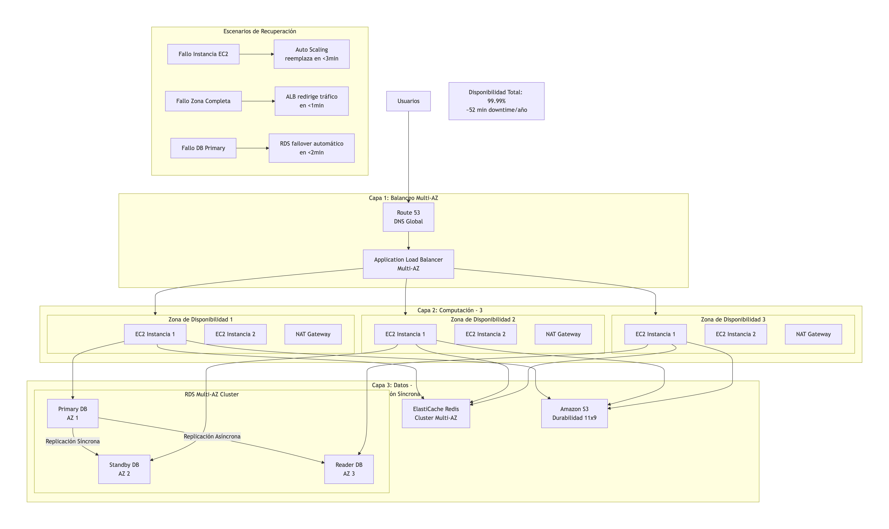
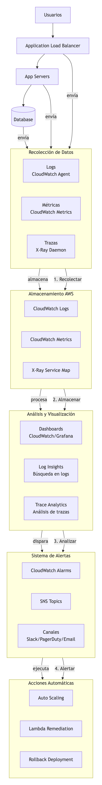
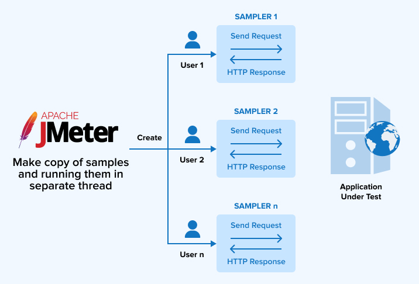

# Módulo 04 · Sesión 04

# Estrategias de Alta Disponibilidad

## Objetivos de la sesión

Al finalizar esta sesión, el estudiante será capaz de:

1. Explicar qué implica diseñar arquitecturas resilientes y tolerantes a fallos en AWS.
2. Implementar estrategias de alta disponibilidad en componentes críticos (compute, base de datos, red).
3. Diseñar despliegues Multi-AZ y Multi-Region, entendiendo cuándo aplicarlos.
4. Elegir e implementar estrategias de Disaster Recovery (DR) según el RTO y RPO requeridos.
5. Ejecutar pruebas de resiliencia y validación de disponibilidad de forma controlada.

---

## Contenido

1. Buenas prácticas para arquitecturas resilientes
2. Despliegue en múltiples regiones
3. Estrategias de Disaster Recovery
4. Pruebas y validación de alta disponibilidad

---

# 1) Buenas prácticas para arquitecturas resilientes

Diseñar arquitecturas resilientes significa que un sistema debe mantenerse operativo incluso frente a fallos inevitables: caída de una instancia, fallo en una zona de disponibilidad, problemas de red, errores humanos, picos inesperados de tráfico, etc.

AWS ofrece una serie de principios y patrones para reducir el impacto de estos eventos.

---

## 1.1 Diseño Multi-AZ como base mínima

El diseño Multi-AZ consiste en desplegar recursos en al menos dos Zonas de Disponibilidad dentro de una misma región.

Esto permite:

-   Aislar fallos de infraestructura de una AZ.
-   Mantener continuidad operativa ante cortes de energía, red o hardware.
-   Minimizar latencia al permanecer en la misma región.

Ejemplos:

-   ALB → Distribuye tráfico entre múltiples AZ.
-   Auto Scaling Group → Instancias EC2 equilibradas entre AZ.
-   RDS Multi-AZ → Réplica sincrónica automática para failover.
-   EFS Multi-AZ → Almacenamiento compartido tolerante a fallos.

---

## 1.2 Eliminación de puntos únicos de fallo (SPOF)

Ejemplos de SPOF:

-   Una sola instancia EC2 sin ASG.
-   Un RDS sin replicación.
-   Un único nodo Redis sin cluster mode.
-   Un único NAT Gateway.

Soluciones recomendadas:

-   ASG, Multi-AZ, clusters, failover automático.
-   Distribución con Load Balancers.
-   Replicación de datos.
-   Uso de servicios serverless o administrados.

---

## 1.3 Desacoplamiento entre componentes

El desacoplamiento evita que un fallo en un componente se propague.

Herramientas recomendadas:

-   SQS
-   SNS
-   Kinesis
-   EventBridge
-   Step Functions

Permiten construir flujos de trabajo resistentes y basados en eventos.

---

## 1.4 Uso de caché para reducir carga

El uso adecuado de caché reduce la presión sobre sistemas core:

-   Redis / ElastiCache
-   CDN con CloudFront
-   Caché local en microservicios

---

## 1.5 Observabilidad: logs, métricas y alertas

Alta disponibilidad sin observabilidad es imposible.

Buenas prácticas:

-   Logging centralizado (CloudWatch, Grafana, Loki).
-   Métricas críticas: CPU, memoria, latencia, errores, conexiones BD.
-   Alarmas CloudWatch.
-   Trazabilidad con X-Ray.

---

# 2) Despliegue en múltiples regiones

Cuando se requiere disponibilidad incluso ante la caída total de una región, se evalúa un diseño Multi-Region.

---

## 2.1 ¿Cuándo usar Multi-Region?

Casos donde es obligatorio:

-   Alta criticidad del negocio.
-   Regulaciones estrictas.
-   Millones de usuarios globales.
-   Riesgo financiero alto si el sistema cae.

Para la mayoría: Multi-AZ es suficiente.

---

## 2.2 Patrones de Multi-Region

### A) Activo – Pasivo

-   Una región activa.
-   Otra en espera (warm o cold).
-   Económico y simple.

### B) Activo – Activo

-   Ambas regiones atienden tráfico.
-   Datos sincronizados.
-   Máxima disponibilidad, alta complejidad.

---

## 2.3 Sincronización de datos entre regiones

Opciones:

-   RDS cross-region read replicas
-   Aurora Global Database
-   DynamoDB Global Tables
-   S3 Cross-Region Replication

Objetivo: RPO cercano a cero.

---

## 2.4 Control de tráfico global con Route 53

Route 53 permite:

-   Failover
-   Latency-based routing
-   Weighted routing
-   Geo-routing

---

# 3) Estrategias de Disaster Recovery (DR)

Las estrategias se definen por RTO (tiempo de recuperación) y RPO (pérdida máxima de datos aceptable).

---

## 3.1 Backup & Restore

RTO: horas  
RPO: horas

-   Backups en S3 o snapshots.
-   Restauración manual o automatizada.

---

## 3.2 Pilot Light

RTO: minutos  
RPO: minutos

-   Infraestructura mínima encendida.
-   Lista para escalar ante desastre.

---

## 3.3 Warm Standby

RTO: minutos  
RPO: muy bajo

-   Infraestructura replicada parcialmente.
-   Escala automáticamente.

---

## 3.4 Multi-Region Active-Active

RTO: casi cero  
RPO: casi cero

-   Ambas regiones activas.
-   Alta complejidad y costo.

---

# 4) Pruebas y validación de alta disponibilidad

Una arquitectura no es resiliente hasta que se la prueba en condiciones reales o simuladas.

---

## 4.1 Pruebas de failover

Simulaciones:

-   Caída de AZ
-   Caída de instancia EC2
-   Failover de RDS
-   Targets no saludables en ALB
-   Fallo en Redis

Se validan:

-   Recuperación automática
-   Continuidad del servicio
-   Funcionamiento de alarmas

---

## 4.2 Pruebas de estrés y carga

Herramientas:

-   Locust
-   JMeter
-   Artillery
-   k6
-   Gatling

Objetivo: validar capacidad y reacción del ASG.

---

## 4.3 Chaos Engineering

Uso de AWS Fault Injection Simulator (FIS):

-   Inyección de latencia
-   Pérdida de red
-   Caída controlada de instancias
-   Fallo de CPU/memoria

---

## 4.4 Revisión periódica de resiliencia

Se recomienda cada trimestre:

-   Ajustar capacity planning
-   Validar backups
-   Verificar RTO/RPO
-   Revisar límites de servicio
-   Ejecutar pruebas manuales y automáticas
