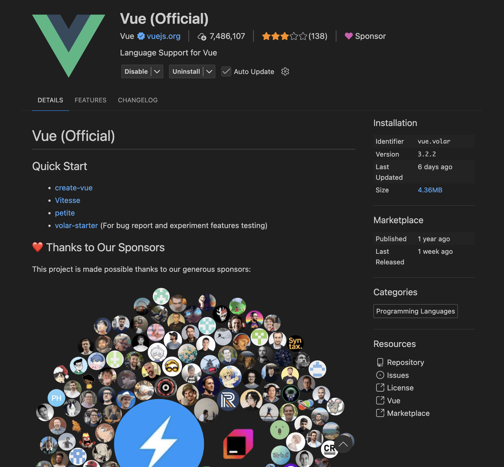
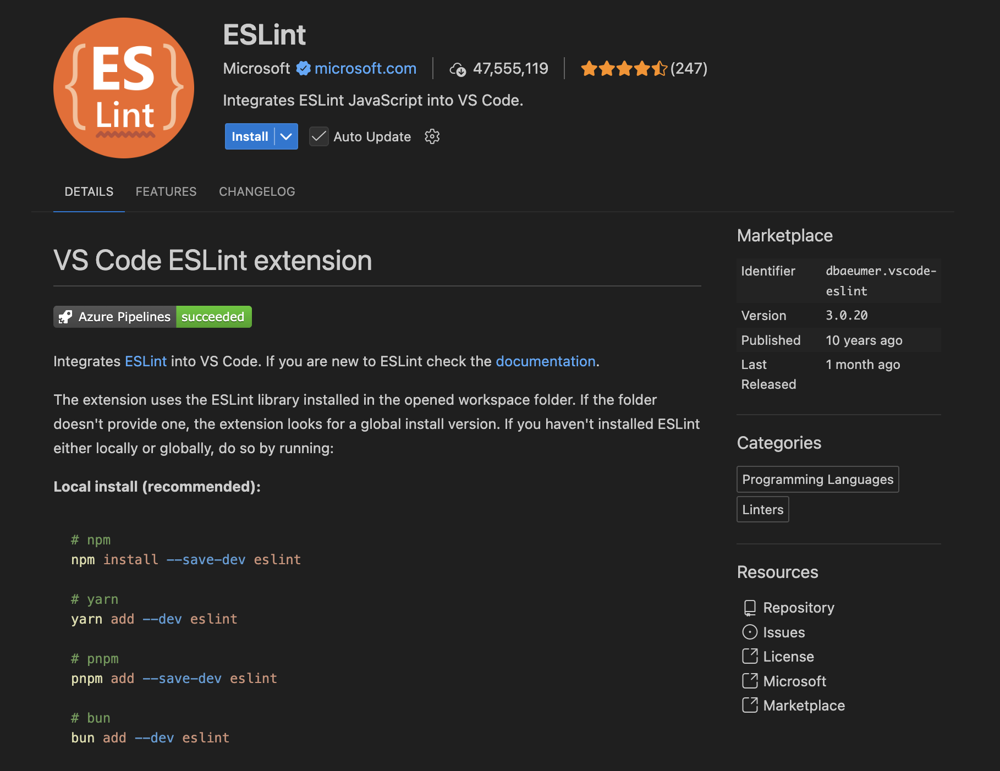
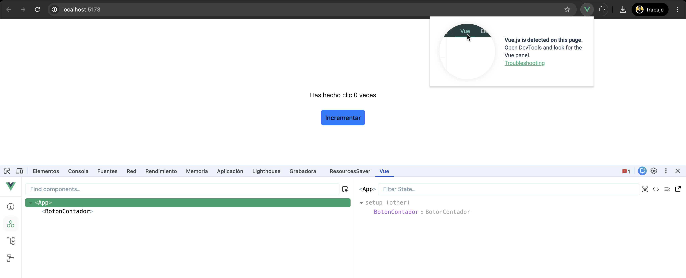

# Clase 04 — Módulo 01

## IDE, Devtools, Debugging y mejores prácticas en Vue.js 3

---

## Objetivos

Al terminar esta clase vas a poder:

-   Preparar un entorno de trabajo sólido para Vue.js 3 (principalmente con VS Code, y conociendo alternativas).
-   Instalar y usar Vue Devtools para inspeccionar componentes, props, estado reactivo y eventos.
-   Aplicar un flujo real de debugging (no depender solo de `console.log`).
-   Escribir componentes con buenas prácticas base (mantenibles, escalables y con buen tipado).

---

## Contenido

-   IDE: VS Code / alternativas y extensiones
-   Instalación y configuración de Vue Devtools
-   Debugging en Vue.js (flujo real)
-   Buenas prácticas base en Vue.js 3
-   Actividad práctica guiada

---

## 1. Tu IDE: VS Code y extensiones

En Vue.js 3, el IDE no es “solo un editor”. Es la herramienta que te ayuda a programar con menos errores y más rápido gracias a:

-   Autocompletado real en `.vue` (template + script + style)
-   Detección temprana de errores
-   Formateo automático y reglas de calidad
-   Navegación y refactors más seguros

Si tu editor no entiende Vue, terminas programando “a ciegas”.

### 1.1 VS Code (recomendado)

VS Code es una opción muy usada para Vue 3 porque, con la extensión correcta, entiende bien los Single File Components (SFC) y mejora mucho el tipado si usas TypeScript.

**Tu meta aquí no es “tunear VS Code”**: es lograr un entorno estable donde guardar el archivo deje el código consistente y los errores aparezcan temprano.

### 1.2 Alternativas (si ya las usas)

-   **WebStorm (JetBrains):** suite “todo en uno”, muy fuerte en refactors y análisis, útil en proyectos grandes.
-   **Neovim + LSP:** rápido y flexible, pero requiere configuración y experiencia previa.
-   **Editores ligeros:** sirven para editar, pero normalmente pierdes diagnóstico/typing/refactors de nivel IDE.

### 1.3 Extensiones esenciales (mínimo recomendado)

#### A) Soporte Vue real (obligatorio)

-   **Vue - Official (Volar)**  
    Es la extensión que hace que VS Code “entienda” Vue 3:
    -   Conecta template con script
    -   Detecta props, emits, computed, refs
    -   Mejora el tipado dentro del SFC

#### B) Calidad y estilo (muy recomendado)

-   **ESLint**  
    Te ayuda a detectar errores comunes y patrones riesgosos (variables no usadas, imports duplicados, etc.).
-   **Prettier**  
    Mantiene el formato consistente automáticamente (comillas, indentación, comas, saltos de línea).

#### C) Productividad (opcional, pero útil)

-   **Error Lens:** errores visibles en la misma línea.
-   **EditorConfig:** evita diferencias de tabs/espacios y finales de línea entre máquinas.
-   **GitLens:** útil para entender cambios y contexto en equipo.

### 1.4 Configuración mínima (lo que quieres lograr)

Asegúrate de que tu proyecto tenga:

-   Formateo al guardar (Prettier)
-   Correcciones de ESLint al guardar (si el proyecto lo usa)
-   Tipado estable dentro de `.vue` (Volar)

Resultado esperado:

-   Guardas el archivo y queda consistente.
-   Se reducen errores por typos y estilos mezclados.
-   Detectas problemas antes de ejecutar.

---

## 2. Vue Devtools (instalación y uso)

Vue Devtools es una extensión del navegador que te permite “ver dentro” de tu app Vue: árbol de componentes, props, estado reactivo y eventos.

### 2.1 Qué problemas te ayuda a resolver

Cuando la UI “no se actualiza” o “algo no se ve”, muchas veces el problema es:

-   Props que no llegan o llegan mal
-   Estado reactivo que no cambia como crees
-   `computed` mal dependiente
-   Evento emitido que nadie escucha

Devtools te ayuda a confirmar la realidad sin adivinar.

### 2.2 Instalación (pasos)

1. Instala la extensión **Vue.js devtools** en tu navegador (Chrome/Edge/Firefox).
2. Levanta tu proyecto en modo dev (`npm run dev`).
3. Abre las DevTools del navegador y busca la pestaña **Vue**.

> Nota: Vue Devtools se usa desde el panel de DevTools del navegador (la pestaña “Vue”).

### 2.3 Si Devtools no aparece (check rápido)

Revisa, en este orden:

1. ¿La app carga sin errores en consola?
2. ¿Está corriendo en modo dev?
3. ¿La extensión está habilitada?
4. ¿No estás en un contexto restringido (página especial, iframe bloqueado, etc.)?

### 2.4 Uso real: qué mirar primero

Cuando algo falla, sigue este orden:

1. **Árbol de componentes**

-   ¿El componente existe?
-   ¿Está montado donde debería?

2. **Props**

-   ¿Llegan con los valores correctos?
-   ¿Son del tipo esperado?

3. **State / Refs**

-   ¿El estado cambia realmente?
-   ¿Se está actualizando la propiedad correcta?

4. **Emits / Events**

-   ¿Se emitió el evento?
-   ¿El padre lo está escuchando?

Idea clave: en debugging se verifica, no se adivina.

---

## 3. Debugging en Vue (flujo real)

Debugging profesional es un proceso repetible. Si aprendes el proceso, puedes resolver bugs difíciles sin depender de suerte o de llenar todo con logs.

### 3.1 Flujo recomendado

1. Reproduce el bug con pasos exactos
2. Aísla el componente responsable
3. Verifica props/estado con Devtools
4. Coloca breakpoints en el punto exacto
5. Observa el estado real en runtime
6. Corrige con el cambio mínimo
7. Repite el caso y valida

### 3.2 Breakpoints: dónde ponerlos

Puntos típicos donde vale oro:

-   Handler de un click (`@click`, submit, toggle, select)
-   Dentro de un `watch` que dispara cambios
-   En funciones que procesan data (`map`, `filter`, `reduce`)
-   Antes de `emit(...)` hacia el padre
-   Antes de llamar una API

Regla práctica: ponlo donde cambia el estado o donde se dispara la acción.

### 3.3 Debugging de reactividad: errores comunes

#### Caso A: “No se actualiza el template”

Posibles causas:

-   Usas un `ref` sin `.value` (en el script)
-   Estás mutando un objeto que no es reactivo
-   Hiciste una copia accidental (por destructuring) y perdiste reactividad

Cómo lo confirmas:

-   Devtools: inspecciona el estado reactivo
-   Breakpoint: mira si el valor realmente cambia
-   Verifica que el template use la misma fuente de verdad

#### Caso B: “Se actualiza demasiado / se ejecuta muchas veces”

Posibles causas:

-   `watch` duplicados o muy amplios
-   `computed` que depende de algo que cambia todo el tiempo
-   Props recreadas innecesariamente desde el padre

Cómo lo confirmas:

-   Devtools: revisa updates y valores
-   Breakpoint: identifica qué dispara el cambio y desde dónde

### 3.4 `console.log` bien usado (solo apoyo)

-   Úsalo para confirmar hipótesis concretas.
-   Úsalo temporalmente (y bórralo).
-   No lo dejes en commits finales.
-   Evita loguear data pesada en loops.

---

## 4. Buenas prácticas base en Vue 3

Estas prácticas no son “reglas bonitas”: evitan bugs y facilitan el mantenimiento.

### 4.1 Props inmutables + emits explícitos (contratos claros)

-   No mutas props.
-   Si necesitas editar: crea estado local y emite cambios al padre.
-   Usa nombres claros para eventos (`close`, `submit`, `update:modelValue`).

### 4.2 `computed` vs `watch`

-   **`computed`:** para derivar datos (sin efectos secundarios).
-   **`watch`:** para reaccionar y ejecutar efectos (API, persistencia, sincronización).
-   **Funciones/handlers:** acciones disparadas por eventos (click, submit).

Regla rápida:

-   “Solo calculo para mostrar” → `computed`
-   “Tengo que hacer algo cuando cambie” → `watch`

### 4.3 Estructura de componentes

-   Componentes base reutilizables: `BaseButton`, `BaseInput`, `BaseDialog`, `BaseSpinner`
-   Componentes de pantalla (views): coordinan flujo y composición
-   Evita mezclar todo en una sola pieza gigante

### 4.4 Estados obligatorios en una UI real

Modela siempre estos estados:

-   loading
-   empty
-   error
-   data lista

Si no los modelas, aparecen bugs de UX y pantallas “congeladas”.

### 4.5 Performance base (sin obsesionarte)

-   Evita lógica pesada en el template
-   Evita `watch` innecesarios
-   No recalcules cosas costosas en cada render
-   En listas grandes: cuidado con renders masivos

## Cierre

Al terminar, debes poder:

-   Mantener un entorno de desarrollo estable (IDE + extensiones + reglas).
-   Diagnosticar problemas con Vue Devtools y breakpoints, no solo con logs.
-   Escribir componentes más limpios, tipados y escalables desde el inicio.
