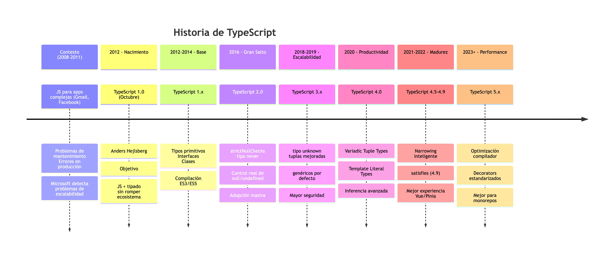
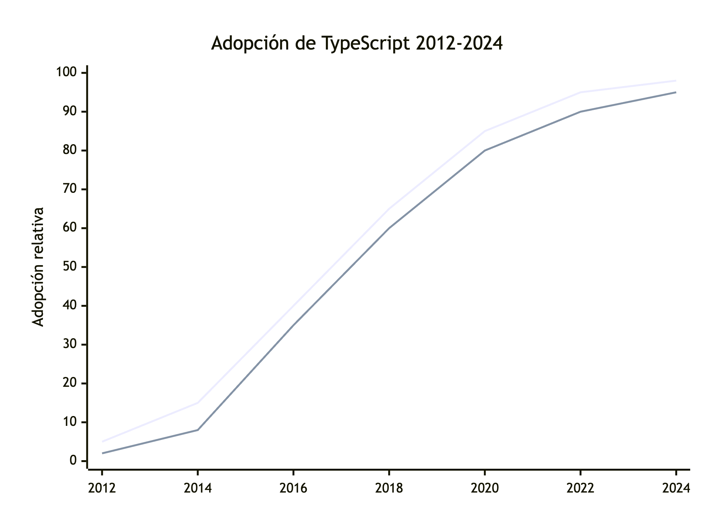

# Historia de TypeScript y sus releases más importantes

Este documento describe la **historia de TypeScript**, su contexto de creación y los **releases más relevantes**, explicando por qué cada versión fue importante y qué problemas reales resolvió.

---

## 1. Contexto: ¿por qué nació TypeScript?

Entre los años 2008 y 2011, JavaScript comenzó a utilizarse para aplicaciones cada vez más grandes y complejas como Gmail, Google Maps y Facebook.

Esto generó problemas reales:

-   Código difícil de mantener
-   Errores detectados en producción
-   Refactorizaciones riesgosas
-   Falta de contratos claros entre equipos

Microsoft, enfrentándose a aplicaciones empresariales de gran escala, detectó que **JavaScript no escalaba bien** bajo estos escenarios.

---

## 2. Nacimiento de TypeScript (2012)

-   Año: 2012
-   Empresa: Microsoft
-   Creador principal: Anders Hejlsberg (C#, Delphi, Turbo Pascal)

Objetivo principal:

> Mantener JavaScript intacto, pero agregarle tipado, estructura y tooling profesional.

Principios fundamentales:

-   Todo JavaScript válido es TypeScript válido
-   TypeScript compila a JavaScript estándar
-   No romper el ecosistema existente

---

## 3. TypeScript 1.x (2012–2014) – La base

Características principales:

-   Tipos primitivos
-   Interfaces
-   Clases
-   Compilación a ES3 y ES5

Impacto:

-   Primer uso en entornos empresariales
-   Base del ecosistema de herramientas modernas

Limitaciones:

-   Inferencia limitada
-   Tipado aún rígido

---

## 4. TypeScript 2.0 (2016) – El gran salto

Este release marca el verdadero despegue de TypeScript.

Novedades clave:

-   strictNullChecks
-   Tipo never
-   Mejor inferencia de tipos
-   Control real de null y undefined

Ejemplo:

```ts
let user: User | null;
```

Impacto real:

-   Menos errores en producción
-   Refactorizaciones más seguras
-   Adopción masiva en la industria

---

## 5. TypeScript 3.x (2018–2019) – Escalabilidad

Características importantes:

-   Tipo unknown
-   Mejoras en tuplas
-   Parámetros genéricos por defecto
-   Compilación incremental

Ejemplo:

```ts
let value: unknown;

if (typeof value === "string") {
    console.log(value.toUpperCase());
}
```

Impacto:

-   Mayor seguridad
-   Mejor performance en proyectos grandes

---

## 6. TypeScript 4.0 (2020) – Productividad

Uno de los releases más influyentes.

Novedades destacadas:

-   Variadic Tuple Types
-   Template Literal Types
-   Inferencia avanzada

Ejemplo:

```ts
type EventName = `on${Capitalize<string>}`;
```

Uso real:

-   Tipado avanzado de eventos
-   Mejores definiciones en frameworks como Vue y React

---

## 7. TypeScript 4.5 – 4.9 (2021–2022) – Madurez

Mejoras incrementales pero clave:

-   Narrowing más inteligente
-   Introducción de satisfies (4.9)

Ejemplo:

```ts
const user = {
    id: 1,
    name: "Ana",
} satisfies User;
```

Beneficio:

-   Validación de estructuras sin perder inferencia
-   Uso frecuente en Vue + Pinia

---

## 8. TypeScript 5.x (2023–actualidad) – Performance

Enfoque principal:

-   Optimización del compilador
-   Menor consumo de memoria
-   Builds más rápidos

Novedades:

-   Decorators estandarizados
-   Mejor soporte para ES2023+
-   Mejor experiencia en IDE

Impacto:

-   Ideal para monorepos
-   Escalabilidad real en proyectos grandes

---

## 9. Línea de tiempo resumida

| Año   | Versión | Impacto         |
| ----- | ------- | --------------- |
| 2012  | 1.0     | Nacimiento      |
| 2016  | 2.0     | Control de null |
| 2018  | 3.x     | Escalabilidad   |
| 2020  | 4.0     | Tipado avanzado |
| 2022  | 4.9     | satisfies       |
| 2023+ | 5.x     | Performance     |



---

## 10. Relación con Vue.js

-   Vue 2: soporte limitado para TypeScript
-   Vue 3: diseñado pensando en TypeScript
-   Composition API maximiza inferencia
-   script setup mejora productividad

Conclusión:

> Vue 3 sin TypeScript es posible,  
> pero Vue 3 con TypeScript es la forma profesional de trabajar.

---

## 11. Conclusión final

TypeScript no apareció por moda.

Apareció porque:

-   JavaScript creció
-   Los proyectos crecieron
-   Los equipos crecieron

TypeScript es la respuesta natural a esa evolución.


