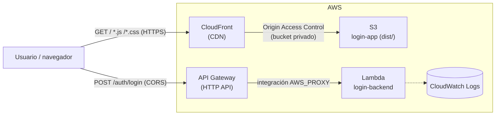
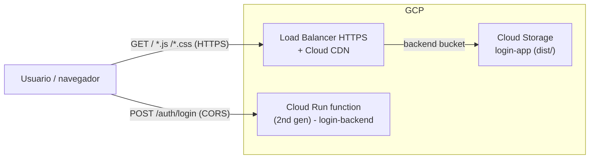

# login-cloud

Infraestructura como código (Terraform) para desplegar `login-app` (frontend) y `login-backend` (API) en **AWS** y en **GCP**, con 3 entornos independientes: `dev`, `stg` y `prd`.

| | Frontend | Backend |
|---|---|---|
| **AWS** | S3 + CloudFront (CDN) | Lambda + API Gateway (HTTP API) |
| **GCP** | Cloud Storage + Cloud CDN (Load Balancer HTTPS) | Cloud Run function (2nd gen) |

## Arquitectura en AWS



- El bucket S3 es privado; solo CloudFront puede leerlo, vía **Origin Access Control**.
- Los 403/404 de S3 se reescriben a `index.html` (200) para que `vue-router` resuelva las rutas del SPA (ej. `/login`) del lado del cliente.
- API Gateway expone una **HTTP API** con una ruta proxy (`ANY /{proxy+}`) hacia una única Lambda, que es donde correría `login-backend` empaquetado (ver [Placeholders](#placeholders-de-backend)).
- CORS en API Gateway restringe los orígenes permitidos al dominio del frontend (configurable por entorno).

## Arquitectura en GCP



- El bucket de Cloud Storage se sirve como **backend bucket** de un Load Balancer HTTPS global, con Cloud CDN habilitado.
- El bucket tiene configurado `not_found_page = index.html`, equivalente al fallback SPA del lado de AWS.
- El certificado SSL es administrado por Google (`google_compute_managed_ssl_certificate`) y requiere que el dominio del entorno apunte a la IP estática reservada (`frontend_load_balancer_ip` en los outputs).
- La función de backend es una **Cloud Run function (2nd gen)**, invocable públicamente (equivalente a la API Gateway pública del lado de AWS).

## Estructura del proyecto

```
login-cloud/
├── modules/                 # lógica de infraestructura reutilizable, sin valores de entorno
│   ├── aws-frontend/        # S3 + CloudFront + OAC
│   ├── aws-backend/         # Lambda + API Gateway HTTP API
│   ├── gcp-frontend/        # GCS + Cloud CDN + Load Balancer HTTPS
│   └── gcp-backend/         # Cloud Run function (2nd gen)
└── environments/            # un "root module" (state propio) por entorno y nube
    ├── dev/{aws,gcp}/
    ├── stg/{aws,gcp}/
    └── prd/{aws,gcp}/
```

Cada carpeta bajo `environments/` es independiente: tiene su propio `terraform.tfvars`, su propio state y se aplica por separado. Esto evita que un cambio en `dev` pueda afectar accidentalmente `prd`.

## Uso

Requisitos: [Terraform >= 1.5](https://developer.hashicorp.com/terraform/install), credenciales de AWS (`aws configure` / variables `AWS_*`) y/o de GCP (`gcloud auth application-default login`) según el stack que vayas a desplegar.

```bash
cd environments/dev/aws        # o environments/dev/gcp, stg/..., prd/...
terraform init
terraform plan
terraform apply
```

Para destruir un entorno:

```bash
terraform destroy
```

### Variables por entorno

Cada stack trae un `terraform.tfvars` con valores por defecto razonables para ese entorno (tamaño de Lambda/función, price class de CloudFront, dominio, CORS, etc.). Los valores que **debes reemplazar** antes de aplicar en una cuenta real:

- `environments/*/gcp/terraform.tfvars`: `gcp_project_id` (proyecto real de GCP) y `frontend_domain` (dominio propio; requerido para el certificado SSL administrado cuando `enable_https = true`).
- `environments/*/aws/terraform.tfvars`: `cors_allow_origins` en `stg`/`prd` (apuntan a dominios de ejemplo).

### Placeholders de backend

Los módulos `aws-backend` y `gcp-backend` incluyen un handler mínimo (`modules/aws-backend/lambda-src`, `modules/gcp-backend/function-src`) que se empaqueta y despliega por defecto, para que `terraform apply` funcione de punta a punta sin depender de un build externo. En un pipeline real, ese paquete se reemplaza por el build de `login-backend`:

- **AWS**: pasar `deployment_package = "<ruta-al-zip>"` al módulo `aws-backend` con el build de NestJS envuelto para Lambda (por ejemplo con `@vendia/serverless-express` o `serverless-http`, ya que Lambda no ejecuta `app.listen()` directamente).
- **GCP**: pasar `source_dir = "<ruta-al-código>"` al módulo `gcp-backend`, exportando el handler HTTP esperado por `@google-cloud/functions-framework`.

### Backend de estado (remoto)

Por defecto cada stack usa el backend local de Terraform, para poder ejecutar el proyecto sin infraestructura previa. En un entorno real, cada `versions.tf` trae comentado el bloque de backend remoto recomendado (`s3` + DynamoDB para locks en AWS, `gcs` en GCP) — descomentar y ajustar el nombre del bucket/tabla una vez creados.
